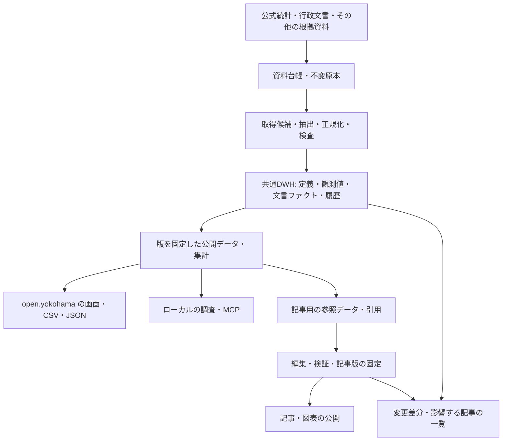

# 横浜市DWHと記事参照の目標設計

作成: 2026-09-07。依頼: このプロジェクトを横浜市DWHの整備にも広げ、open.yokohamaの記事作成で参照できる姿を設定する。
本書は全体の目標設計です。人口分野の共通DWH・記事参照・静的API・制限付き内部MCPを実装しました。実装範囲と残る点は[実装記録](DWH-IMPLEMENTATION.md)を参照してください。
現状の根拠は [監査](DWH-AUDIT.md)、採用する設計方針は [ADR 0002](adr/0002-yokohama-dwh-and-editorial-references.md) にまとめます。

既存3系列の説明と、現在のファイル・記事・訂正がどう変わるかは[具体例による全体説明](DWH-EXAMPLES.md)を参照してください。
2026-09-07の追加指示により、MCPは外部公開停止・ローカル利用のみとします。APIキーやクラウド認証があっても再公開しません。
本書のMCP連携はローカルでの互換性・検証を指し、DWHの実装・公開条件に外部MCPの再開を含めません。

## 目的

**横浜の数字・文書上の事実・出典・改定履歴を蓄積する共通データ基盤を、このプロジェクトの中核にします。**
open.yokohamaは、そのデータを使って市民に説明するWeb・記事媒体として位置づけます。
同じ資産を調査、比較、CSV/JSON、MCPでも再利用できる状態を目指します。

ここでの横浜市DWHは、横浜市域に関する公開情報の蓄積・分析基盤です。
市役所の内部業務システムや、横浜市が公式に運営するDWHを意味しません。
対象は人口、財政、暮らし、施設、政策・意思決定、都市史へ段階的に広げます。

## 最初に実現する利用体験

1. 編集者が「2025年の横浜の人口増減」などの問いから、収録済み指標・定義・対象期間を探せます。
2. 数値と併せて、基準日・単位・出典箇所・注意点・改定状態を取得できます。
3. 記事の本文・図表は同じ参照データから作成し、使った値・計算式・資料版を記事に固定できます。
4. 読者は本文の出典から根拠へ進め、データ更新時には編集者が影響する記事を把握できます。
5. 未収録の事実が必要なら一次資料を調べ、再利用価値のある根拠を登録してから記事で使えます。

すべての文章をDWHへ収録することは求めません。数値・検証可能な事実は参照を持ち、解釈・提案・未確認の問いを区別します。
施設不足や政策効果は、人口データがあるだけで確認済みにしません。

## データの流れと正本



| 層 | 保存するもの | 正本と更新規則 |
|---|---|---|
| 原本 | CSV、XLSX、HTML、PDFと取得記録 | 内容ハッシュで不変保存。同じURLの更新も別snapshot。利用条件・再配布可否を記録 |
| 候補 | 抽出結果、形式エラー、値の差分、検査結果 | 公開側から読ませない。失敗しても既存の公開版を維持 |
| 共通DWH | 指標定義、地域、観測値、文書ファクト、根拠、改定 | 検査済みデータの正本。安定したキーと不変の版を分離し、旧版を保持 |
| 公開データ | 共通DWHから生成した集計・JSON/CSV・検索索引 | releaseごとに不変。`latest` は公開済みreleaseを指す。値や定義を手編集しない |
| 記事 | 原稿、参照値・引用、算式、検証結果、記事版 | 原稿は編集の正本。データ版・本文版・レビューを結び、公開記事を再現可能にする |

同一の数値を別の正本として手入力しません。配布・表示用の複製には生成元と版を付けます。
予算表や施設表を数値観測へ無理に押し込まず、共通の地域・時間・出典を使う分野別の表として拡張します。

実装時の配置案は次のとおりです。現在存在しないディレクトリも含み、今回作成・移行したものではありません。

```text
data/raw/                    既存の公開可能な不変原本
data/catalog/                資料・指標定義・地域・利用条件の正本
data/warehouse/              検査済み観測値・文書ファクト・引用・改定履歴
data/releases/<releaseId>/   不変のmanifestと公開用データ
data/published/              最新公開版から生成する既存形式との互換出力
data/editorial/              原稿・記事参照・検証・記事版
artifacts/                   取得候補・一時的な検査ログ
```

長期に必要な取得・訂正・検査記録はwarehouse/release側に保持し、一時artifactの保存期限に依存させません。
公開できない全文原本は台帳に記録した別の保全先で扱い、公開repoに混在させません。

## 共通の参照契約

以下は論理モデルです。初期実装は既存JSONに互換adapterを足して始め、保存技術から決めません。

| 対象 | 最低限の情報 | 意味・制約 |
|---|---|---|
| Dataset / Source | 安定ID、資料系列、提供者、原典URL、利用条件、範囲、更新間隔、確認担当 | 資料系列のIDと原本の内容ハッシュを分ける。出典の実在だけで主張を支持した扱いにしない |
| SourceSnapshot | source ID、raw hash、保存先、取得日時、公表日、形式、抽出処理版 | 不明な公表日はnullと理由。再取得日を事実の有効日や公表日に代用しない |
| MetricDefinition | IDと定義版、単位、統計系列、母集団、分母、基準、集計可能性 | 人口残高を時点間で合計しない。比率は分子・分母から再計算し、地域の比率を単純合計しない |
| Geography | 地域ID、自治体コード、親地域、名称・境界版、有効期間 | 初期は市と18区。町丁や他都市を追加するとき、名称一致だけで結合しない |
| Period | 時点/期間、開始・終了、月/暦年/年度、基準日 | 1月1日、年間届出、年度を区別。期末残高と期間中の動きを自動置換しない |
| Observation | 論理キー、版ID、値、欠測理由、出典・箇所、状態 | 1指標×1地域版×1時点/期間×1属性組×1定義版を1件とする |
| DerivedFact | IDと版、入力観測の版、式・処理版、丸め、単位・分母 | 増減率・5年平均・順位・指数を再計算可能にする。LLMに数値計算を任せない |
| DocumentFact | 安定IDと版、命題、対象主体、有効期間、支持/反証/文脈の引用、検証記録 | 「いつ何が決定されたか」等を蓄積。観測値と文章の支持判定は別種の記録 |
| Citation | snapshot ID、ページ/節/表/行/列、引用文・抽出本文hash | 原資料の版と箇所を指定。CSVの複数入力行やPDF表のセルも表現できるようにする |
| DatasetRelease | release ID、schema版、収録定義・データ・原本のhash、処理版、公開日時、検査記録 | 全系列を束ねる。各数値の観測時点が同じという意味ではない |
| ArticleReference | 記事ID・本文版、block ID、データrelease、観測/派生値/文書ファクトの版、引用 | 同じ記事の要約・本文・図表が共通の参照から値を取得する |
| IngestionRun / Change | 実行ID、対象系列、確認日時、結果、差分、旧新版、理由 | 原典改定・計算修正・新期間追加・欠落・取得失敗を区別。記事への影響を逆引きする |

### キーと版を混同しない

- 観測の論理キーは、資料系列・指標定義版・地域版・期間・属性組で決めます。原本hashを含めません。
- 観測の版IDは、論理キー・値・欠測状態・出典版・抽出/計算版などの正規化内容から決めます。同じ値でも根拠や処理が変われば別版です。
- `revision` は系列内の改定順を補助する番号です。全データを特定するrelease IDには使いません。
- releaseは入力内容のmanifestから決め、旧releaseを上書きしません。記事の版はデータreleaseと別に作り、循環参照を避けます。
- 既存のpopulation/dynamicsのIDは別名として保持します。agesにも論理キー・版IDを追加し、旧クライアントの契約を壊しません。

現資料にはない性別・年齢・会計等を後から加える場合、属性を省略して既存の総数と衝突させません。
推計人口と住民基本台帳、国勢調査の基準改定、予算案/成立予算、当初/補正/決算は識別できる形で残します。
比較可能性が確認できない系列は、別々に取得できても自動比較の対象にはしません。

### 確認状態と公開状態

数値の原本照合、文章の支持/反証、人間の確認、公開の可否は別属性にします。
既存の `machine_verified`、`supported` 等を全領域共通の「真実」ラベルへ変換しません。
公開判断と検証の責任範囲は [FACT-CHECK](FACT-CHECK.md) を引き継ぎます。

## 記事作成で使う方法

### 現在使える入口

ローカルの [MCP](runbooks/mcp.md) の `search`、`get_metric_series`、`compare_geographies`、`get_source` と、3系列のCSV/JSONを使えます。公開MCPは停止中です。記事作成はローカルのファイル・core関数の参照を基本にします。
例えば `get_metric_series({"geography":"141003","metric":"natural_change","frequency":"year"})` から2025年を選べます。
動態の `get_metric` は最新年を返すため、特定年の原稿では取得結果の期間を必ず確認します。
記事resourceは既存3記事の原稿・主張・引用を返します。一般的な文書ファクトの検索機能ではありません。

当面の原稿作成でも、値だけをメモせず、対象commit・観測IDまたは地域/期間/指標・出典hash・引用箇所を残します。
資料が不足すれば一次資料を追加し、[既存の編集手順](FACT-CHECK.md#使い方)で原稿と根拠を再検証します。
現行の原稿schemaは限定的なため、長文記事や新分野を既に公開できるとは扱いません。

### 最初に追加する参照出力

CLIまたはcore関数で、問いに必要な指標・期間・地域を指定して「記事用の参照データ」を生成します。
初版は既存3系列を対象にし、編集画面の新設を前提にしません。

出力には `releaseId`、検索条件、観測と定義、派生計算、引用、確認日時、収録範囲、未提供理由を含めます。
読みやすい出典表記と機械用IDを併せて返し、原稿の要点・本文・図表から同じ参照を利用します。
これを元に記事依存台帳を生成し、参照先の欠落や版の混在を公開検査で拒否します。
記事モデルも数値参照と引用を保持する形に拡張します。既存の署名対象の原稿・根拠・検証実装が変わる場合は、旧署名を流用せず再検証します。

具体例は、現データにある「2025年の自然増減−18,732人、社会増減＋18,896人、合計＋164人」です。
入力3観測の版と `−18,732 + 18,896 = 164` の計算を固定します。
これは暦年の届出による増減であり、人口残高の端点差や政策効果として引用しません。
この例の値は [ローカル公開データ](../data/published/dynamics.json) から取得したもので、新しい参照機能の実行結果ではありません。

### 記事と更新型画面

| 利用場面 | 時点と版の選び方 | 更新時の扱い |
|---|---|---|
| 調査中の原稿 | 最新の公開releaseを検索し、原稿確定時に固定 | 新しい資料の有無を確認してから公開 |
| 公開済み記事 | 公開時のデータ・根拠・計算・本文版を固定 | 過去記事の数字を黙って置換せず、訂正・更新版と変更理由を残す |
| トップ・区ページなど更新型画面 | ビルド時に公開releaseを解決して固定 | 次のビルドで更新。生成解説の条件も再検査し、時点を表示 |
| 時系列・都市比較 | 指定release内で比較可能な期間・定義を選択 | 系列ごとの「最新」を無条件に混在させない。不足は未提供として返す |

公開記事の参照データの固定と、公開済みデータの誤りを周知することは両立させます。
重大な訂正では旧版の状態に警告・保留を付け、通常検索から除外しつつ、履歴参照で訂正理由を確認できる形にします。

## 取得・鮮度・訂正の運用

1. 系列ごとに取得・確認runを記録し、1系列の失敗が他系列の確認結果を消さないようにします。
2. 同じ原本を再取得した場合は観測版を増やさず、確認日時のみrun台帳に残します。
3. 新期間・改定・削除・定義変更を差分に分け、過去値の採用は理由とレビューを記録します。
4. 変更から観測・派生値・文書ファクト・記事を逆引きし、再検証が必要な対象を列挙します。
5. 公開前に参照整合性・原本再解析・必要な文章検証を通し、Webのデータreleaseを確定します。MCPとの一致はローカルで検査します。
6. Web公開先のrelease IDを照合し、旧版取得を維持します。外部MCPの再公開は行いません。

鮮度は観測日、公表日、取得日、最後に更新を確認した日、次回確認予定を分けて表示します。
年次統計の古い観測日を取得失敗と扱わず、予定は資料の公表周期に基づけます。不明なら不明とします。
定期的な根拠確認と記事の検証期限を監視し、原本を再取得しただけで記事を再検証済みにしません。

原本の保存先と公開可否を分け、公開不可の全文を静的配布・MCPに含めません。
文書の保全対象・保存先・復元方法を台帳に記録し、原URLが変わっても許容された保存原本から再検証できることを確かめます。
外部保管先・新しい課金サービスは、この設計の作成だけでは導入しません。

## 実装順と受入条件

段階0（現状監査・目標設定）が今回の成果です。以下は次に進む実装計画です。
現行の国内都市比較・公共的論点・財政の優先順を保ち、その前に既存人口データで共通化を実証します。

| ID・順 | 成果物 | 完了の条件 |
|---|---|---|
| DWH-01 共通カタログ | 3系列・24指標の資料/定義台帳、論理キー・版ID、共通問い合わせadapter | 16,072値を欠落・値変更なく解決。定義・単位・時点・行/複数行が戻る。旧CSV/JSON/MCPとの互換検査が通る |
| DWH-02 記事1件で参照を実証 | 記事用の参照出力、計算記録、記事依存台帳、データrelease、根拠原本の復元手順 | 上記2025年の例で本文・図表・引用が一致。後続データ版ができても旧記事を再現でき、参照欠落・版混在は拒否 |
| DWH-03 改定を通す | 正規化正本と候補/公開物の分離、履歴、run台帳、差分からの影響一覧 | 一時環境の原典改定で関連記事を列挙。保留・再検証・訂正・旧版取得を実演。1系列失敗時も残りの検査結果が残る |
| DWH-04 利用経路へ展開 | Webのデータカタログと記事導線、版を指定できる配布・ローカルMCP | 同じrelease・同じ条件でWeb/JSON/CSV/ローカルMCPの数値・定義が一致。読者が出典と訂正履歴へ到達。外部MCPは停止を維持 |
| DWH-05 分野を広げる | 国内比較の共通指標→公共的論点→予算・決算の分野別データ | 期間・地域・統計基準の比較可否、会計・年度・予定/実績を検査。新分野から記事参照まで一貫して利用 |

DWH-02までは小さな対象で版管理と記事参照を完成させます。
全領域の収集、汎用の編集CMS、自由入力のAI回答を、その完了条件に加えません。
資料調査と市民検証は並行できますが、必要な専門家確認や人間承認を未実施のまま代行しません。

最初の共通化が完了したら、基盤の評価は指標数だけでなく、参照解決率・原本再現率・更新未確認の系列数・影響記事の処理状況で行います。
初版の参照解決・値の再現は対象全件100%を受入条件とし、運用の応答期限は実際の担当体制を確かめて設定します。

## 保存技術と見直し条件

当面は既存のGit・不変原本・型付きJSON・静的配布を活用します。
必要に応じて分析用SQLファイルやDBを生成する場合も、再生成可能な派生物として扱い、手更新する別正本を作りません。
常時DBや特定のDWH製品は今回選定しません。

現在の原本約7.86 MBは [ADR 0001](adr/0001-static-public-data-core.md) の約10 MBの見直し目安に近いため、次の大型資料を取り込む前に保存方法を評価します。
これは即時の移行条件ではありません。Git履歴の増え方、再構築時間、複数編集者の更新競合、必要な検索・集計を測ります。
その結果に応じて原本保管先や分析用ストレージを選び、容量・費用・復元性を具体化したADRを追加します。
