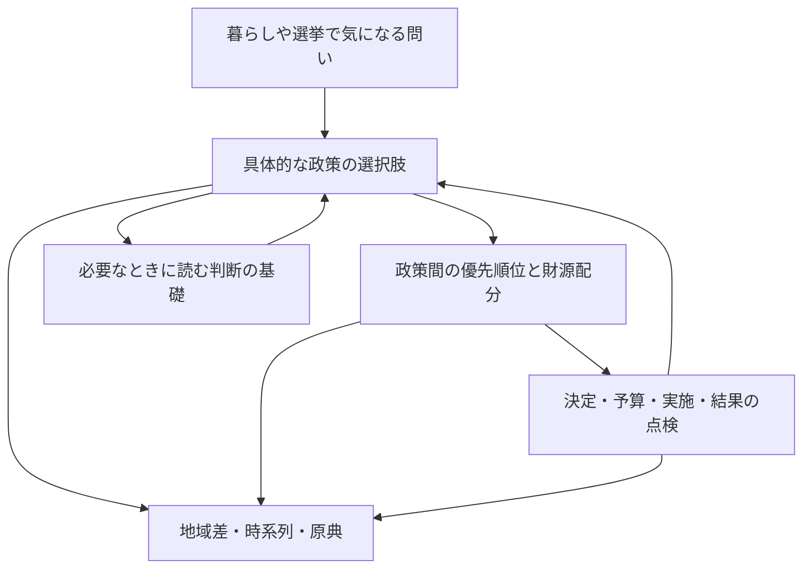

# Open Yokohama リデザインプラン

更新：2026-09-07。争点から逆算する体験へ改訂したレビュー案。
リデザインの目的・判断・仕様・工程の正本は本書とする。長期構想は[VISION.md](VISION.md)、実装状態は[STATUS.md](STATUS.md)に置く。
当初のプラン再検討に続き、ユーザーから最小試作・初期検証の準備と、具体的な計画に沿う順次実行が委任された。人間による調査・採用判断と公開は、実施・承認の記録を別に持つ。

第6.6節に旧3記事の撤去と、サイト全体の問い・優先順位・次の実行単位をまとめました。第6.5節は地域差の地図とホーム改善です。現在の対象は給食を含む7論点の初版と、市長選の入口 `/elections/mayor-2026/` です。公開委任・追加ブリーフ・今後の打線は第6.4節に追記しました。給食原稿の大枠の採用と実装は第6.3節、最初の候補比較は第6.2節です。第14節の人口試作は技術資産として保持し、内容不足による採用比較の停止は第6.0節に記録しています。

## 1. 今回の結論

**選挙や暮らしの出来事で気になった争点から、何を判断する話なのかをつかみ、判断を分ける条件をたどり、必要な事実と根拠を確かめられる公共情報プロダクトにする。**

利用者に人口・財政・制度を順番に学んでもらい、最後に政策判断を組み立ててもらう構成を改める。
編集側が「争点→下位の問い→比較・証拠」の関係を調べて示す。利用者は、その関係と限界を踏まえて自分の考えを持つ。
選挙の時期は優先する来訪機会とし、選挙後も同じ問いを政策・予算・実施・結果へ追えるようにする。

### 旧案から変える判断

| 旧案の中心 | 改訂案 | 理由 |
|---|---|---|
| 生活の場面から気づきを得るP1を最初に検証 | 争点は気になるが、判断材料の関係が分からない状態を主対象にする | 今回の指示では、関心が生まれた機会を理解へつなぐことが重要 |
| 自分の区・都市を比べることを主な価値にする | 争点の判断に必要な比較を、理由とともに提示する | 比較項目を自力で選べることを前提にしない |
| 人口など個別分野から理解を積み上げる | 争点の見取り図から必要な下位問いへ進み、元の争点へ戻る | 要素間の接続を読者任せにしない |
| 全体画面2〜3案を先に作り込む | 一つの争点と具体的な答えを固め、その同じ内容で構成案を比較 | 内容のない見栄えの比較を避ける |
| 操作成功・原典到達を中心に評価 | 問いの前進を主評価とし、操作・到達・維持工数を別に測る | 操作できることと判断材料を理解することは異なる |
| 公開後に内容を増やす | 一つの問いの更新・訂正まで成立させてから広げる | 更新できない争点解説を蓄積しない |

「多くの人は普段の暮らしで精一杯」という指示を、**学習・探索の負担を提供側が引き受ける設計前提**として採用する。
市民の何割に当てはまるかを測った事実とはしない。政治への日常的な関心や長時間の閲覧を利用条件にしない。

## 2. VISIONと添付フィードバックの対応

### 守る基盤、変える体験

| VISIONの方針 | 今回の具体化 |
|---|---|
| 原典と構造化データを中核資産にする | 争点の文章から主張・比較・原本の箇所と版へたどれる |
| 事実・解釈・提案、反証と未確認を分ける | 「確認できたこと」「前提に依存すること」「何を重視するか」を分ける |
| 時間・地理・数字の条件を残す | 短い答えにも対象期間・地域・推計の区別を残す |
| 課題・政策・予算・成果を根拠付きで接続 | 争点から政策の選択肢、実施権限、費用、結果へ進む |
| WebとMCPで同じ情報を利用 | 既存MCPを維持し、今後の公開済みの問い・証拠も共通正本から提供する |
| 個人の政治的嗜好推定等を対象外にする | 候補者推薦・相性診断・政治的な個人別出し分けを行わない |
| 50指標・30課題等を長期目標にする | 長期目標を維持し、短期の成功を記事数や指標数で判定しない |

ユーザーの追加指示を受け、VISION.mdにも争点からの体験、読後成果、問いの維持を反映した。構造化の作業は提供側が下から積み上げ、閲覧体験は問いから下へたどる。この二つを両立させる。
VISIONの選挙結果・投票率の利用は公開集計値の記述的・歴史的比較とし、現在の公共政策の争点理解も扱うことを明確にした。個人の政治的嗜好推定を対象外とする原則は維持する。

### フィードバックから採用・調整すること

| 項目 | 判断 |
|---|---|
| ①価値観→⑦体験→検証・運営を接続 | 採用。第3〜12節で具体化 |
| タイトルが約束する問いに、その場で答える | 採用。人口の読み方の一般論では代替しない |
| 人口の将来像を最初の完成例にする | 技術と証拠の縦断実装として採用。争点から入る体験も別に検証する |
| 初期の主対象S1、隣接対象S0 | 採用。既存の6ペルソナは利用上の障壁を点検する補助へ移す |
| 検証付き問い前進率（QPR） | 暫定採用。参加者内の指標とし、全訪問者へ外挿しない |
| MCPは需要確認後に追加 | 本案件では既に存在するため維持。新しい争点機能の拡張だけ段階化 |
| 週8時間・月2万円等 | 承認済み稼働・予算として採用しない。既存の費用抑制方針を維持 |
| 実装まで直ちに進める指示 | 後続の直接指示で順次実行が委任された。第11節に従い、初期試作と検証準備から実行 |
| 複数の成果物ファイル | 本書へ統合。別の計画正本を増やさない |

## 3. ①〜⑤：何を変え、誰に価値を渡すか

| 層 | 本案件での定義 | 確かめること |
|---|---|---|
| ①価値観 | 調べる余裕や知識にかかわらず、根拠と限界を知って自分で考えられる | 読者の結論を採点・誘導していないか |
| ②実現する変化 | スローガンや断片的な数字から、判断条件を説明できる状態へ進む | 何が確認でき、どこで判断が分かれ、何が未確認かを説明できるか |
| ③原因仮説 | 時間不足に加え、事実と政策の接続、比較条件、権限が見えにくい | 読者が実際に止まる箇所はどこか |
| ④戦略 | 関心が生まれた争点を少数選び、問い・答え・根拠・運営を完結させる | 来訪理由と、維持できる証拠があるか |
| ⑤提供価値 | 専門資料を横断せず、争点の構造と必要な判断材料を把握できる | 短時間でも一つの疑問を解消・具体化できるか |

### 主対象は属性ではなく利用状態

- **S1・優先：** 選挙や報道でテーマを知ったが、何を確かめれば判断できるか分からない。争点の要点と判断条件を先に渡す。
- **S0・隣接：** 暮らしで気になることはあるが、問いが曖昧。生活の言葉から同じ争点・問いへ案内する。
- **S2・根拠確認：** 説明や数字を確かめたい。原本・比較条件・計算を直接開けるようにする。

一人がテーマや時期によって移る状態であり、アカウント属性として保存しない。
選挙が入口でも投票権のない住民を排除しない。読むだけ、保留する、次に調べなくてよいと分かることも成果とする。

### 優先して反証する仮説

| 仮説 | 観察すること | 成立しなければ |
|---|---|---|
| H1：関心はあるが、問いを分解する負担が大きい | 直近の気になる話から、次に何を調べたかを再現 | 分解表示より直接回答や検索を改善 |
| H2：争点から入る方が、人口から入るより関連を理解しやすい | 同じ内容で、入口と戻り先の理解を比較 | 生活の問い等の入口を強める |
| H3：選択肢・権限・費用を結ぶと理解が進む | 因果、実施主体、負担の混同が減るか | 問いを狭め、説明の順序を修正 |
| H4：短い要点でも重要な留保を保持できる | 要点だけ読んだ人の誤解を確認 | 要点の情報量と表現を修正 |
| H5：選挙後にも問いを使い直せる | 必要なときに同じ問いへ戻る理由があるか | 更新範囲や流通を見直す |

頻度や効果は未計測。旧案の人物像への同意を調査成果としない。

## 4. ⑥：争点から逆算する問いの構造

ここでいう争点は、**公共の選択について判断が分かれる具体的な問い**を指す。
「人口」「財政」「子育て」は分野タグであり、それだけでは争点にならない。
争点の答えは、必ずしも賛否の結論ではない。「どの条件なら、どの選択肢の利点・負担が変わるか」が具体的に分かることを目指す。

### 共通の構造

```text
争点：何をどう変えるか、何を優先するか？
├─ 何の問題を解くのか？ 現状と対象、困りごとの証拠
├─ どんな選択肢があるか？ 現状維持・改善・代替案
├─ どの条件で判断が分かれるか？
│  ├─ 効果：誰に何が変わり、その根拠は何か
│  ├─ 負担：誰が何を負担し、別の使い道は何か
│  ├─ 実現性：誰が決められ、何年かかり、何が必要か
│  └─ 不確実性：何が未確認で、何が分かれば評価が変わるか
└─ 個別の問い → 比較・説明 → 主張 → 原典の該当箇所
                         ↓
       この事実で元の争点の何が分かり、何は決まらないか
```

ツリーをそのまま全画面で操作させない。最初は判断を分ける3〜4点の見取り図を出し、必要な枝だけ開く。
各下位ページに「元の争点」「今回分かったこと」「残る判断条件」を置く。知識の寄り道で当初の目的を失わせない。
表示上は主親を一つ持つ木とし、人口等の共通材料を複数の争点から参照できる関連リンクも持つ。

### 具体例：公共施設の更新をどう進めるか

**以下は設計例。実際の選挙で争点になっていること、特定施設の問題、政策効果を確認したものではない。**

根の問い案：**「公共施設を更新するとき、近さ・機能・将来の負担をどう両立する？」**

| 下位の問い | 必要な証拠 | 元の争点への戻し方 |
|---|---|---|
| 何を直す必要があるか | 施設の状態、利用実態、点検・更新計画 | 更新の必要性を確認。人口減だけで廃止を決めない |
| 将来、誰がどれだけ利用し得るか | 同一版の地域・年齢別将来人口、利用圏と利用実態 | 需要を考える一材料。区人口を施設利用者数と同一視しない |
| 近くに残す・複合化する等で何が違うか | 具体案、移動条件、提供機能、運営方法 | 移動の負担と機能の違いを同じ項目で比べる |
| 費用と負担はどう違うか | 整備費、維持費、財源、期間、代替案 | 初期費用だけの有利不利を避ける |
| 誰が決め、どう確かめられるか | 対象施設の所管、計画、議決・意思決定記録 | 実際の権限と意思決定段階へ戻す |

ここから「横浜の人口の将来像は、区によってどう違う？」を開く。
読み終えたら、同じ推計の地域差が需要検討の材料になる一方、施設の存廃には利用圏・利用率・移動・費用の確認が残る、と元の問いへ戻す。
人口ページの成功だけで、公共施設の政策判断を支援できたとはしない。

### 他の候補と、採用するための条件

| 争点候補の設計例 | 分解する問い | 初期に不足する証拠 |
|---|---|---|
| 子育ての負担を減らすには、何を優先する？ | 支援対象、利用条件、供給、費用、他自治体との条件差 | 制度・利用実態・財源・比較可能な自治体資料 |
| 移動手段を維持するために、どんな負担や方法を選ぶ？ | 需要、供給、人員、権限、費用、代替手段 | 路線・利用・運営・制度の資料 |
| 大きな公共投資を、何と比べて評価する？ | 目的、見込む効果、費用、リスク、代替用途 | 具体事業の計画・評価・財源・代替案 |

いずれも現在の主要争点という認定ではない。採用前に対象の選挙・時期と公開資料を確認する。
話題性だけでなく、生活への関係、公共的重要性、誤解を減らせる余地、回答可能性、維持工数を記録して選ぶ。
政治主体が提示した二択をそのまま全選択肢としない。根拠のある他の案や現状維持も検討する。

## 5. 選挙を入口にし、政策の経過へつなぐ

### 選挙時と通常時の関係

同じ争点の恒常ページを正本とし、選挙時の入口はその時点で確認した問いをまとめる。
通常時は暮らしの疑問、予算・統計の公表、政策の実施・見直しから同じページへ入る。
選挙のたびに解説を複製せず、選挙時点の版を残し、現在の版との差を確認できるようにする。

選挙の種類によって判断対象と権限が異なるため、選挙種別・対象地域・確認時点を明記する。
国全体の経済問題を、市の権限だけで解決できる話として見せない。個別の権限は資料確認後に掲載する。

### 争点の選び方も編集対象にする

- 掲載理由、対象期間、調べた資料、検討中・見送ったテーマと理由を編集記録に残す。掲載分を「全争点」と称さない。
- 行政資料、計画、議事録等で問題と選択肢を確認する。選挙公報等を入口の背景に使う場合も出典と時点を残す。
- 候補者の順位付け・推奨は行わない。候補者別公約比較は初期範囲に含めず、扱う場合に別の掲載基準を設計する。
- 非党派は、根拠の強弱を半々に見せることではない。同じ検証基準を適用し、編集の利害と訂正を開示する。

## 6. ⑦：画面とコンテンツの契約

### 6.0 コンテンツから画面へ渡す工程（今回の是正）

**起点は、暮らしや選挙で関心が生まれた人の未解決の問いと、読後にできるようになる判断。**
使える統計・ページ型・グラフから主質問を作らない。既存資料の有無は実現方法を選ぶ条件であり、掲載価値の根拠ではない。
添付仕様の第3〜8章・第11章・第14章とVISIONに沿い、以下の成果物を既存のページ契約へひも付ける。

#### パイプラインと、各工程で決めること

| 順 | 工程・判断 | 作るもの | 次へ進む条件 |
|---|---|---|---|
| 1 | 何が気になり、何を判断できずにいるか | 利用場面、現在の代替手段と困る箇所、実際の観察と仮説、読後成果 | 誰の何が前進するかを具体的に説明できる。本人の調査が未実施なら需要は仮説と記録 |
| 2 | どの争点を、どこまで扱うか | 2〜3の争点候補、掲載理由、生活への関係、公共的重要性、資料の見通し、維持工数、見送り理由 | 「何の問題について、どんな選択があり、何で判断が分かれるか」を言える。一問を選んだ理由がある |
| 3 | 何を確かめれば、その問いへ答えられるか | 根の問い、判断条件、下位問い、選択肢、関係する立場、必要な証拠、反証条件 | 各下位問いの答えが元の判断にどう効くか説明できる。必要性を説明できない統計は外す |
| 4 | 証拠を集め、答えられる範囲を確定する | 原資料・版・箇所、定義・期間・地域、計算、反証資料、未確認一覧 | 資料が支持する範囲を確認。足りなければ問いを修正・縮小し、既存データで別の問いにすり替えない |
| 5 | 読者に返す具体的な答えを作る | 短い答え、根拠付きの説明、選択肢の比較、生活との関係、重要な限界、元の問いへの戻し方 | 配色・カード・操作がなくても文章と簡単な表で読む価値がある。一般論や「追加調査が必要」だけで終わらない |
| 6 | 編集レビューと事実確認を行い、修正する | 指摘・修正・未解消事項、対象版、確認者・確認範囲 | 主質問と答えが一致し、重要主張の根拠が対応。重要な不足がある内容は画面の採用比較へ渡さない |
| 7 | 理解に必要な表現を選ぶ | 各内容を文章・図解・グラフ・表・操作のどれで伝えるか、その理由 | 各表示に理解上の役割がある。ここで初めて説明主導・比較主導・問い選択等を2〜3案にする |
| 8 | 最小試作で初期検証する | 同じ確認済み内容の試作、価値・操作・理解の課題、実施記録、修正 | 課題と採点自体の妥当性を確認し、人間の観察で採用・再設計を判断。正式な画面固定前に実施 |
| 9 | 採用案を本番化し、公開・更新する | 採用範囲、画面と本文・データの整合検査、公開版、更新・訂正の担当と期限 | 必要な編集・独立確認・公開承認が対象版にある。更新が説明や図へ及ぼす影響を追える |

工程は一方向に流すだけではない。資料により問いを修正し、原稿のレビューで追加調査し、利用者の誤読に応じて説明や問いへ戻る。
事実確認は原稿完成後の一回だけにしない。調査中に証拠と計算を確かめ、原稿時に主張を照合し、画面化後に省略・図の軸・選択条件・共有用要約による意味の変化を確認する。
利用者の困りごとの聞き取りや文章だけの読解確認は前倒しできる。正式な画面採用の比較には、価値のある共通内容を先に用意する。

#### 編集レビューとファクトチェックは別の問いを検査する

| 確認 | 見ること | 担当と記録 |
|---|---|---|
| 編集レビュー | 読者が知りたいことに答えたか、重要度と説明順が妥当か、判断条件や他者の事情が欠けていないか | 制作者が自己点検し、別の確認者の指摘・版・未解消点を記録。運営者への同意を品質基準にしない |
| ファクトチェック | 数字の一致、資料が主張を支えるか、比較条件・権限・因果・推計の扱い、反証、引用の文脈 | コードの検算と資料の意味の確認を分離。独立確認が必要な政策・因果等は実際の確認者を記録 |
| 画面化後の確認 | 短縮・見出し・図表・初期選択で元の主張が変わらないか、留保と出典が残るか | 内容の版と画面の版を照合。数値同期の自動検査だけで意味の確認を済ませない |
| 利用者検証 | 本人の目的、操作、理解が前進したか | 人間が実施。技術検査・AIレビューの合格とは別に記録 |

AIは資料探索、問いの構造化、下書き、欠落・反証候補の指摘、差分整理を担う。決定的なコードが数値を計算する。
自己点検・別のAIによる確認・人間の編集確認を区別し、複数AIの一致を事実の証明や人間の承認として扱わない。
必要な独立確認が未実施でも調査・原稿の改善は進められるが、その内容を確認済みとして採用・公開へ渡さない。

#### 一問について、画面の前にレビューできる成果物

別の大きな仕様書は作らず、既存のページ契約へ次の内容をまとめる。長い数表や原本だけを添付データに分ける。

- **編集ブリーフ：** 来訪場面、本人の疑問、代替手段、観察と仮説、掲載理由、読後成果、反証条件。
- **問いの構造：** 根の問いと判断条件・下位問い、それぞれを確かめる意味。
- **内容原稿：** 主質問、具体的な短い答え、比較・説明、選択肢と負担、限界、ここで分かったこと。レイアウトの指示なしでも読める形。
- **主張と根拠の対応：** 主張ID／本文／種類／原資料・箇所・版／比較条件・計算／支持・反証／留保／確認状態。
- **レビュー記録：** 対象版、誰が何を確かめ、どこを直し、何が未解決か。表示方法はこの内容を確かめてから比較する。

#### 現在の試作への判定と、次の実行順

2026年1月→8月の人口比較は数値を検算できたが、その期間の差を知る必要性と、施設判断への具体的な寄与を立証していない。
「市全体と各区は同じではない」という答えと、多くの未確認事項を添えるだけでは、争点に対する提供価値が不足している。
この状態でA/B/Cのレビューを依頼した判断を撤回する。**3案は技術資産として保持し、コンテンツ再設計が済むまで採用比較・利用者調査の対象にしない。**

次は順1〜3として争点候補の比較と一問の編集ブリーフを作り、順4〜6の調査・内容原稿・主張と根拠の対応・レビューへ進む。
次にユーザーへ提示する対象は、この一問の内容とその根拠。人口・公共施設・将来推計は候補や利用可能な材料であり、主題として自動採用しない。
取得済み原本と検算処理は保持する。以後の追加データ作業も、選んだ問いとの関係と優先度を示してから進める。


### 6.1 構成の参考と、横浜版への翻案方針

ユーザー指定の[深津貴之氏のjapan-todo「少子化・子育て負担」](https://fladdict.github.io/japan-todo/issues/population/low-birthrate/)を2026-09-07に読解した。
参照したのは公開ページの内容構成。掲載内容の正確性や、制作側の調査・レビュー工程を確認したものではない。

参考にする点は、冒頭で判断に必要な全体像を渡し、現状・原因・影響から選択肢と実行上の条件へつなぐこと。
図表は説明の途中に入り、異論・不確実性と根拠をたどれる。単なるデータ一覧にせず、一つの課題を考える材料を揃える構成として参照する。

横浜版は、読者が横浜の具体的な選択を考えられることを目的に、次の編集構成を独自に作る。
以下は原稿に含める内容の順序案であり、固定の見出し・ページ分割・UIテンプレートではない。

| 読者へ渡す順 | 横浜版で用意する内容 | 内容が成立したと判断する条件 |
|---|---|---|
| 1：この話を確かめる意味 | 暮らしや選挙との接点、具体的な主質問、現時点の答え、判断が分かれる条件 | 記事を読む前提知識を求めず、何が分かるかと重要な限界を伝えられる |
| 2：横浜で確かめられる状況 | 問題の規模・推移・地域差、影響を受ける人の条件、背景の説明 | 市全体の数字と区・生活圏の違いを区別。原因の仮説と確認済みの関係を分ける |
| 3：現にできることと残る問題 | 現行の施策、対象・利用条件、意思決定、予算・実施・成果、市と他主体の権限 | 制度が存在することと、利用できること・効果があることを区別する |
| 4：選び方で何が変わるか | 現状維持を含む案の利点、負担者、費用、時間、実現条件、異なる立場の見方 | 同じ項目で比較し、何を重視すると評価が変わるかが具体的。未確認を点数で埋めない |
| 5：どこまで考えが進んだか | 最初の問いへの回答、残る不確実性、判断が変わる追加情報、政策実施後に確かめる結果 | 一つの問いが解けるか、何を保留するかが分かる。未完成の説明を関連ページへ回して済ませない |
| 6：自分で検証し直す材料 | 主張に対応する原典・箇所・版、計算、比較条件、確認状態・変更履歴 | 重要な主張の近くからも到達できる。出典を末尾に並べるだけにしない |

構成を埋めるために文章やデータを量産しない。問いに不要な項目は省き、不可欠な材料が不足するなら調査・問いの範囲へ戻る。
詳細を調べた後に冒頭の短い答えを確定し、同じ主張から要約・説明・比較表を作る。表示順と制作順は分ける。

#### 独自に作る範囲と、採用しない近道

- 見出し・文章・図の形・レイアウト・コードを転載したり、地名と数字だけを横浜へ置き換えたりしない。参考元へのリンクを残す。
- 参考ページの数値・原因説明・施策評価を検証済みの根拠として引き継がない。原資料から横浜の対象・時点・定義と主張の関係を確かめる。
- 緊急性・深刻さ・効果等の段階評価は自動採用しない。比較尺度と根拠を定義できなければ、実際の違いと未確認事項を言葉で示す。
- 因果を示す図の矢印にも根拠と留保を付ける。全国の関係を横浜の政策効果として適用しない。
- 市民に行動を要求することを記事の着地点にしない。判断材料を得て、相談・追加確認・対話・保留・読了を本人が選べるようにする。

次の一問の編集ブリーフ・原稿・根拠対応は、この構成原理を参照して作る。画面探索は第6.0節の編集レビューと事実確認を経た内容で行う。

### 6.2 最初の内容原稿：中学校給食費の負担

2026-09-07、ユーザーの「go」を受けて第6.0節の順1〜6を実行した。
レビュー対象は[内容原稿](content-review/school-lunch/DRAFT.md)。画面・計画書の評価に先立ち、この一問の答えと根拠を確認する。
[根拠・自己点検記録](content-review/school-lunch/REVIEW.md)と、取得版を固定した `evidence.json` を添える。計画の正本は本書のままとする。

#### 候補の比較と選定

| 候補となる問い | 判断に必要な違い | 今回の判断 |
|---|---|---|
| 横浜は中学校の給食費も無償にすべきか | 全員支援と対象を絞る支援、現在の家計負担、国と市の財源、継続性 | 内容制作の一問に選定。現行料金・援助・国の対象範囲を一次資料で接続でき、市民の声に対象範囲への疑問が実在する |
| 小児医療費の助成は、どこまで広げるべきか | 年齢・対象費用・利用条件・財源 | [公式案内](https://www.city.yokohama.lg.jp/kenko-iryo-fukushi/kenko-iryo/iryohijosei/shoni/)では2026年6月の年齢拡大を案内。次に何を選ぶ問いかの絞り込みが必要なため後続候補 |
| 利用者が少ない地域の移動を、どう維持するか | 路線維持、代替交通、費用負担、車を使えない人の移動 | [地域公共交通計画](https://www.city.yokohama.lg.jp/kurashi/machizukuri-kankyo/kotsu/toshikotsu/plan/chiki-kotsu-plan.html)を候補資料として確認。具体的な生活圏と需要・運行条件の調査が先に必要 |

資料の見つけやすさだけでなく、既存支援と選択の違いを具体的に説明できる点を重視した。
選挙で最も重要な争点という判定でも、給食無償化の推奨でもない。人口・将来推計の技術資産と既存G1/G2契約は保持する。

#### ページ契約への追記：問題・検証ブリーフ

2026-09-08再診断：以下は初版の選定記録。小中の料金差だけでは問題の根拠にならず、市民の声も小中比較への需要を直接示していなかった。現在の問題設定・証拠の限界・執筆前の条件は[第6.7節](#給食記事の問題診断小中の違いだけでは問題にならない)を優先する。

| 項目 | この一問の設定 |
|---|---|
| 来訪場面・主質問 | 給食無償化の報道・政策の説明を見て「小学校は無料なのに、中学校にも広げるべきか」と気になった人。保護者だけに限定しない |
| 現在の代替手段 | 市の料金案内、就学援助の案内、国の制度説明、ニュースや政策の紹介。資料が分かれている事実は確認したが、読者が実際に使う手段と困る箇所は未観察 |
| 観察の根拠 | [2026年4月の市民の声](https://cgi.city.yokohama.lg.jp/shimin/kouchou/search/data/38000081.html)に、私立中学生を含む支援範囲への疑問がある。投稿の「中学校無償化」という前提は事実として転記せず、市の回答と料金案内で区別した。1件で需要の量・代表性を説明しない |
| 仮説 | 料金・既存援助・負担者・継続財源がつながると、スローガンへの賛否から自分の判断条件へ進める。保護者以外にも価値があるかは未検証 |
| 範囲 | 2026年度の横浜市立中学校・義務教育学校後期の通常フルセット。小学校は対比。私立・特別支援学校中学部等を同一料金として扱わず、拡大時の対象境界として示す |
| 読後成果 | 現行の負担と援助を説明し、一律0円と援助拡充の違い、判断に必要な追加情報を自分の言葉で述べられる。政策への賛否自体は採点しない |
| 反証条件 | 当事者の主な疑問が料金ではなく味・提供方式なら問いを変更。申請案内で目的を達成し政策比較を求めないなら制度案内へ縮小。独立確認で中心事実が崩れれば原稿を修正。追加費用が必要な読者に本稿で答えられなければ、費用調査前に画面比較へ進めない |

#### 問いの分解と、原稿へ返した答え

| 判断条件・下位問い | 根拠から返せた内容 | 残る調査 |
|---|---|---|
| 家計：いま誰がいくら払うか | 通常1食330円。20食なら6,600円という条件付き例。認定された就学援助対象者は支払い不要 | 実際の年間食数、支払世帯・援助対象者の人数と分布 |
| 対象：困っている家庭を支えられているか | 援助の申請・審査中の立替・認定後の返金を説明 | 非申請の人数・理由、所得条件変更による追加対象人数。制度の存在を効果の証明にしない |
| 財源：小中で差があるのはなぜか | 国の新制度は小学校段階。市の補助も国の臨時交付金を活用 | 中学校無償化の正味追加費用と複数年度財源。国への提案案と実施決定を区別 |
| 選択：何を変える案か | 現状維持／対象を絞る援助拡充／一律0円を同じ項目で比較。国への要請は併用可能 | 特定の計画・公約の評価には、対象・開始年度・積算・実施後評価の一次資料が別途必要 |

#### 現在の判定と次の順序

- **作成済み：** 実内容の原稿、重要主張と根拠の対応、取得版、数値検算、制作者による意味の照合と修正記録。
- **未実施：** 独立した事実確認、人間の編集確認、利用者による価値・操作・理解の検証、内容採用、画面採用。本番実装・公開も未実施。
- **推奨：** まず内容原稿をレビュー対象にする。具体的な政策比較ができるため選んだが、費用の未確定を含む原稿の適格性は未採用。
- **次の内容作業：** 追加費用の資料探索と対象人数・既存援助との会計対応。公表資料で確定できなければ範囲と条件を維持し、架空の概算を埋めない。
- **その後の画面探索：** 同じ内容を、説明から条件を読む案／政策の違いを比べる案／本人の疑問から読む案で最小比較する。旧人口A/B/Cの検査実績を、この内容の価値・理解の実績に転用しない。
- **検証への接続：** 既存QPRと第14節の価値・操作・理解の分離を維持。課題は「自分が知りたかった点」「援助と無償化の差」「追加費用を断定できない理由」「根拠の発見」を測れるか予備確認し、既存人口用台本をそのまま使わない。

### 6.3 給食費ページの初版と、政策間の財源配分への接続

2026-09-07、ユーザーの「大枠よい、これでファーストバージョン作ろう」を受け、原稿v0.1を初版実装の内容として採用した。
これは原稿の大枠への合意と初版実装の委任であり、独立した事実確認・利用者検証・公開承認の実績ではない。
ページは `/issues/school-lunch/`。採用原稿を直接Markdownから表示し、本文・根拠・条件は維持する。

| 構成案 | 仮説・操作負担 | 誤読リスク・維持 | 初版の判断 |
|---|---|---|---|
| 説明を読み、必要な箇所へ目次で進む | 基本の答えを先に理解し、比較・財源へ進める。選択操作を必須にしない | 長文で離脱する可能性。原稿と一対一に保ちやすい | 初版に採用。成立した原稿を省略せず、価値・理解の確認対象を具体化できる |
| 政策比較を先に出し、各案の根拠へ進む | 比べたい案が明確なら速い | 現行援助を知らないまま比較し、全家庭への利益を同一視する恐れ。要約と原稿の同期が必要 | 比較表は本文内に置く。入口としての優位性は未検証 |
| 疑問を選んで対応する答えへ進む | 家計・援助・財源へ直接進める | 最初の選択負担と、未選択の条件を見落とす恐れ。分岐の維持が必要 | 専用の分岐画面は作らず、同じ見出しへの目次リンクで探索可能にする |

人間による初期検証の前にサイト全体の固定テンプレートへ横展開しない。今回の初版実装を、画面の利用者検証済みという意味に拡張しない。
受入条件は、本文全体・原稿版・出典リンク・重要な留保の保持、ホーム／問い一覧／検索からの到達、スマホ・昼夜・JS無効時の可読性と導線。
原稿の古い制作管理用ステータスは画面に転載せず、最新の確認範囲をページ末尾に表示する。
AstroのMarkdown表示は[公式資料](https://docs.astro.build/en/guides/markdown-content/)に従う。追加のMarkdown依存はビルド用で、閲覧時にAI生成や外部API通信はしない。

政策間のトレードオフは今後の別ページとして扱う。初版末尾に「同じ財源を、何に向けるか」という上位の問いを接続し、未作成ページへのリンクは置かない。

次の調査では、比較候補ごとに **年度／対象／現状を続ける費用／正味追加費用／一時・継続費用／財源の使途制約／受益者／見送る施策・便益／実施時期／確実性** をそろえる。
給食費の正味追加費用を先に確かめ、その後で同じ配分判断の対象になる政策を選ぶ。交通・医療・防災を、根拠なく同じ財布の二者択一にしない。
財源が共通しない、年度が異なる、便益の比較尺度が成立しない場合は交換可能な選択肢として比較せず、その制約を説明する。

### 情報構成

| 画面 | 最初に得られるもの | 深掘り |
|---|---|---|
| トップ | 答えを用意できた少数の争点・問い、暮らしとの関係、確認時点 | 争点から／暮らしの問いから／地域から |
| 争点ページ | 何を選ぶ話か、確認できた要点、判断を分ける条件 | 選択肢、費用・権限、下位の問い |
| 下位の問いページ | 特定の問いへの短い答えと中心的証拠 | 地域・期間比較、条件、原典、元の争点へ戻る |
| 地域・比較 | 同じ問いを地域条件に照らした結果 | 任意の地域比較、値表、出典 |
| 根拠 | 主張に対応する箇所、版、定義、計算 | 原本、訂正・更新履歴 |
| 運営・訂正 | 運営主体、非公式性、利害、確認範囲、訂正方法 | データ利用・MCP等 |

既存の `/issues/`、`/wards/`、`/sources/` 等を前提にする。旧統計3記事の撤去と転送は、ユーザー指示に基づく第6.6節を適用する。
新しい争点ページのURLは実装時に決め、既存URLの削除・意味の無断変更を避ける。将来推計は既存の現在人口の問いと区別する。

### 読む順序

1. **要点を得る：** 何の問いで、ここまで何が分かるか。重要な条件と限界も同じ場所に置く。
2. **判断の構造を見る：** 意見が分かれる条件、選択肢ごとの利点・負担・未確認を示す。
3. **必要な問いだけ確かめる：** 比較・図表・説明から根拠へ進み、元の争点へ戻れる。
4. **ここで終える／次を確かめる：** 解けた部分と残る部分を区別する。回答や回遊を強制しない。

要点約30秒・主な根拠約3分は設計目安であり、所要時間の保証ではない。
最初から長い行政用語集や注意書きを読ませず、使う箇所で必要な語を説明する。
区を選ぶ前にも、編集側が確認した一つの具体的な答えを渡す。

### 公開ページが満たす契約

`利用場面・現在の代替手段 → 観察の根拠 → 主質問 → 読後成果 → 答え → 重要主張 → 比較・原典 → 限界 → 元の問いとの関係 → 検証方法・反証条件`

争点ページで同じ比較項目をそろえる対象は、目的・対象・現状維持・効果・費用・負担者・権限・実行条件・時間軸・不確実性。
価値判断を含む問いでは、何を重視すると評価が変わるかを示す。根拠がある差は明確に説明する。
「資料未取得」「公表を確認できない」「比較不能」「該当なし」を区別し、0や一般論で穴埋めしない。

### 視覚方針

横浜の青、昼夜・期間テーマの概念、緑テーマの公開保留を継承する。既存B案・部品集を新案の骨格として固定しない。
図は判断条件の関係、グラフは具体的な違い、地図は位置を理解するために使う。実在景観を誤って描く生成画像は使わない。
図表と同じ内容を文章・HTML表で確認できるようにし、色だけで意味を伝えない。増減を善悪の色にしない。

数量を扱う節の採否・複数指標・軸・形式・読解確認は、[グラフ選択ルール](CHART-GUIDELINES.md)を適用する。保育記事の2時点比較を実例とし、判断理由は記事の既存レビュー記録に残す。

キーボード、読み上げ、文字拡大、320 CSS px相当のリフロー、動きを減らす設定を確認する。自動検査だけで適合済みとしない。

### 6.4 主要論点の初版公開と、その後の打線（2026-09-07）

ユーザーから、給食の本番公開と、市長選の主要論点を翌日までに制作・公開する委任を受けました。初版の対象は給食に、市政の信頼・財政・GREEN×EXPO・地域交通・保育・学校体育館の空調を加えた7論点です。入口は `/elections/mayor-2026/`、追加原稿と根拠は [内容確認記録](content-review/mayoral-issues/REVIEW.md)に置きます。

公式資料で2026年10月18日の市長選を確認しました。2025年選挙を起点にする仮置きは取り下げました。9月7日の確認時点で2026年の公式候補者・選挙公報は掲載予定です。7論点は現在の市政・予算・制度からの編集上の選定であり、候補者の公約網羅や有権者の関心順位ではありません。

公開の委任は利用者検証や追加原稿の逐語承認とは区別します。説明主導の構成を暫定利用し、全サイトの固定テンプレートとしては採用しません。原稿・表示・検証契約の変更は版を固定して照合します。

#### 問題・検証ブリーフへの追加

共通の現在の代替手段は、市公式の制度ページ・予算PDF・会見記録を個別に探すことです。それらの資料が分散し、会計・年度・定義が異なることは実査しました。利用者が実際に何を使い、どこで困るかの聞き取りは未実施です。「短い答えと比較を接続すると判断が進む」は仮説として扱います。

| 主質問・読後にできてほしいこと | 確認した根拠／未検証の仮説 | 変更・中止する条件 |
| --- | --- | --- |
| 信頼：責任の評価と再発防止策を分ける | 調査報告・会見の存在を確認。制度の問いが読者の関心に合うかは未検証 | 既存の独立機能が十分に働いているなら、新設より運用改善へ問いを変更 |
| 財政：総額と新規支出可能額を分ける | 当初予算・編成時不足・財源区分を確認。読み分けられるかは未検証 | 補正・財源確保で条件が変われば更新。同条件の費用がそろわなければ配分表を出さない |
| EXPO：事業費と節減可能額を分ける | 単年度の一事業・財源内訳を確認。契約別の変更可能額は未確認 | 関連総額・既契約・解約費等がそろえば実額比較へ進む |
| 交通：運賃負担と交通供給を分ける | 敬老パス対象と新交通支援を確認。どちらへの需要が大きいかは未検証 | 地域の実利用・断念理由が得られれば重点を変更 |
| 保育：待機0と保留の区分を説明する | 同時点の定義と人数を確認。通園・時間帯の実態は未確認 | 主な不一致が時間帯等にあるなら、枠拡大だけの問いから変更 |
| 防災：計画と稼働、空調と避難所全体を分ける | 資料本文123校と図表80校の差を発見。関係を未確認と明示 | 対象校・工事時点・電源条件が確認できれば工程比較を更新 |

給食のブリーフは第6.2節を維持します。7論点で住宅・医療介護・地域経済等まで網羅できたとはしません。

#### 解き方の比較と暫定採用

第6.3節の3案比較を再利用します。A：説明主導は前提を共有してから選択肢へ進み、原稿を一対一に維持しやすい一方、長文離脱が仮説です。B：比較主導は案を早く見渡せますが、保留の定義や財源区分を知らない段階の誤読と要約同期の負担があります。C：問い選択型は関心へ直行できますが、最初の選択と未選択条件の見落とし、分岐維持が負担です。

今回の公開初版はA、Bの表とCの目次を本文内で利用します。利用者の優位性を実証した採用ではありません。最小試作品は実内容の公開初版そのものとして再利用し、別の全画面を作り直しません。B/Cの独立した入口の試作は、下記の初期検証で離脱・探索負担が観察された部分に限定します。

#### 人間が行う初期検証の追補（未実施）

既存の進行役台本・同意・匿名記録の扱いは第14節を維持します。旧人口課題を新記事の合否へ流用しません。担当者は未定です。実施日・担当・保管先は人間が設定し、外部募集や依頼の送信は行っていません。初回1〜2名、1名30分を目安とし、最初の1名の記録を確認してから残りへ進みます。日程は未設定で、翌日の公開期限とは分けます。

進行役は参加者に特集の公開URLを渡せば始められます。読み上げ文と記録欄は次のとおりです。

1. 提示前：「最近、横浜の政策で気になったことはありますか。何で調べて、どこが分かりませんでしたか」。政治的支持や投票先は収集しません。
2. 提示：「気になる記事を一つ選んでください。判断に使えそうな材料を探し、必要なら根拠も確かめてください」。誘導せず、開いた場所・迷い・介助を記録します。
3. 読後：「最初の疑問に何が答えられましたか。何がまだ足りませんか。どういう場面なら使いますか」。価値の一致・一部一致・不一致・判断不能を理由とともに記録します。
4. 理解：「この内容を、読んでいない人に説明するとしたらどう話しますか。今ここから決められないことは何ですか」。正解の用語を先に示しません。
5. 操作：「その説明の根拠を開いてください。別の選択肢と、その条件を見つけてください」。自力・迷いあり・介助・未達を別記します。

**進行役用採点案：** 事実F、限界U、政策との関係P、次の問いQを各0〜2点で採点し、価値・操作と合算しません。2＝条件を含む自分の説明、1＝一部のみ、0＝説明不能または重大誤解。保育では0人と2,532人の区分、EXPOでは単年度事業費と節減額、空調では計画・不一致と稼働を区別できるかを見ます。賛否・支持候補・暗記の量は採点しません。

最初の1〜2名は課題と採点の妥当性を確かめる回とし、QPRの本計測に混ぜません。質問の復唱しか得られない、誘導で成功する、採点者間で解釈が合わない場合は課題を修正します。既存QPRの定義は第9節を維持します。

記録様式：`匿名ID／実施日／担当／記事URL・版／閲覧前の問い・代替手段／生発言／操作・介助／価値と理由／F・U・P・Qと根拠／重大誤解／課題自体の問題／採用判断`。結果は空欄です。生回答を公開Gitへ保存しません。実際の記録と匿名所見ができたときに完了とします。

人間による判断は、課題の妥当性→価値・操作・理解→構成の採用の順で行います。公開済みを検証済みへ読み替えず、重大誤解があれば該当箇所を先に訂正します。

#### 主要論点の後に行う順番

| 順 | 次の成果 | 着手・完了の条件 |
| --- | --- | --- |
| 1 | 公開7論点の訂正・更新と、未確定費用の調査 | 初版公開後。特に空調校数差、給食追加費用、EXPO既契約額を追います。数字を埋めるための推測はしません |
| 2 | 2〜3政策の財源配分を比較する最小ページ | 同じ年度・会計・対象の追加市費、使途制約、継続費、受益者、見送る便益がそろった組だけ比較します。利用者検証を並行します |
| 3 | 有権者のための基礎記事の連載 | 個別論点を読んで生じる疑問から作ります。今の依頼では計画へ追加し、本文制作は行いません |
| 4 | 候補者公約の比較と不足論点の追加 | 2026年の公表資料がそろったら同一設問で整理。未回答を反対と扱いません。住宅・医療介護・地域経済・脱炭素は候補です |
| 5 | 選挙後の約束→予算→実施→結果の追跡 | 当選者・議決・執行の一次資料が得られた順に更新。実施と効果を分けます |

順1の調査や人間の実施待ちですべてを止めません。順2の費用がそろわない間は、基礎記事の資料収集・候補者公表資料の確認・既存コード改善を並行できます。外部日程に依存する順4は、10月4日の告示等に応じて先行させます。ここで未設定の未来の作業を、自動実行予約済みとは扱いません。

**基礎記事の打線（将来候補）：**

1. 「投票先を考えるとき、最初に何を決めるか」：自分の困りごと、重視する価値、変えられる条件。特定の結論へ誘導しません。
2. 「市長・市会・県・国は、何を決められるか」：公約の実行主体と議会・他機関との関係。
3. 「公約の金額と『財源』をどう読むか」：総額／追加額、単年度／毎年、国費／市費、何を見送るか。
4. 「実績・目標・効果をどう見分けるか」：実施件数、政策効果、統計の分母、比較対象、不確実性。
5. 「完全に一致する候補がいないとき、どう比較するか」：政策間の重み、譲れない条件、未回答の扱い。投票先の自動推薦はしません。
6. 「投票の方法と利用できる支援」：期日前・不在者・代理投票等は、対象選挙の選管資料を公開時に確認します。
7. 「投票した後、何を見続けるか」：予算・議決・執行・結果を、最初に選んだ問いへ戻して追います。

基礎記事は、知識を修了してから投票するための必修課程にはしません。気になった政策から必要な知識へ寄り道し、元の問いへ戻れる短い記事として設計します。


## 6.5. 地域差を読める地図と、ホームの入口（2026-09-07）

### 問題・検証ブリーフとページ契約への差分

保育記事の「年齢と地域で異なる」から、どの区がどれだけ違うかへ進めることが目的です。
ホームでは常設の問いを偏りなく発見でき、市長選の入口が一記事の付属物に見えないことを目指します。
VISIONの「争点→判断条件→比較・証拠」「同じものさし」「選挙後も問いを追う」を適用しました。

| 契約項目 | 今回の追加 |
|---|---|
| 現在の代替手段 | 市の保育補足資料PDF7ページの18区表、個別の園検索、既存記事の文章。PDFには数値があるが、人数と割合の並べ替え・地域の位置関係は読者が補う必要があります。園検索の実利用状況は未調査です |
| 観察の根拠 | ユーザーが具体的な数字と3色地図を要望。既存ホームの給食固定と、給食枠内の選挙導線を実画面・コードで確認。N1の市集計・区別表を取得・画像確認しました。一般利用者の理解や回遊への効果は仮説です |
| 主質問 | 市の「待機児童ゼロ」の下で、申請者に占める保留児童の割合は区によってどう異なるか。年齢×区の人数や個々の園の空き率は答えの範囲に含めません |
| 読後成果 | 人数最多と割合最高の区が違う理由を説明し、自分の区の値・分母・市全体を確かめ、地図で言えないことを一つ説明できます |
| 反証条件 | 利用児童数と保留児童数の地域帰属が同じでないと判明したら分母の復元を中止。園の空き率・入園確率だと誤読されたら、地図のタイトル・定義・強調順を修正。3色が判断を粗くし過ぎるなら連続尺度または表中心へ変更します |

### 解決原理の比較

| 案 | 仮説・操作負担 | 誤読リスク | 維持コスト・判断 |
|---|---|---|---|
| A：18区の順位表を先に読む | 自分の区を名称から探し、人数と割合を横に照合する | 位置関係が分からず、人数だけを不足の順位として読む | 最小。地図の代替・詳細表示として残します |
| B：市全体との3色地図と短い答え | 地域差を見渡し、必要なら区を選んで数字を確かめる | 色を良否・全国的な標準・入園確率と誤解する | 共通境界を初回だけ整備。今回は推奨し実装。参照値・定義・表を同画面に付けます |
| C：区の選択から答えへ進む | 自分の区だけ先に読み、操作後に比較へ進む | 全体差に気づかず、選択しないと答えに届かない | 選択UIの保守が必要。Bの補助操作として用意し、入口の必須操作にはしません |

同じ検算済み18区の数字を使用します。Aは図の下の開閉表、Cは選択欄として最小実装し、Bを中心に置きました。
初版公開の判断根拠はユーザーの具体的な地図要望と、位置・割合・人数を同時に読めることです。利用者比較実験での優位性を示す採用ではありません。

### 具体的な内容・生成規則

2026年4月1日の保留児童2,532人を利用児童71,302人との和73,834人で割り、市全体3.4％とします。
育児休業の延長希望を含むため、記事の年齢別分析1,256人とは対象が異なります。
人数最多は港北区312人、割合最高は瀬谷区6.8％。市全体比0.8倍未満／0.8〜1.2倍未満／1.2倍以上の3色を、丸め前の値で判定します。
20％幅は編集上の比較目安で、行政基準・有意差・全国平均・空き率ではありません。前年同日の割合も表で確認できます。
国土交通省N03の2023年境界を固定し、出典・加工・境界年を併記します。数値と境界の年を混同しません。
原表→18区と市の検算→定義・分類の編集確認→共通地図→HTML・SVG・PNG・CSV→公開版照合の順で生成します。
再現手順は `data/geography/README.md`。通常ビルドは通信せず、固定原表・地図・フォントから全出力の一致を検査します。

### ホームの比較と推奨

給食枠内の選挙リンクは記事とキャンペーンの従属関係を誤認させるため分離します。
全面を選挙ヒーローにする案は季節の集客には強い一方、常設プロダクトの目的を覆うため選びません。
恒常的なサイト説明→独立した選挙特集→日替わりの問い、の順に役割を明示します。
日替わりは日本時間の日付で全員共通の7日周期。閲覧中に自動送りせず、前後ボタンと問い一覧を用意します。
選挙特集は2026年9月7日から10月18日まで。翌日からブラウザ側で非表示にし、問い一覧から特集を引き続き読めます。
JavaScript無効時には静的な日付付き特集とビルド日の問いが残る制約があります。期限後の次回デプロイでは静的表示も外す運用が必要です。

### 人間が実行する初期検証の追記案（未実施・未割当）

18区の数字が見えても、色を入園の確率と取り違えると政策の判断を誤ります。今回は価値・操作・理解を分けて観察します。
実施担当は人間の調査担当1名（未定）。実施日・期限は未設定で、調査の予約や他者への依頼送信はしていません。1人20分、まず台本の予備確認1人、その後3〜5人が目安です。
対象画面は [保育記事](https://open.yokohama/issues/childcare-access/) と [ホーム](https://open.yokohama/)。公開後は実施時の版・スクリーンショットを記録します。

1. 読む前に「保育について今いちばん知りたいことと、普段使う情報源を教えてください」と尋ね、答えをそのまま記録します。
2. 「このページで、それを調べてください」と伝えます。操作を教えず、探した場所・止まった箇所・援助の有無を記録します。
3. 「人数が最も多い区と、割合が最も高い区を教えてください。違う理由は何でしょう」と尋ねます。
4. 「あなたが気になる区の人数・割合を見つけ、数字の出典を開いてください」と伝えます。地図・選択・表のどれを使ったか記録します。
5. 「地図の色から何が分かり、何は分かりませんか」「この地図は1歳児の入園確率を表していますか。なぜですか」と尋ねます。
6. ホームを開き「給食以外の問い、市長選で考える論点を探してください」と伝えます。独立した入口を見つけられるか記録します。
7. 最後に「最初の疑問はどう変わりましたか。次も使いたい場面はありますか」と尋ねます。

記録様式：実施日／画面の版／参加者ID／端末／事前の疑問・代替手段／課題ごとの発言原文・操作・援助／価値・操作・理解の各結果／採点者／修正点。
氏名・政治的支持・投票先を集める必要はありません。政党への賛否や、支援の拡充に賛成したかを採点しません。
最初の1人の記録を依頼者が確認してから続けます。既存QPRは保持し、課題が読後成果を測れているか、二人が同じ発言に同じ採点を付けられるかを先に確かめます。

採用判断側の基準：価値＝本人の疑問が解消・具体化した根拠がある、操作＝答え・区別値・出典に援助なしで到達、理解＝人数と割合の違い・分母・地図の限界を自分の言葉で説明できる。各軸を別々に未確認／未達／達成と記録します。
入園確率への誤読は説明を直して再検証する条件です。少人数の結果を市民全体の成功率へ外挿しません。
**状態は実装済み・制作者検査と、利用者検証・全サイトへの形式採用を分離します。後二者は未実施・未採用です。**

## 6.6. 旧3記事の撤去と、サイト全体の制作順（2026-09-07）

ユーザーの「意図を持って作り直し、打線全体を組んで優先度を付ける」という指示に基づく改訂です。
第6.4節の制作順を以下で具体化します。既存7記事・原典・検算・地図・利用者検証の計画を再利用し、未検証の画面形式を全体へ固定しません。
今回の成果は旧3記事の撤去と編集計画です。下の新規候補の本文が執筆・検証・公開済みという意味ではありません。

### 撤去の判断と、残す価値

撤去するのは `/issues/population/`、`/issues/households/`、`/issues/density/` です。
原稿・実装を確認すると、市の代表値・一般的な限界・共通の比較表が中心で、タイトルへの具体的な答えと公共の選択への接続が不足していました。
古い日付だから消すのではなく、現在のページ契約を満たす役割を持てていないため、記事としての提供を終了します。
人口等の観測値、原本、定義、18区比較と区別時系列は維持します。旧3記事のURLは、対応する指標を選んだ `/wards/` へ301転送します。
ホーム・問い一覧・検索・サイトマップ・区ページから旧記事を除き、MCPの検索も公開7記事の一覧にそろえます。履歴はGitに残します。
人口・世帯・密度を新しい記事の穴埋めテーマにはせず、下表の「施設の将来」「住居費」「移動条件」等の判断材料として再編集します。

### このサイトが引き受ける問いの全体像

中心は **「横浜で暮らし続けるために、限られたお金・人・土地・時間を何に使うか」** です。
すべての疑問を財政だけに還元せず、権利、最低限のサービス、安全、公平性、実行能力も判断条件にします。
四つは閲覧順を強制する講座ではなく、行き来できるコンテンツの役割です。



| 役割 | 読者が持ち帰ること | 現在と不足 |
|---|---|---|
| 暮らしの選択 | 何を変え、誰が助かり、どんな負担・弱点があるか | 7記事を公開済み。住宅・医療介護・働くこと・環境等が不足 |
| 政策をまたぐ配分 | 同じ条件でいくら使い、何を優先し、何を見送るか | 財政記事は入口。追加費用の横断比較は未成立 |
| 判断の基礎 | 誰に何を求め、約束・金額・実績をどう確かめるか | 7本の候補を保持。網羅的な政治入門ではなく、記事からの寄り道として制作 |
| 選んだ後の点検 | 約束が予算化・実施され、期待した成果につながったか | 公開された意思決定から追う仕組みと記事が不足 |

### 優先度の付け方

市民の関心順位を調査した結果ではなく、編集・制作上の判断です。以下の順で判定します。

1. **P0：公開中の誤読・誤りの影響を減らす。** 原資料の不一致と更新を最優先にします。
2. **P1：既存の問いをつなぎ、判断の不足を埋める。** 財源・権限・人口とサービスの接続を先に作ります。
3. **P2：扱えていない暮らしの領域を広げる。** 関心の実査と資料の成立性を確かめて選びます。
4. **P3：比較・歴史・長期追跡を深める。** 既存の問いへの説明力がある場合に着手します。

同じ段階では、公共的重要性／既存記事への接続数／根拠の取得・比較可能性／更新負担で順を決めます。
資料が手に入ることだけを掲載理由にせず、重要な資料不足は調査対象として残します。下位の段階でも期限のある訂正・公式資料の公表は前倒しします。

### 制作する問いの打線

各行は一つの主質問です。「候補」は問題の存在や選択肢の効果を確認した記事ではありません。

| 順・ID | 主質問／公開時の形 | 読後成果・主要な判断条件 | 状態・優先する理由／必要な材料 |
|---|---|---|---|
| P0・Q01 | 公開7記事の、数字・費用・工程は今も正しいか | 確認済み・未確認・変更点を区別する | 継続更新。空調校数差、給食の追加市費、EXPOの変更可能支出が先。原稿内の訂正・追記を優先 |
| P1・Q02 | 支援を増やすなら、何にいくら振り向け、何を見送るか | 追加市費・毎年の支出・使途制約・失う便益を比較する | 最優先の新しい中心記事。財政・給食・空調・交通・EXPOを接続。比較可能な2政策が成立してから金額表を公開 |
| P1・Q03 | 市長に何を求められ、市長だけでは何を決められないか | 市長・市会・県・国・事業者の役割と実行条件を確かめる | 基礎記事の初手。複数の公約を読む共通の道具。現行法令・市の制度・具体的な政策例を取得してから執筆 |
| P1・Q04 | 子どもや高齢者の数が変わると、学校・公共施設をどう残すか | 人口予測とサービス需要を分け、近さ・機能・費用を比べる | 旧人口記事の作り直し先。将来推計原本は取得済み、統合・検算は未完。年齢別・施設利用・移動時間・更新費が必要 |
| P1・Q05 | 給食の支援は、一律無償と必要な家庭への援助をどう組み合わせるか | 到達しない家庭、立替負担、追加費用を説明する | 公開記事を深める。新記事を重複作成せず、給食原稿の費用と対象の穴を埋める |
| P1・Q06 | 待機児童ゼロの次に、保育の何を改善するか | 保留・地域・年齢・時間帯・質を区別する | 公開＋区別地図あり。年齢×区・通園・人員は未確認。今回の地図の人間による理解検証を優先 |
| P1・Q07 | 通院・買い物の移動を、運賃支援と交通の確保でどう支えるか | 安く乗れることと、乗れる交通があることを分ける | 公開記事を深める。便数・対象地域・利用実態・支援費の資料が必要。高齢者だけの問題としない |
| P1・Q08 | 学校の暑さ対策と避難所整備を、どの順で進めるか | 工事・利用開始・停電時の稼働を区別する | 公開記事を深める。校別工程、空調単独費、電源・運転費を確認。整備数の不一致はQ01で先に扱う |
| P1・Q09 | 大型事業に、これからどこまで市費をかけるか | 過去の支出、今後変えられる額、残る便益を分ける | EXPO記事を維持。既契約・解約・運営・跡地関連の範囲をそろえる。総額から節減額を推定しない |
| P1・Q10 | 市政の説明責任を、誰がどう点検するか | 個人の責任と制度の働きを分け、再発防止策を確かめる | 信頼の記事を維持。調査の提言と制定・運用状況を区別。人物評へ転換しない |
| P2・Q11 | 住居費の負担を減らすため、市は何を支えるべきか | 家賃・公的住宅・住み替え等の対象と負担を比べる | 未着手。旧世帯記事の再編集先。所得・家賃・世帯類型・住宅ストック・市の権限を調査。世帯平均から孤立や不足を推定しない |
| P2・Q12 | 医療・介護が必要になっても、地域で暮らし続けられるか | 費用助成と受入能力・人員・在宅支援を区別する | 未着手。提供体制・待ち・距離・人員・市県の役割が必要。個別診療の助言は扱わない |
| P2・Q13 | 豪雨・地震に備え、何を先に整えるか | 危険度、守れる範囲、整備期間、避難の条件を比べる | 未着手。ハザードと人口・施設・整備事業の対応を確認。行政区平均だけで個人の安全を判定しない |
| P2・Q14 | ごみ・脱炭素の負担と効果を、家庭・企業・市でどう分けるか | 排出・削減量・費用・分担・不確実性を説明する | 未着手。計画値と実績、家庭負担と全体効果を比較できる資料が必要 |
| P2・Q15 | 働く人と地域の事業を、市はどう支えるか | 雇用・賃金・事業継続のどこを改善し、市の施策が届く範囲を考える | 未着手。産業・就業・支援制度・効果測定を調査。企業誘致額を住民の便益と同一視しない |
| P3・Q16 | 公共空間・緑・再開発を、誰のためにどう使うか | 土地・アクセス・環境・維持費・合意形成を比べる | 未着手。旧密度記事を判断材料として接続する先。町丁・土地利用・施設配置が必要 |
| P3・Q17 | 他都市の制度を横浜に取り入れると、何が変わるか | 規模・対象・財源・実施条件の差を踏まえて比較する | 個別政策で比較する理由が生まれた時に制作。都市の総合順位表を目的にしない |
| P3・Q18 | 過去のまちづくりの判断は、今の選択をどう制約するか | 当時の条件・決定・費用・現在の影響をつなぐ | 個別の施設・交通等へ接続できる一次資料がそろった順。雑学だけの連載にしない |
| 時点連動・Q19 | 候補者は同じ問いに何を約束し、何をまだ示していないか | 対象・費用・財源・期限・権限で公約を比較する | 公式資料公表が開始条件。公約未公表・未回答を反対と扱わない。順位・相性診断は作らない |
| 時点連動・Q20 | 選んだ後、約束はどこまで進んだか | 予算化・契約・稼働・成果を分けて点検する | 決定・議決・実施資料に合わせ着手。当選後だけでなく現行政策にも適用する |

Q01は品質維持の作業、Q05〜10は既存記事の更新、Q19〜20は時点に応じて動く企画です。20本すべてを新規執筆する計画ではありません。
Q02が中心ですが、その資料待ちでQ03や公開記事の修正を止めません。住宅等の未カバー領域は、資料調査と利用者の実際の疑問がそろえばP1へ上げます。

### 判断の基礎記事は、必要になった場所へ置く

| 制作順 | 主質問 | 戻る先・読後成果 |
|---|---|---|
| 1＝Q03 | 市長・市会・県・国は何を決められるか | 各政策へ戻り、公約の実行主体と必要な合意を確認 |
| 2 | 公約の金額と「財源」をどう読むか | Q02へ戻り、総額／追加額、一時／継続、国費／市費を区別 |
| 3 | 実績・目標・効果をどう見分けるか | 各政策・Q20へ戻り、分母・比較対象・因果の限界を説明 |
| 4 | 投票先を考えるとき、何を優先するか | 気になる政策から、自分の判断条件を言葉にする |
| 5 | 完全に一致する候補がいないとき、どう比べるか | Q19へ戻り、譲れない条件・不一致・未回答を整理 |
| 6・選挙時に前倒し | 投票の方法と、利用できる支援は何か | 対象選挙の公式案内へ進む。選管資料をその時点で確認 |
| 7・Q20に接続 | 投票した後、何を見続けるか | 元の政策から予算・議決・実施・結果を確認 |

### 次の実行単位と受入条件

同時に本文化する主質問は最大2件です。原資料取得・検算・既存修正・人間の検証準備は並行できます。

| 実行順 | 今回の状態／次に作るもの | 完了の条件 |
|---|---|---|
| 0 | 旧3記事の撤去、データへの転送、入口と検索の整理 | 旧本文が配信されず、3URLの末尾スラッシュ有無から対応指標へ301転送。検索・サイトマップ・MCPにも旧記事が残らない |
| 1 | Q01＋Q02の比較成立性を棚卸し。下の台帳を今回作成 | 同年度・会計・正味追加市費・継続費・使途制約・対象・成果・資料位置を埋め、不足と調査先を特定。2政策で比較成立しなければ架空の配分を公開しない |
| 2 | Q03の問題・検証ブリーフを下記に作成。次は原典取得と内容原稿 | 市長単独／議会議決／国県等との関係を具体例で確認。採点課題で「公約に書けば実行できる」という誤読を発見できる |
| 3 | Q02の成立した最小比較、Q03の実内容入り最小試作 | 正式画面を固定する前に、価値・操作・理解を別々に確かめる人間用課題を準備。実施記録がなければ未検証と表示 |
| 4 | Q04の人口とサービス需要の接続 | 取得済み将来推計の19地域を検算し、対象地域・施設・時間軸を一つに絞った問いへ答える。人口減だけで統廃合を結論しない |
| 5 | Q11〜15から次の1領域を選ぶ | 実際の疑問、判断に必要な資料、維持負担を見直す。すべての領域で同じ図・テンプレートを義務化しない |

期限はカレンダーの日付で約束せず、上記の成果条件で進めます。外部資料・人間の検証は予約済みではありません。

### 着手した比較成立性の棚卸し：Q02

既存の原稿と固定原本の確認範囲から整理しました。今回、新たな財政数値を確定したものではありません。

| 比較候補 | いま使える材料 | 配分比較に不足するもの | 次の取得先・判定 |
|---|---|---|---|
| 給食の一律支援／援助拡充 | 現行料金・援助・国市の制度。給食の既存原稿と出典台帳 | 対象食数、既存援助との重複、正味追加市費、年度途中の実施条件、継続財源 | 教育委員会の費用内訳・予算決算資料。食材予算総額を追加費用にしない |
| 学校の暑さ対策の前倒し | 教育予算D1の事業費と工程。校数の不一致を明示済み | 体育館単独費、市負担、前倒し差額、施工能力、利用開始日、運転保守費 | 事業内訳・契約・校別工程。包括事業費を工事校数で割らない |
| 地域交通の支援拡充 | M1・M2の対象と施策の仕組み | 支援単価と実績、拡充対象、供給能力、利用便益、追加市費 | 交通・地域交通の事業計画と決算。補助単価だけで全市展開費を推定しない |
| EXPO関連支出の見直し | X1・F2の単年度予算と財源区分 | 既契約、変更可能部分、解約費、関連会計、返還条件、継続費 | 契約・補正・関連事業の資料。予算総額を自由に振り替えられる額としない |

現時点では横断的な配分表の公開条件を満たす2政策は未確定です。次の原資料取得は給食と学校の暑さ対策から始め、双方が成立しなければ地域交通へ比較候補を広げます。
一方の資料取得が難しいことだけを理由に重要性を下げず、「比較不能の理由」と「その政策単独で答えられる範囲」を残します。
最小試作ではA：説明＋比較表、B：固定予算の配分操作、C：重視する条件から比較、を同じ確認済み内容で比べます。
初手はAを推奨します。Bは自由に振替可能という誤読、Cは重み付けの誘導と条件の見落としがあり、比較条件が確定する前に実装しません。

### 次に本文化するQ03のページ契約

- **利用場面・現在の代替手段：** 公約を読んで「これは市長が決められるのか」と疑問を持つ場面。市の制度説明・議会案内・法令を個別に読む方法があります。実際の利用者の探索行動は未調査です。
- **観察の根拠：** 既存7原稿には財源、議決、事業者、国の制度が登場します。役割を横断して説明する公開記事はありません。「権限の見取り図があると判断しやすい」は未検証の仮説です。
- **主質問・読後成果：** 市長に求める約束と、その実現に必要な他の主体・手続きを、政策例を使って説明できます。
- **内容と根拠：** 給食・交通・予算の例を候補に、現行法令と市・市会の公式説明を取得します。国県の権限、指定都市の扱い、予算提案と議決を確認し、一般的な三権分立の図で代替しません。
- **反証条件：** 制度の説明より財源の不足が主なつまずきなら、Q02・金額の基礎記事を入口にします。権限の境界が一図で誤読されるなら、主体別ではなく政策の手順別に構成を変えます。
- **比較する案：** A＝具体的な公約例から実行主体へ進む説明、B＝主体別の一覧から調べる、C＝政策を選んで実行手順へ進む。初手はAを推奨し、同じ3例で比較します。
- **検証課題案：** 「例の政策を進めるには誰の判断が必要か。市長の約束だけで確定するか。根拠を示して説明してください」。価値は本人の疑問への一致、操作は自力の根拠到達、理解は主体・条件・未確定の区別で分けて記録します。

新規の読者調査・独立レビューは未実施です。既存の台本・記録様式を第6.4〜6.5節から再利用し、課題の妥当性を先に確認します。


## 6.7. 問題の構造から読者の理解を設計する（2026-09-08）

**同日追記：以下の説明順から作ったv0.2はユーザーのレビューで再設計となった。現在の設計判断は第6.8節を優先する。** 概念の区別は維持するが、「既存援助→それでも全員支援が必要か」を記事の入口に固定しない。

ユーザーが給食記事を読み、「何が起き、何が問題で、どの立場・価値が対立し、何を選んでどう調整できるか」を順序立てて理解したいと指摘した。これは具体的な読者フィードバックとして記録する。全利用者の理解率、独立した事実確認、他記事への形式採用を示すものではない。

**今回の範囲は現状監査と編集工程の改善案。公開本文・画面・原資料の基準版は変更しない。** 第6.0節の工程を維持し、実行が弱かった「執筆前の構造化」と「説明順の編集判断」を以下で具体化する。編集案の優位性は人間の検証前であり、全記事へ固定しない。

### 現状：規定した工程と、実際に確かめたこと

| 対象 | 現状の実行・成果 | 足りなかったこと |
|---|---|---|
| 問いの選定 | 第6.2節で3候補から給食費を選び、対象読者・主質問・読後成果・反証条件を記載 | 「無償化」を最初から選択の中心に置き、そもそも何を改善する問題なのかを十分に開いていない |
| 構造化 | 家計・対象・財源・選択の下位問いを作成 | 読者の前提知識、制度変更の経緯、誰のどんな不利益か、解くべき課題と手段の関係を一つの見取り図にしていない |
| 調査・執筆 | 原資料取得→箇所・版の固定→数値検算→原稿→主張と根拠の対応→同じ制作者による自己点検 | 手続きの存在は確認したが、困難の規模・実態、当事者の主張、政策効果の証拠は不足。制度の説明から需要や対立を推定できない |
| 編集・画面化 | ユーザーによる原稿の大枠採用を受け、Markdown本文を画面化 | 冒頭コピー・「いま分かること」・日付表示はAstro側に別置き。変更検出はあるが、本文と合わせた説明の役割・前提・順序の審査が弱い |
| 自動検査 | 原本ハッシュ、指定箇所、選択した計算、原稿・表示版、出典対応、本文欠落、画面操作を検査 | 重要な問いの欠落、説明順、飛躍、読後の応用力は自動テストの合格から判断できない |
| 人間の確認 | 原稿の大枠採用と、今回の具体的な編集フィードバックがある | 独立した事実確認、体系的な初期利用者検証、理解の優位性の検証は未実施 |

実態を短く書くと、**候補・ブリーフ→制度調査・検算→原稿・自己点検→大枠採用→画面化・自動検査→公開**だった。仕様にある全工程を完了したわけではない。読みやすさや内容の質を、原稿のバイト一致と混同しない。

### 構造化で分けるもの

以下はこのサイトで使う編集上の作業定義であり、政治学の唯一の分類や、読者に暗記させる用語一覧ではない。

| 概念 | 編集時に確かめる問い |
|---|---|
| 現象・背景 | 何が起き、いつ何が変わったか。確認済みの事実と推測を区別できるか |
| 問題 | その状態が、誰のどんな生活・権利・目的にとって望ましくないのか。比較基準と実態の証拠はあるか |
| 原因・仕組み | なぜその状態が続くのか。制度上の経緯、因果の証拠、仮説を混同していないか |
| 課題・目的 | どの状態をどこまで改善したいか。「無償化する」など特定の手段を目的の代わりにしていないか |
| 争点 | 目的・原因認識・公平さ・手段・費用・権限のどこで判断が分かれるか |
| 政策手段・選択肢 | 誰が何を変える案か。現状維持・代替案・併用・段階導入はどう違うか |
| 調整・実施シナリオ | どの条件なら利点があり、誰に負担が残るか。対象・時期・補完策・役割分担をどう組み合わせるか |
| 評価・見直し | 実施後に何が変われば目的に近づいたと言えるか。何が分かれば自分の判断を変えるか |

「誰と誰が対立するか」は、実際の当事者の主張が確認できた場合に示す。確認できていない集団に賛否を割り当てない。同じ人が普遍的な支援と重点支援の両方を望むこともある。事実に基づく立場、編集側が整理した価値の緊張、未検証の利害仮説を区別する。すべての問題を二者対立や妥協で解く図式にせず、権利・法令・実行能力など選択の境界も確認する。

### 政治の問題を読む共通の枠組み

分野と問題の型、政策の設計、実現条件を一つの分類に混ぜない。複数選択できる編集用の問いとして使い、記事では必要な概念を具体例の後に説明する。

| 層 | 編集用の例 | 読者に渡す理解 |
|---|---|---|
| 分野：何についてか | 教育、社会保障、経済、行政運営、憲法・権利、安全、外交 | 話題の所在。分野名だけでは、何を解く問題かは分からない |
| 問題の型：なぜ公共の判断が必要か | 負担・機会の偏り、サービス不足や利用障壁、周囲への影響、共同での備え、権利の衝突、監督・説明責任の欠如、将来世代との配分、主体間の調整 | 別分野でも同じ構造を見つけ、何を調べるべきか考えられる |
| 判断が分かれる軸 | 全員を同じ制度で支える／必要の大きさに応じて支える、速さ／確実さ、自由／規制、公平さの異なる捉え方 | 一つの「正しさ」で決まらない理由。実証できる事実の争いと価値判断も分ける |
| 政策の設計：誰に何をどう届けるか | 所得・年齢・居住地などの対象条件、給付額、自己負担、申請の要否、現金・サービス、段階的な縮小や例外 | 所得制限は主に受給対象の設計。全員支援と対象限定の違いを、具体的な対象と手続きで読む |
| 実現・継続条件：何がそろえば動くか | 法的権限、決定手続き、予算、人員・設備、契約、他主体の協力、時間、運用の仕組み | 対象条件を満たす人がいることと、政策を実施できることは別。政策ごとに一次資料で確認する |
| 検証するもの：どの主張か | 状況、原因、効果、費用、価値判断、将来見通し | 状況の統計だけでは、原因や政策効果の証明にならない |

給食費なら、分野は教育・子育て、当面の編集上の型は「費用負担の分配と支援の対象範囲」。支援の利用障壁も調査対象になる。ただし、価格差があることだけで格差の深刻さや生活への影響を実証したことにはならない。

### 中立性・冷静さは必須の編集判定（2026-09-08追記）

ユーザーの明示指示により、[VISIONの必須原則](VISION.md#必須の編集原則中立で冷静に伝える)を、この工程の必須条件とする。これまでの「どの価値を重視すると望ましい案が変わる」という説明も、サイトが政策の推奨を代行しない表現へ見直す。

| 点検 | 合格条件 | 修正する例 |
|---|---|---|
| 事実と主張 | データ・傾向・計算・効果の証拠・価値判断・第三者の主張を区別 | 傾向だけから政策の必要性を断定する。第三者の要請を編集部の結論として書く |
| 政策への推奨 | 各案の変化・残る問題・成立条件を説明し、採用や賛否を勧めない | 「無償化すべき」「この案が望ましい」「この価値を重視するならこの案を選ぶ」 |
| 比較の公正さ | 現状維持を含めて同じ項目で比較。確認できない効果や費用は未確認と表示 | 一案だけ利点を強調する。他案の不利益だけを書く。異なる証拠の強さを同等に見せる |
| 冷静な表現 | 規模・時点・比較条件・限界を具体的に示す | 不安や怒りをあおる見出し、根拠のない「深刻」「当然」、主体を善悪で描く |
| 画面での意味 | 見出し・冒頭・本文・図表・末尾の問いを一緒に確認 | 赤緑や順位で政策の良否を暗示する。問いの形で特定案の採用を当然視する |

点検は単語検索だけで合格にしない。「すべきか」という疑問文は賛成の断定ではないが、何を問題にし、選択肢をどう限定しているかを文脈で見る。法令上の義務・手続き上の条件・比較を成立させる要件は、根拠を示す記述として政策推奨と区別する。

Editorの自己点検、必要な別担当の確認、画面化後の確認で対象版と指摘・修正を残す。中立性に反する編集上の結論が残る原稿は完成扱いにしない。今回、全7記事の適合審査や自動判定の実装を完了したとはしない。

ユーザーの指摘を受け、「中学校の給食費支援には、どんな選択肢があるか」という改題案は撤回する。読者の頭にある疑問を表さず、何を考える話かが薄まるため。給食記事は現在の「無償にすべきか」という問いを維持する。「すべきか」と問うこと自体を政策推奨と判定しない。本文の「望ましい案」「目的に合う」は、サイトが評価を代行していないか引き続き点検する。

**問いの編集基準：** 読者が実際に抱く疑問、または具体的な事実・関係から生まれる新しい気づきを、読者の言葉で表す。中立性のために問いを無難で抽象的な言葉へ弱めない。実際の読者の言葉を確認した場合と、編集側の仮説は区別する。本文はその問いに応え、根拠・異なる立場・各案の影響を示す。問いの強さと、答えを誘導しないことを両立させる。

### 深津氏の記事分析から取り入れる原理と、適用の境界

2026-09-08、`posemaniacs-claude-code-operations` の `context/promotion/copy-rubric.md`、`article-rubric.md`、`article-playbook.md` と `.claude/lanes/copy-rework.md` を確認した。参照版はcommit `4f73aac550ccd57fa04866e7c9c16ad2e5f4d9e8`。management側も探索し、分析を整理した基準の正本はoperations側と確認した。元のChatGPT分析全文は会話にあるという記録であり、今回その全文を取得したとはしない。

分析対象の公開原典は深津貴之氏の[「Q. どのAIモデルがいいですか？」](https://note.com/fladdict/n/n8988752e2713)。読者の問いから入り、具体的な支障を示してから概念を導入し、最後に別の状況にも通じる見方へ広げる構成を確認した。以下は分析記録を踏まえた当サイト向けの編集判断であり、深津氏が政治記事の中立性や当サイトの工程を提唱したという意味ではない。

| 分析・既存基準 | 当サイトの執筆前設計に取り入れること | そのまま採用しないこと |
|---|---|---|
| W1：重要度の階層 | 中心となる読後理解、その理解に必要な前提、補足を分ける | 特定政策や政治的価値を「最重要」として編集部が選ぶこと |
| W2：現象の後に命名 | 読者が分かる具体的な状況と、その関係を説明してから概念名を渡す | 前提のない「財源」「公平性」を見出しやコピーだけで先行させること |
| W3：末尾で見方を広げる | 本文で確かめた関係を、別の政策を読む際の問いへつなぐ | 根拠を超えて「真の原因」を一つに断定すること、政策への賛同や行動を促す結論 |
| W4：短さだけで平易さを測らない | 因果や条件をつなぐ説明に必要な文量を確保し、段落・文の長短を調整する | 他媒体の文字数・文長の分布を理解度の合格点へ流用すること。参照元でも数値基準の較正は未完了 |
| S0〜S6：文章より先に構造を審査 | 中心の理解、一節の役割、素材の置き場、論理順、見出し階層、素材の漏れを確定する | 同じ語の出現回数で論理の重複を判定すること、複数の根拠を機械的に一節へ閉じ込めること |
| R12・R13：つまずきを解き、必要な説明を削らない | 「学校が違うのに、なぜ比較するのか」などの疑問を先に洗い出し、解消する位置を設計する | 素材を全部載せること、説明不足を要約だけで処理すること |

販売への誘導、描画学習固有の説明順、参照元CMSの表・引用表示制約は移植しない。当サイトの価値・操作・理解の検証を、別媒体の内部評価で代替しない。

### Editorが執筆前に確定する内容

Editorは文章を短く直す役だけではなく、**何をどこまで解明し、どの順序で読者へ渡すかを決める編集の役割**とする。別のAIを追加するだけで独立レビュー済みにしない。今回、新たな担当者への依頼やAIの自動審査は実行していない。

既存のページ契約に、以下の成果を短文・表で残す。「確定」は不確かな原因を決めつける意味ではなく、何を説明でき、何を保留するかを明示すること。

1. **読者の出発点と到達点。** 本人の言葉／編集仮説、来訪場面、現在の代替手段、前提知識を分ける。読後成果は「賛否が変わる」でなく「何の関係を説明し、別の案に何を問えるか」とする。
2. **問題診断。** 現象、影響を受ける人、妨げられる生活・目的、比較基準、その状態を生む仕組みを分ける。実害の観察と、費用をどう分担するかという価値判断の争点を区別する。料金差や特定案の存在から問題を逆算しない。
3. **競合する説明と反証。** 現行制度の目的・理由・対応済みの範囲を調べる。異なる原因仮説、現状維持の理由、各案への有力な反論を同じ強さで点検し、どの発見で問題設定や案を変更するか記す。立場の代弁を創作しない。
4. **中心となる理解と情報の重み。** 読者に残す関係を一文で書き、前提・根拠・補足を分ける。特定政策を支持する「記事の主張」に置き換えない。複数の目的や原因を無理に一つへ還元しない。
5. **争点と証拠の対応。** 状況→現行対応→残る実態または分担への問い→目的ごとの選択肢→実施条件をつなぐ。各関係に事実／当事者の主張／編集上の整理／未検証の仮説を付け、必要な証拠と反証を対応させる。
6. **節の役割と素材の配置。** 各節の「読前の理解→新しく分かる関係→次の疑問」と見出し階層を決める。数値・定義・事例・比較表・反論・限界には置き場と必要な理由を付ける。採用しない素材は理由を残し、重要な反証を削って単純化しない。
7. **概念の導入とつまずきの解消。** 各用語に先行する具体例と初出位置、矛盾に見える箇所とそれを解く説明を指定する。給食なら「支払額が減ることから、子育てや教育への効果をどこまで言えるか」を解く。既存援助を当然の基準にした反語的な入口は使わない。
8. **画面と読解課題への接続。** 導入・要約・本文・図表・メタ情報を同じ説明設計に含める。必要な関係に応じて文章・図・表を選ぶ。末尾は別の政策にも使える問いへつなぎ、問題文に答えを埋め込まない読解課題を用意する。

本文着手前に、問題の根拠・価値前提、説明の飛躍、未配置の素材、役割の重複、未解消のつまずきを構造としてレビューする。中心の説明に証拠が不足する場合は、その主張の執筆を保留するか範囲を狭める。原資料取得・検算・別の箇所の作業は進められる。執筆後に構造の誤りが分かった場合は、原稿と設計の両方を直す。

その後に本文を執筆し、**編集レビュー→主張・原典・反証の事実確認→修正→同じ内容の表現案比較→最小試作→人間の初期検証→詳細設計・公開**へ進む。調査と事実確認は途中にも戻れる。別の巨大な仕様書や新規CMSは不要で、既存のページ契約・DRAFT・REVIEW・evidenceを使う。

### 給食記事の問題診断：小中の違いだけでは問題にならない

**「小学校段階は保護者負担0円、中学校には支払いが残る」を問題の入口にする前案を撤回する。** ユーザーは「学校が違うのに、なぜ中学校で支払うことが問題なのか」と指摘した。前案は、異なる学校段階を同じ負担にする理由も、支払いによって何が妨げられるかも示していなかった。制度差は観察できる状態であり、それだけで不当さや政策変更の必要性は導けない。

#### まず何を分けるか

「中学校の給食費も無償化すべきか」という問いは維持する。ただし、入口の言葉に含まれる解決策を、調査の結論にしない。少なくとも次の二つでは、説明する問題も必要な証拠も違う。

- **支払いに困る家庭が必要な支援を受けられているか。** 給食費が他の生活費を圧迫する、対象条件から外れる、手続きのため利用できないなどは調査する仮説。誰に何がどの程度起き、既存援助で何が解消されたかが必要になる。料金表から実態は分からない。
- **困窮しているかにかかわらず、子育て費用をどこまで公費で分担するか。** これは支援漏れの証明だけでは決まらない公共的な選択。年齢や所得、通う学校などのどの違いを対象条件にするか、他の支援との関係を含めて理由を比較する。「困っている人がいないなら議論自体が不要」とはしない。

この区別は、給食を用意して栄養・食育の機会を提供することと、保護者の支払いを軽くすることを分けて考えるために必要になる。両者は関係しうるが、同じ目的・同じ効果とは限らない。

**調査で確認した公的な整理：** 文科省の[2024年12月27日の課題整理](https://www.mext.go.jp/content/20241227-mxt_kenshoku-000039428_1.pdf)（PDF3〜5ページ）は、給食の教育上の目的と、幅広い世帯を対象とする子育て支援を区別している。また、設備・人件費と食材費の負担区分について過去の考え方を紹介している。これは制度の経緯と同省の整理であり、現在の分担が唯一正しいという根拠ではない。[2026年度の国の制度説明](https://www.mext.go.jp/a_menu/sports/syokuiku/kyu-lighten.html)も、公立小学校段階への食材費支援の目的を子育て支援と明記する。いずれも2026-09-08に参照した。横浜の家計困難の規模や、政策の実際の効果を示す資料ではない。

**小中の比較が意味を持つ条件：** 子育て費用の分担を目的とするなら、「中学生のいる家庭にも同じ目的が当てはまるのではないか」という問いが生まれる。一方、学校段階による必要性、実施条件、導入順序などに区別の理由があるかも確かめる。年齢が違うだけで排除を正当化せず、同じ子どもであるだけで同額支援を当然とも扱わない。小学校に限定した実際の政策決定理由は、この一般的な検討例で代用せず追加調査する。

編集時には「仮に小学校にも支払いがあったら、何の問題が残るか」と問い直す。家計の困難は残りうる。学校段階間の取扱いへの疑問は形が変わる。これで困難の問題と比較上の公平さを切り分ける。架空の政策変更を予測するための問いではない。

#### 問題仮説・証拠・反証・手段の対応

以下は編集上の分解であり、横浜で全項目が発生しているという認定や、実在する集団の賛否の分類ではない。

| 解明すること | 現在確認できること／不足する証拠 | 比較に入る手段と評価 | 何が分かれば説明を変えるか |
|---|---|---|---|
| 支払後の暮らしにどんな支障があるか | 料金と認定者への援助は既存F01・F02。所得・世帯構成別の実際の負担、必要な支出を減らす状況、援助対象外の困難は未確認 | 現行援助、対象・金額の変更、広い負担軽減など。支払額の減少と生活改善を分けて評価 | 困難が既存支援で解消されているなら「困窮が残るため必要」という説明を弱める。広い子育て支援の是非まで否定しない |
| 援助が必要な人に届くか | 初回申請等の審査中の支払いと認定後返金はF06。非申請の人数・理由、立替による支障の規模は未確認 | 周知、申請・認定・支払い時期の改善、対象条件を変える案。到達率や手続き負担を比較 | 手続きが障壁ではないなら、その改善を中心策に据えない。制度手続きの存在を利用失敗の証拠にしない |
| 子育て費用を誰まで共同で負担するか | 国の制度目的は上記資料。小中・公私・給食を食べられない人など、対象の根拠について異なる考え方がありうる | 全員支援、対象限定、現金等の別手段や併用を同じ目的で比較。誰に何が届き、届かないかを示す | 実際の主張や目的が異なれば争点の整理を変更。「公平」の意味を一つに固定しない。価値判断を統計だけで反証できるとしない |
| 他の支援や給食の質との間で何を選ぶか | 正味追加費用、継続する資金、同じ予算条件での代替案の効果は未確定 | 現状維持、段階導入、他の支援との組合せ、国と市の役割分担。費用だけでなく到達対象と継続条件を比較 | 費用や効果の前提が変われば比較をやり直す。無償化すれば必ず他の特定事業が削られる、質が落ちるとは書かない |

支払額が減るという直接の変化から、栄養改善・教育格差の縮小・出生数の増加までを一続きの効果として書かない。効果ごとに仕組みと証拠を確かめる。「全員支援なら全員に追加利益」でもなく、すでに支払いがない人、給食を食べない人への扱いを分ける。

**需要の証拠も修正する。** 初版ブリーフの[市民の声](https://cgi.city.yokohama.lg.jp/shimin/kouchou/search/data/38000081.html)は、公立と私立の支援範囲への疑問である。小学校と中学校の差が主要な不満だという根拠ではない。投稿にある中学校無償化という前提も、市の回答と区別する。この1件を問題の代表性や困窮の証拠に拡張しない。今回のユーザー指摘は、こちらの問題設定が伝わらなかった直接の観察として使う。

#### この一問で渡す理解と、説明順の設計

**中心となる読後理解（Editor用）：** 給食費無償化の議論には、必要な家庭に援助が届いているかという問題と、子育て費用を広く公費で分担するかという選択があり、目的によって対象・比較する案・必要な証拠が変わる。

これは冒頭の完成コピーではない。最初からこの抽象文を読者へ提示せず、現在の支払いと援助を具体的に説明してから概念へ進む。現行制度の対象・料金等は9月7日の証拠版を参照しており、公開改稿前に最新状態を再確認する。

| 節の役割・階層案 | 新しく分かる関係／解消するつまずき | 配置する素材と留保 |
|---|---|---|
| 導入：何を考える問いか | 給食が提供されること、家庭が食材費を払うこと、その支払いへの援助は別。なぜさらに無償化を問うのかへ接続 | 主質問は維持。家庭の困難を創作せず、費用分担を考える話と示す。コピーは以下の内容成立後に作る |
| H2：現在は誰が何を負担しているか | 公費と家庭の分担、援助がある理由、現在の国・市の対応をつなぐ | F01〜F06、制度経緯と目的。給食の費用と保護者への請求の違いを説明。経緯の詳細はH3へ |
| H2：援助があっても、何が議論になるか | 必要な人への支援が足りないという問題と、困窮の有無によらず支える選択を分ける。ここで小中比較の意味を説明 | 上の問題仮説と証拠の限界。20食の金額例は支払いを具体化する補足に限定。実態を示す数値としない |
| H2：案を変えると、誰の何が変わるか | 目的ごとに、現状維持・援助改善・広い支援を同じ項目で比べる | 対象、直接変わる負担、未確認の効果、残る問題。公私等の対象境界はH3。制度案の比較と実在する当事者の主張を区別 |
| H2：実施と継続には何が必要か | 支払いがなくなっても給食を作る費用は必要。その費用を誰がどう用意するかへ進む | 負担者・正味追加費用・継続する資金・権限・段階導入の条件。ここで「財源」を具体化し、比較できない費用は保留 |
| 末尾：別の政策にも持ち帰れる問い | 「何を改善するか」「どこに線を引く理由があるか」「効果を何で確かめるか」を別の案にも使える | 本文の関係を短く再整理。賛否を指定せず、説明した以上の原因や効果を追加しない |

**内容検証用の課題案：** 「援助を受ける家庭は給食費を払わない、という説明を読んだ。それでも無償化が議論される理由を、本文の根拠と分からない点を挙げて説明してください」。目的の違い、制度と利用実態の区別、追加効果の限界を説明できるかを見る。賛否、用語の暗記、特定の結論への一致は採点しない。この課題自体の妥当性と誘導の有無も人間の予備確認が必要で、実施・採点は未実施。

- **冒頭コピーと「いま分かること」：** 現状は約束と短い答えのつもりだったが、前提のない抽象語と金額が先行した。導入は問題の全体像を渡し、本文はその関係を順に解く。「いま分かること」という共通ラベルを残すことを目的にしない。金額例は、負担の具体化が必要になった位置へ移す。
- **「2026年度の制度」：** 対象時点を示す表示。入口で単独表示するより、現行制度の説明に「以下は2026年度の横浜市立校の制度」と自然に接続する。対象範囲と時点の情報は保持する。
- **「資料確認：2026年9月7日」：** 制作者が資料を照合した日を意図した固定表示であり、本文の最終更新日や全制度の最新確認日ではない。今後は公開日・本文更新日・制度確認日を実記録で分け、画面には必要な意味が分かる形で示す。再ビルド日を記事更新日にしない。
- **「確認の範囲」：** 現在は未確認事項と確認方法へのリンク。単に「参考資料」へ改名するとリンク先と意味がずれる。冒頭の導線を「参考資料」にするなら実際の資料一覧へ接続し、その末尾に確認日・未確認事項・変更履歴を置く。判断に直結する限界は本文にも残す。

### 編集判定と次のレビュー対象

現行給食記事は、出典・数値・本文の保存検査とは別に、**問題の構造と説明順を再設計する対象**と判定する。事実誤りを新たに発見したという判定ではない。

次のレビュー対象は完成画面ではなく、給食一問の「問題の見取り図＋説明順＋不足する証拠」。必要な原資料調査は並行して進められる。構造の段階では以下を満たすか点検する。

- 状況の差が、誰にとってどんな問題かを、根拠と価値判断を分けて説明できる。
- 目的と手段、制度の存在と実際の利用、価格差と生活への影響を区別できる。
- 各案がどの問題に効く想定なのか、残る問題と成立条件を追える。
- 用語を知る前でも具体的な状況を読め、必要なところで名前と意味を学べる。
- 新しい仮の案を示されたとき、対象・残る負担・必要な証拠を質問できる。暗記や見出しの復唱を成功としない。

既存QPRと価値・操作・理解の分離を維持する。後で人間の調査課題を作る際は、既知の答えを質問文に埋めず、課題・採点が構造理解を測れるか先に確かめる。今回、調査の実施・採点値・構成案の採用実績は追加しない。

### 2026-09-08：設計からレビュー用本文へ

ユーザーの「文章がレビューできる段階になったら教えて」を受け、[給食原稿v0.2](content-review/school-lunch/DRAFT-v0.2.md)を作成した。追加調査で確認した7月21日の大臣会見は、中学校について実施状況の違い等を整理して検討するという説明。小学校限定の理由全体が未確認であることと、この具体的な説明が得られたことを区別する。

「援助があるのに、なぜ全員の無償化を議論するのか」を入口に、上記の問題診断と説明順を全文へ反映した。原資料8件を取得し、主張・編集上の整理14件を記録した。版・確認方法・未解消事項は[既存のREVIEW](content-review/school-lunch/REVIEW.md)に集約する。文章レビューへ進めるという制作者の判定であり、人間の理解検証・政策の採用・本番反映ではない。


## 6.8. 給食費：政治過程と効果を調べてから内容を設計する（2026-09-08）

**状態：ユーザーの方向付けを受け、Aを修正して内容設計を進める。詳細構成・本文・画面の採用や利用者検証は未実施。** v0.2の「文章レビュー可能」という自己判定を撤回する。原稿は指摘対象の版として保存する。今回の原資料と主張の対応は [design-evidence.json](content-review/school-lunch/design-evidence.json)。P番号は同台帳に対応する。

### 最新の方向付け：論点の発端から現在の選択へ

2026-09-08、ユーザーは「表面の論点からエビデンスと背景を遡り、発端と当時の議論を理解したうえで、現在の議論を説明する」と指定した。Aが最も近く、Bはインパクト・優先度・トレードオフの説明に使う。Cの公約評価と、実現・未実現を左右した政局の詳細は今回の主軸から外す。以下の旧比較表は探索の記録として維持する。

**Aの中心を「決定の経緯」から「問題が生まれ、現在の問いへ続く背景」に修正する。** 政党間交渉を詳しく読ませることを読後成果にしない。現在の実施状況、対象、費用分担、決定権限は、選択肢を誤解なく比較するために必要な事実として残す。

**調査の順序：** 現在の問い→その根拠・参照資料→以前の提案・制度・当時の統計→問題として取り上げられた背景と選択肢→後に変わった条件・残った論点→現在の選択肢と影響の照合。

**読者へ渡す順序：** 現在の問い→何を解こうとして始まった話か→当時の状況・考え方・選択肢→その後に何が変わったか→いま何を選ぶ話か→規模・効果・費用とトレードオフ。調べた全経緯を時系列で本文に載せる必要はない。

発端は「制度の成立」「現行の負担区分」「近年の再議題化」に分けて追う。最も古く見つかった文書を唯一の起源と断定しない。後年の公式史、同時代の原文、現在からの解釈を区別する。別々の目的から生まれた議論が合流していれば、その関係を示す。

#### 追加で遡った材料と、未確定の接続

| 系統 | 確認した材料 | 現在の問いへ渡す関係／まだ言えないこと |
|---|---|---|
| 給食を継続する制度が必要になった背景 | P13『学制百年史』は、1951年の援助打切りと1952年度の補助縮小、保護者負担増と給食中止を、法制化の気運が高まる経緯として説明 | 費用分担と提供の継続が結び付く。後年の公式史による説明であり、当時の法案審議を読了したことにはしない。今日の無償化議論の唯一の起源ともしない |
| 保護者負担をどう位置付けたか | P15に再録された1970年2月28日の審議会答申は、公費と保護者の分担を支持する一方、児童手当創設など広い社会政策と合わせた公費負担の議論は、同審議会では扱わなかったと記載 | 当時の制度上の説明と、検討範囲の外に残された問いを分ける。現行の負担区分を自然・不変の基準としない。再録資料の確認であり当時の議事録の照合は未実施 |
| 近年の物価対応 | P14：2022年9月9日公表、同年7月29日時点の調査。物価高騰対応の交付金等による保護者負担軽減の実施・予定を把握 | 値上げ分を公費で補う施策と、従来の支払額全体を無償化する施策は区別する。2023年の少子化対策をこれだけで生んだとは言わない |
| 少子化・子育て政策での位置付け | P12：2023年3月31日試案、PDF3・7・12頁。少子化の進行と子育て費用を課題とし、経済的支援策の中に給食費無償化へ向けた実態把握・課題整理を記載 | 6月の閣議決定より前に位置付けが確認できる。冒頭は関係府省会議・当事者ヒアリング等を参照しており、給食費が具体策に入った背景をさらに辿る手掛かりになる。給食費軽減の出生への効果は証明していない |

次の調査は、P12が参照する会議・当時の統計と、自治体の先行施策の目的を優先する。原資料で同じ関係を確認でき、現在の対象・目的・比較案に結び付いた枝は整理へ移す。現在の問いに関係しない制度史は本文を増やす理由にせず、未接続の仮説として台帳に残す。

#### Bを組み込む位置と比較の役割

| 役割 | 必要な数字 | 説明すること |
|---|---|---|
| インパクト | 対象人数、援助を反映した実支払減、所得・家族構成別の受益、持続期間 | 誰にどの程度の変化が届くか。支払減と生活・教育・出生への効果を分ける |
| 優先度 | 問題の規模・深刻さ・推移、対策の効果と費用、対応が遅れる影響 | 何を重視すると比較が変わるか。金額だけでサイトが優先順位を決めない |
| トレードオフ | 同じ年度・会計範囲の純増費用、継続費、使途制約、代替策の対象と効果 | 同じ資源で何を選べ、何が対象外・先送りになるか。公費の総額と自由に振替可能な額を混同しない |

この方向付けは編集方針へのユーザーの支持として記録する。詳細構成の完成、利用者の理解検証、本文の採用、本番適用の完了を意味しない。

### 問題・検証ブリーフの更新

| 項目 | 今回の設計 |
|---|---|
| 主質問・読者 | 「中学校の給食費も無償化すべきか」。政治・経済を日常的には追わない横浜の有権者。問いへの賛否はサイトが指定しない |
| 制作者が起こした問題 | 援助制度を当然の基準に置き、広い支援だけに理由の説明を求めた。実際の議題化・提案・交渉より先に、援助と一律支援という抽象比較を決めた |
| 読後成果 | 論点が生まれた背景と当時の選択肢、変わった条件、現在も残る問題をつなげて理解できる。中学校への拡大を対象・効果・費用・代替案から考えられる |
| 現在の代替手段 | 選挙公報、ニュース、自治体の料金案内、政党資料、SNSが候補。対象読者の実際の利用状況は未観察。個別資料だけでは決定の経緯と効果を行き来しにくい、という仮説 |
| 観察の根拠 | ユーザーは導入を反語・道徳的な問題設定と受け取り、背景・政治過程・数字の不足を指摘した。これは今回の原稿への直接の観察であり、一般読者の需要調査ではない |
| 反証条件 | 背景を説明しても現在の選択に結び付かないなら説明順や採る経緯を変更。想定した発端と現在の論点に資料上の接続がなければ因果仮説を変更。Bの比較条件が揃わなければ定量的な優劣を出さない |

### 調査で確認した事実年表（本文ではない）

| 時点／資料 | 当時の記載・確認事実 | 解釈の境界 |
|---|---|---|
| 2023-06-13／P01：こども未来戦略方針、PDF9・冊子7頁 | 閣議決定に「学校給食費の無償化の実現に向けて」。実態調査と、その後の具体策検討を記載。少子化対策の方針に給食費を位置付けた | 無償化開始の決定日でも、最初の提唱者が判明したという意味でもない |
| 2024年／P06：CPI年報、PDF29・表5-3 | 横浜市の食料の消費者物価指数は前年比4.6％上昇 | 家庭の支出が一律4.6％増えたという値ではない。2023年の方針を後年の数値で説明しない |
| 2024-12-23／P08・P10 | 立憲・維新・国民民主が学校給食法改正案を共同提出。立憲の説明は物価高、地域・家庭間の格差、教育の公平性を挙げる | 党が掲げた目的と、実際に解消された格差は別。法案提出は成立・施行ではない |
| 2025-02-25／P11：三党合意、PDF1・3頁。P02・P03：各党の説明 | 自民・公明・維新は、小学校を念頭に2026年度実現、その後の中学校拡大を合意。同じ文書で2025年度予算等の修正・年度内早期成立を合意 | 政策と予算成立の協議が接続している。特定の有権者層からの得票増、交渉の全因果を証明したわけではない |
| 2025-08-03市長選／P05：公報全2頁 | 山中竹春欄は中学校の全員給食開始、小山正武欄は給食費等の無償化、福山あつし・田中康夫欄は調理方式に言及 | 全員への提供、料金、作り方は別の争点。この公報だけで全公約を網羅せず、当選を無償化への支持率と扱わない |
| 2025-11／P04：横浜市の国要望、PDF14・冊子11頁 | 市は速やかな制度設計と全額国費を要望。当時の仮定として、国費が食材調達費の半分なら市費最大約60億円と記載し、他の子育て・教育事業への影響を懸念 | 制度確定前の条件付き試算。2026年度の実負担、中学校だけの追加費用、実際の事業削減額ではない |
| 2025-12-19／P09：三省対応方針、第2節 | 趣旨に「保護者負担の軽減を通じた子育て支援」。公立小学校段階・所得不問・基準月5,200円。学校給食法を改正せず自治体への予算補助で実施する方針 | 2024年提出法案が成立して実施されたという筋書きにはできない。基準超過分の徴収も可能で、全国一律の完全無料という意味ではない |
| 2026-01-26／P07：横浜市長の予算会見 | 商品券配布・給食費軽減・商品券補助を選んだ理由として、交付金の推奨メニュー、生活者支援、公平性、迅速性、事務コスト等を説明 | 三施策の選定について市長が公表した理由。給食施策だけの効果測定、予算議決の記録、隠れた動機の証拠ではない |

現在の料金・支援条件はv0.2用原資料S1〜S4等を再利用できる。ただし、国・市の予算の議決日、成立額と当初案の差、実施通知までの接続は追加調査する。年表の順序だけを因果関係として描かない。

### 構造：実際の政治過程と、効果の検証をつなぐ

調査の基本単位は「原因→当然の解決策」ではなく、**観測された状況／当事者による問題の定義／提案／協議と決定／実施／直接の変化／検証された効果**。各接続に根拠を置く。議題化の経緯と、政策に効果があるかは別々に確かめる。

| 関係・争点 | 現在の根拠 | 追加で解明すること |
|---|---|---|
| 子育て費用・教育費を政策課題にする | 国の少子化対策への位置付け、物価統計、提案各党が公表した理由 | 対象時期の実質所得・教育支出、所得層別の負担、他の課題より優先された理由。価格上昇だけで政策優先度を説明しない |
| 政党の提案を実施方針へ変える | 三党が教育費支援と予算修正・成立を同じ合意で扱った | 既存調査を保存。政局の詳細は今回の必須調査から外し、決まった対象・条件を理解するために必要な事実へ絞る |
| 国の方針を横浜で実施する | 市の全額国費要望と条件付き費用試算、三省方針、市長会見 | 市・県・国の確定負担額、決定権限、既存事業との重複、継続財源 |
| 誰への何の支援とするか | 所得条件、学校段階、既存援助優先、非喫食者の扱い | 同じ追加予算で一律・対象限定・段階導入をした場合の対象人数、受益分布、事務費、残る負担 |
| 家庭に届く変化を確かめる | 料金と援助条件から支払額の変化は条件付きで算出可能 | 支払減、可処分資源の変化、消費・困窮・教育・出生への効果を分ける。前後差だけで政策効果としない |
| 選挙との関係を確かめる | 公報に記載された公約・訴求と当選結果 | 既存調査を保存。得票への効果と公約実現の評価は今回の必須調査から外す。将来扱う場合も、受益者と支持者と投票理由を区別する |

「低所得家庭 vs その他の家庭」という対立を作らない。今回確認した対立・調整には、政策目標の配分に加え、**国と自治体の費用負担、政党間の実施条件、支援対象の境界**がある。家庭の属性だけで賛否を割り当てない。

### 内容設計の3案：同じ主質問・事実で理解への入口を変える

| 案 | 読む順序と仮説 | Pros | Cons・誤読リスク | 操作負担・維持コスト |
|---|---|---|---|---|
| A：決まった経緯から理解する | 現在の決定を一つ示す→議題化した背景→提案と協議→決まった範囲→家庭と公費の変化→中学校で残る判断。経緯が分かれば選択を位置付けられる | 今回欠けていた「なぜ今・なぜこの形か」を説明し、具体例から政治の構造を学べる | 歴史や政党名が長いと離脱。時系列を単一原因の物語に見せやすい | 順に読むだけ。本文に必要な転換点へ絞り、年表詳細は補足。過去の記録と最新の決定を別管理 |
| B：家計と公費の変化から理解する | 対象別の前後差→誰に何が届くか→背景・決定経緯→同じ予算の選択肢→効果の限界。生活上の規模が関心をつくる | 費用と対象を具体化でき、援助済み家庭と新規対象を混同しにくい | 金額だけの記事に戻る危険。平均値が所得差を隠す。正味費用が未確定の現状では主軸を埋められない | 初期表示で基本を完結し任意で属性比較。対象人数・単価・援助重複・負担区分の継続更新が必要 |
| C：公約と決定の差から理解する | 実際の公約→その後の決定→変わった条件と決定者→受益・費用→未決事項。公約を確かめたい関心から読む | 選挙を入口に約束・権限・実施を区別できる | 全員給食と無償化を混ぜると誤った公約判定になる。国の決定を市長の単独成果に見せる危険 | 公約と同一対象の決定を対照する。全文公約・議決・進捗の照合負担が大きく、選挙後も更新が必要 |

**比較時点の推奨はA。同日のユーザー指示で、上記「最新の方向付け」の内容に更新した。** Aを論点の背景から現在の選択へつなぐ軸にし、Bを影響・優先度・トレードオフに組み込む。Cの詳細化は進めない。政策の推奨ではなく編集方法の方向付けである。

### 執筆前に必要な中間成果と検算

1. **背景と決定の台帳：** 日付・主体・原文位置・提案/合意/議決/実施を固定する。当時公表された目的と、制作者の因果仮説を分ける。今回の年表で開始し、成立・実施の接続を埋める。
2. **利益と費用の表：** 給食提供の有無、既存援助、学校段階別に旧支払額・新支払額・対象人数・行政の純増費用を同じ期間で比較する。「単価×仮の20食」は説明例であり、実態集計の代用にしない。
3. **背景と効果の証拠表：** 当時の問題・統計・代替案、公表された狙い、実際の受益、生活への効果を別行にする。研究があっても地域・対象・比較条件が違えば横浜への適用限界を示す。支持・投票への効果は今回の必須項目にしない。
4. **節ごとの設計：** 読者が最初に持つ疑問、追加する事実、理解して持ち帰る関係、必要な図表、言えないことを割り当てる。情報量は見出し数から決めない。
5. **内容案を比較してから本文へ：** 比較済みのAを上記の方向で修正し、Bの数値を配置する。構造のレビューを先に行い、本文→編集レビュー→主張と接続の事実確認→同じ内容の最小画面試作→人間の初期検証→詳細設計の順。文字列一致や原本ハッシュだけでは因果・中立性の確認を代替しない。

家計の直接変化は `制度変更前の実支払額 − 制度変更後の実支払額`。既存援助による支払ゼロ・返還や非喫食を反映する。市の純増負担は、新規支出・事務費・追加収入・既存支出との置換を同じ会計範囲で照合する。国からの移転は市の財源になっても、社会全体の費用が消えたことにはならない。

「他の政策に使えなくなる額」は同じ制約の予算から選べる範囲で比べる。給食無償化のために実際に削られた事業と、仮に他へ使った場合の比較は別表示にする。研究未照合の出生数・教育成果・景気効果は便益額へ足さない。

### レビューで決めること・残る仮説

内容設計はAを修正しBを組み込む方向へ進める。冒頭の完成文はまだ作らない。入口は現在の問いから、論点が生まれた背景へ接続する。具体的な決定を最初に置くことや、「援助がある。それでも必要か」という前提は固定しない。

背景の説明が現在の選択の理解につながること、短い年表で理解が進むこと、家計の数字をどこまで求めるかは未検証。詳細年表・原文・検算を補足へ置くが、本文に必要な条件や限界は隠さない。政局の詳細やCの公約評価を省いても、実施・未実施の事実は正確に表示する。

価値は本人の元の疑問が解けたか、操作は答え・比較・根拠を自力で探せるか、理解は提案/決定/効果と国/市の役割を説明できるかで分ける。まず課題の誘導と採点基準を人間が確認する。賛否の一致、特定の説明順への好み、用語の復唱を理解の合格条件にしない。今回のユーザー指摘を利用者全体の検証結果とせず、QPR・人間の利用者検証・独立確認・採用は未実施のままとする。

## 6.9. 給食記事の読者・説明順・文量・素材を一緒に設計する（2026-09-08）

**状態：内容設計の中間成果。** ユーザーの「文章量の緩急」「読者が欲しいもの」「それが理解できる流れとその他の要素」を反映した。第6.8節のAを修正した方針とBの利用を具体化する。以下の問い・文量・表示は編集仮説であり、本文完成・画面実装・利用者検証・採用済みという意味ではない。

### 変更前から何を変えたか

- **起点：** 「援助があるのに、対象外まで無料にする必要があるか」から、当時何が課題として挙がり、給食費が対策に含まれたのかへ変更。既存制度にも拡大案にも、目的・効果・費用を同じ項目で確認する。
- **読む順：** 制度と負担額を先に並べる構成から、入口→背景→現在地→影響→選択→着地へ変更。各節の前後で読者が何を理解するかを定義した。
- **情報量：** 一様に短くする方針から、背景と選択肢は厚く、入口・現在地・着地は短くする配分へ具体化した。字数は試作の目安で、理解を保証する基準ではない。
- **図表：** 一般的な候補列挙から、背景の関係図・現行対象表・受益比較・選択肢比較それぞれの仕事と置き場を指定した。
- **検証：** 「読みやすいか」という総合感想から、本人の疑問が解けるか／自力で探せるか／条件と限界を説明できるかを分けた。説明不足で戻る箇所と、重複で冗長になる箇所も観察する。

ここまでは前回までの設計変更。記事本文・公開画面は変更していない。以下の「残っていた調査を実行した結果」と、実内容を入れた構成・検算・人間向けの検証手順が今回の追加分となる。

### 読者が求める成果と、確認できた需要

**中心の需要仮説：** 「給食費無償化」という言葉を聞いた有権者が、何を改善するための話で、自分や地域に何が変わり、何を比較すれば自分の考えを持てるかを知りたい。読後に賛成・反対を決めても、証拠を待って保留してもよい。

「制度史を読みたい」「政治の基礎を習得したい」を来訪動機と仮定しない。背景と概念は、本人の具体的な問いを解くために渡す。読者の時間が限られることを、必要な説明を理解できないことと同一視しない。

| 読者の問いの仮説 | 記事が渡すもの | 需要・観察の状態 |
|---|---|---|
| 給食費を無料にする話は、何を変えようとしているのか | 発端で挙げられた問題と、給食費が対策の一つに挙がった理由 | 背景が分からないというユーザーの直接指摘あり。一般読者の言葉としては未確認 |
| 自分の家計や、横浜で暮らす人にどのくらい関係するのか | 対象別の変化と規模。給食利用家庭に加え、既存援助の対象や給食を利用しない家庭、公費の負担も扱う | 金額だけでは学びにならないという指摘あり。どの属性への関心が強いかは未確認 |
| なぜ意見が分かれるのか | 実在する主張が重視する目的と、同じ案でも利益・費用が違う関係 | 利害・選択肢・調整を知りたいというユーザーの明示要望あり。集団ごとの賛否は未観察 |
| その案で目的は達成できるのか。他に何を選べるのか | 直接の支払減、生活への効果の証拠、同じ資源で比較する案と条件 | インパクト・優先度・トレードオフをBで扱う方向付けあり。比較表の理解は未検証 |
| 自分の意見を持つには、あと何を確かめればよいか | 既知・未確認の境界と、残る判断材料への導線 | VISIONに沿う到達点。読者がその導線を利用できるかは未検証 |

料金や援助の申請方法だけを探す来訪にも、現行の公式案内への直リンクで応える。その需要を記事全体の前提にせず、保護者以外の読者にも政策の影響が分かる構成とする。現在の代替手段・観察の根拠・反証条件は第6.8節のページ契約を継承する。

### 追加調査から設計へ渡すこと

- **2023年2月20日の第3回関係府省会議（P17）：** 給食費・医療費等の経済的支援が中心になる一方、地域の支援団体・担い手への支援も重要だという構成員の問題提起があった。奥山氏は自治体間の無償化競争に触れ、支援全体を組み合わせて考える必要性を述べた。これは当時の発言記録であり、経済的支援が劣るという記事の結論や、横浜の実際の予算削減の証拠にはしない。
- **2023年3月31日の第6回会議（P19）：** 試案に給食無償化が入った段階で、給食を実施していない自治体の存在、対象・財源の整理が課題として挙げられた。目的だけでなく対象や提供状況が選択肢を左右することを説明する材料となる。発言者は公表要旨で「構成員」とされ、推測で氏名を補わない。
- 2月の議論→3月の試案という時系列は確認できるが、特定の発言が給食費の採用を決めたという因果は未確認。唯一の発案者を見つけたとはしない。議事要旨から辿る資料と、効果を確かめる研究を混同しない。

出典・原文位置・限界は [design-evidence.json](content-review/school-lunch/design-evidence.json) のT13・T14。第2・3・5・6回の議事要旨ページを取得して局所照合した。全6回・配付資料の網羅レビューを完了した記録ではない。

### 読解の順序と文量の緩急

短い入口→背景をつなぐ説明→現在地を短く整理→影響を具体化→選択肢を比較して考える→短く着地、の順にする。見出しは内容確定後に読者の言葉で作る。以下の節名は編集上の役割であり、完成見出しではない。

| 節・役割 | 読者の状態→新しく理解する関係→次の疑問 | 素材と説明の置き方 | 文量の配分目安 |
|---|---|---|---|
| 入口：読む理由が分かる | 「無償化」という言葉は知る→何を考える記事か分かる→なぜこの話が出たか | 主質問と、背景・影響・選択を解く約束。料金差を不公平の証拠にせず、抽象的な善意や予算用語を先行させない | **短：80〜140字**。1段落。別の「いま分かること」で同じ説明を繰り返さない |
| 背景：何を解こうとしてきたか | 無償化を単独の案として見る→元の問題・従来の対応・近年の変化がつながる→今どこまで進んでいるか | 近年の子育て費用・物価対応と当時の議論を軸にする。費用分担の由来は必要な箇所で短く補う。P12/P14/P17を中心に、P13/P15は補足候補 | **厚：400〜600字**。2〜4段落。状況→問題認識→提案の関係に文字を使い、年号や会議名の羅列にしない |
| 現在地：決まっている範囲をそろえる | 背景を理解→給食の提供・支払額への支援・対象範囲を区別→誰の何が変わるか | 国と横浜、対象年度、学校段階、援助・非喫食を整理。制度の対象確認は必須だが、政局の解説は広げない | **短〜中：180〜260字**。小さな対象表を添え、歴史から現在へ戻ったことを明示 |
| 影響：変化の規模をつかむ | 制度を知る→家計の支払減と行政の追加負担が分かる→その変化は目的にどう効くか | Bの対象別比較。実支払額、人数、所得に対する規模、直接効果と未検証の効果。数値が揃うまで空欄を仮の実態値で埋めない | **中：200〜320字**。説明＋比較図または表。本文では数字を読む意味と条件を解き、全数値を読み上げない |
| 選択：案を変えると何を得て何が残るか | 規模を知る→目的・対象・費用を同じ条件で比較→どの判断材料が足りないか | 一律軽減、対象を絞る支援、他の子育て支援等を、実在する提案と編集上の試算に分ける。P17の問題提起は代替案を探す手掛かり。同一予算での比較は正味費用と使途制約を照合後に表示 | **厚：350〜500字**。考え方を2〜3段落で解き、案ごとに同じ比較項目の表を置く。本文は差の理由に使う |
| 着地：何が分かり、何をまだ選ぶ必要があるか | 情報を受け取る→判断できる範囲と未確認事項が分かる→自分の考えを持つ／保留／次の資料へ | 本文で解いた関係を短く受け、残る具体的な数字・効果・条件を示す。別政策へ使える見方は給食の具体例からつなぐ | **短：60〜100字**。一般論の質問3つや賛否の誘導で締めない |

本文は暫定で約1,300〜1,900字、表・図の説明等を含め約1,500〜2,300字から試す。これは版を作るための配分であり、読者が読み切れると検証した上限や全記事の共通規格ではない。必要な接続が不足すれば増やし、繰り返しを削る。読了時間は未計測で表示しない。

### 文・段落・ページの三段階で緩急を作る

1. **文：** 状況と条件の関係は、一文を細切れにせず読めるまとまりで説明する。その後に、そこまでで確かめた関係を短い文で受ける。短文にするために留保を落としたり、「だから必要だ」と政策の結論を置いたりしない。
2. **段落：** 1段落は一つの関係を解く。背景の説明、具体例、関係の整理を分ける。各段落を同じ字数・同じ文数へ揃えず、短文だけの連打や一文ごとの装飾的改行を避ける。
3. **ページ：** 背景と選択肢に説明を配分し、その間の現在地と比較図で整理する。図表は文章の代わりに関係を伝えるものとして置き、説明を読まないと意味が分からない装飾にしない。

POSEMANIACS operationsの同じ参照版 `4f73aac550ccd57fa04866e7c9c16ad2e5f4d9e8` で、copy-rubric W1〜W4・W8、article-rubric S1/S3/S4・R12/R13を再照合した。長短の落差、具体から概念、節の役割、つまずきの解消を取り入れる。原典の「12字以下」などの数値や販売への誘導は移植せず、文長の分布は必要なら診断に使う。分布が一致しても理解や中立性の合格とはしない。

### 文章以外の要素を、解く疑問に割り当てる

| 要素 | 読者のための役割 | 配置・採否条件 |
|---|---|---|
| 主質問と短い導入 | 自分の疑問に答えるページかを判断できる | ページ冒頭。問いは「無償化すべきか」を維持。制度年度や確認情報を主役にしない |
| 背景の見取り図 | 当時の問題・従来の対応・現在に残る問いの関係を確認する | 背景の説明後、3〜4要素から試す。日付だけの年表を標準採用しない。因果が未確認の接続は矢印で断定しない |
| 対象表 | 公立小学校段階・中学校段階等の現行の扱いと、既存援助・非喫食の条件を取り違えない | 現在地。凡例や専門語を覚えなくても読めるラベル。詳細条件が判断に必要なら折り畳まない |
| 影響の比較図 | 支払額・対象人数・公費の規模を比べる | 影響の節。家計と行政は単位・母集団をそろえた別の図で扱う。地図は地域差が問いを解くときだけ採用し、今回は未選定 |
| 選択肢の比較表 | 同じ項目で利益・残る問題・費用を行き来する | 選択の節。広い表を前提にせずスマートフォンでも比較を維持する。推奨色や案ごとに違う強調を使わない |
| 短い用語説明 | 既に読んだ具体的な関係に名前を付ける | 「国・県・市がどの費用を払うか」を説明した位置で費用分担、「どの収入で賄うか」の位置で財源へつなぐ。独立した用語学習を先に要求しない |
| 根拠・詳細・公式手続きへのリンク | 気になった主張を確かめ、必要なら自分の手続きへ進める | 主張の近くに出典、末尾に参考資料と実際の確認日。本文更新日と資料確認日を区別。引用・再録・当事者の主張が分かる表示 |
| 関連する問い | 当該記事では解けない判断を次のページで進める | 末尾。政策間の予算配分等、実際に読める関連先に限る。未作成のページを読むよう促さない |

全要素を一度に実装しない。比較図と表が同じ仕事なら片方にする。本文の重要な反証・例外・費用条件は補足へ追い出さない。会議の全経過・制度史の細部・検算式・原文の長い引用は、必要な根拠を本文に残したうえで詳細へ置く。

### 構成レビューと、人間が確かめる点

- **制作者の構成点検：** 全素材に置き場と理由を付け、節を取り除くと何の理解が失われるかを説明する。中核の証拠がない節は本文完成扱いにせず、調査対象とする。本文・図表・メタ情報の重複を点検する。
- **価値：** 読む前に本人が知りたいことを自由回答で記録する。読後に何が解け、何が残ったかを対応させる。「背景が役立ちましたか」と望む答えを先に与えない。
- **操作：** 自分で選んだ疑問の答えと、その根拠を探してもらう。どこを開いたか、戻ったか、助けが必要だったかを記録する。単にページを最後まで進めたことを成功にしない。
- **理解：** 読後に「この話で、いま何を選ぶことになっているか」を自分の言葉で説明してもらう。次に、本文のある案で何が変わると読み取ったか、その根拠と限界を確認する。背景との接続、対象・効果・費用の区別を採点対象とし、賛否や用語の一致は採点しない。
- **緩急：** 説明不足で前に戻る箇所、十分分かったのに説明が続く箇所、図表から本文へ戻れない箇所を観察する。短い滞在やスクロールだけを理解・離脱理由と判定しない。

既存QPRと価値・操作・理解の分離を維持する。課題・採点基準の予備確認は未実施。今回はユーザーの構成レビューに出す段階であり、実読者の需要・読解・適切な文量を検証したとはしない。背景の接続と当時の統計の照合、Bの条件付き受益表は下記まで進めた。本文はこの内容をレビューできてから書く。

### 残っていた調査を実行した結果

**1. 背景の数字を原調査へ遡った。** 2023年3月の政府試案が挙げる子育て・教育費の「52.6％」は、2021年出生動向基本調査の限定された回答者についての値だった。予定する子ども数が理想を下回る初婚どうしの夫婦で、妻が50歳未満の854回答を母数とする。複数回答・無回答除外であり、全家庭の困窮率でも、給食費を理由に出生を控えた割合でもない。[原調査の結果概要PDF58–59](https://www.ipss.go.jp/ps-doukou/j/doukou16/JNFS16gaiyo.pdf)／T15。

これで「当時の政府が何を問題として示したか→どの調査を根拠にしたか」の接続は確認できた。物価上昇への対応（P14）と子育て費用全体への対応（P12）は別の課題として説明する。給食費の採用を特定の統計や会議発言だけで説明する因果は確定していない。

**2. 家計への直接の変化を、条件付きで数表にした。** [市の現行案内](https://www.city.yokohama.lg.jp/kosodate-kyoiku/kyoiku/sesaku/kyusyoku/kyushokuhi.html)は中学校フルセット330円/食。[物資購入事業計画PDF3](https://www.city.yokohama.lg.jp/city-info/yokohamashi/org/kyoiku/jigyoukeikaku/r8jigyoukeikaku.files/0232_20260126.pdf)の170日見込みを使う例とする。これは全家庭の年間実績ではない。

| 比べる家庭と条件 | 現行の支払い | 仮に同じ給食の保護者支払をゼロにした場合 | 直接減る額・残る確認 |
|---|---:|---:|---|
| 援助なし・フルセット170食を利用 | 56,100円 | 0円 | 56,100円。実際の利用食数や所得に占める比率は別途確認 |
| 援助により対象期間の最終負担が既にゼロ | 0円 | 0円 | 追加の支払減は0円。申請・立替がどう変わるかは別の効果 |
| 対象給食を利用しない家庭 | 個別条件による | 代替給付の設計による | 同額の現金が配られるとは限らず、一律の受益額を置かない |

援助の扱いは[2026年度就学援助案内PDF4](https://www.city.yokohama.lg.jp/kosodate-kyoiku/kyoiku/soudan/shugakuenjo/shugakuenjo.files/0119_20260403.pdf)に対応する。新規申請の審査中の立替と認定後の返還は、最終負担と分ける。計算式・入力値・出典・掲載条件は [impact-calculations.json](content-review/school-lunch/impact-calculations.json)。

**3. 市の純増費用に使えない総額を切り分けた。** 物資購入計画の対象は生徒76,000人に教職員5,000人が加わり、事業内には改修中の小学校への供給も含む。生徒分だけでも `76,000人×170食×330円＝42.636億円` は全員が全額支払う仮定の控除前総額にすぎない。既存援助、実際の支払対象食数、事務費、代替給付、財源の置換を反映した純増費用ではなく、本文の政策費用には採用しない。

[就学奨励費の事業計画PDF27–28](https://www.city.yokohama.lg.jp/city-info/yokohamashi/org/kyoiku/jigyoukeikaku/r8jigyoukeikaku.files/0214_20260126.pdf)も照合したが、今回確認した資料では必要な中学校給食費援助分を分離できなかった。「その他収入」や就学援助事業全体を差し引いて埋めない。所得層別の実負担も未確定。資料がないと断定した結果ではない。

[市の予算概要PDF21](https://www.city.yokohama.lg.jp/city-info/yokohamashi/org/kyoiku/yosan/r8yosangaiyou.files/0009_20260507.pdf)の物価対応110円/食・年20,680円は188回の例示だった。170日見込みとは別の前提であり、年間額を混ぜない。市の上乗せ支援に国の臨時交付金を使う点も、継続財源を考える条件として残す。

**4. 支払減の先にある効果の研究を確認した。** 国内の参考研究として、青森県の小学生家庭で無償化と親の心理的負担の変化を推定した[RIETIの2026年Discussion Paper](https://www.rieti.go.jp/jp/publications/dp/26j031.pdf)を確認した。前期間の傾向を直接検証できず、表7-2のWild Cluster Bootstrapのp値は0.06。横浜の中学生や出生数への効果を確定する証拠にはしない。研究の該当節を確認した段階で、体系的レビューや再推定は未実施。効果が未研究と決めつけず、対象と限界付きの補足候補に置く。

### 実内容を入れた構成の骨組み

以下は執筆前の内容カード。完成見出し・導入文・公開画面ではない。資料の順に文章をつなぐのでなく、各節で解く関係を一つに絞る。

| 節 | 今回埋めた内容 | 読者へ渡す関係と表現上の制約 |
|---|---|---|
| 入口 | 主質問は「中学校の給食費も無償化すべきか」。何を改善する話で、誰に何が変わり、どの選択が残るかを扱う | 「困る家庭を助ける」「小中の差がある」だけを問題の証明にしない |
| 背景 | 2022年に確認できる物価対応と、2023年試案の子育て費用をめぐる問題認識。原調査の母数を確認し、当時の会議にあった現金的支援と地域サービスの組合せも説明 | 家計の値上がりを抑える目的と、子育て費用を広く分担する目的は重なるが同じではない。給食費は複数対策の一つとして扱われた。出生増の効果が証明されたから選ばれたとは書かない |
| 現在地 | 横浜では小学校等の現行対象は0円、中学校通常フルセットは330円/食。中学校の価格上昇分110円/食は支援され、援助認定者の最終負担は0円 | 給食の提供、値上がりの抑制、従来支払額のゼロ化は別の変更。対象差は制度の現状であり、それ自体を不公平の結論にしない |
| 影響 | 上の3行の受益表。170食の例で56,100円の直接減と、既存援助で0円の家庭への追加の支払減を区別。市の純増費用は未確定と示す | 家計の支払減は計算できても、出生・消費・生活全体への効果は別の証拠が要る。費用の未確定を「高すぎる」「軽微」と読む根拠にしない |
| 選択 | 下表の現行・拡大・対象変更・他支援の比較。案ごとに対象と追加効果、残る条件をそろえる | 目的を共有しても対象と手段の選び方は分かれる。現行維持にも、公費を別の目的へ向けることにも説明すべき条件がある |
| 着地 | 分かったのは議題化の背景、現行の支援、支払いの変化。まだ必要なのは純増費用・同条件の代替策・横浜への効果の証拠 | 賛否を代行せず、どの不足情報で自分の判断が変わるかを見つけられるところで閉じる |

### 政策の比較は、同じ項目でどこまで埋まったか

これは内容構成A/B/Cの比較とは別の、記事内で扱う政策手段の比較。給食の提供内容が同じという条件で費用負担を比較する。無償化と同時に給食の提供自体が変わる効果を混ぜない。

| 比較対象・位置付け | 変わる対象・直接効果 | 残る問題・比較に必要な費用条件 |
|---|---|---|
| 現行の料金と援助を継続：確認済みの基準 | 援助認定者以外の利用者は支払いを続ける。現行制度からの追加の支払減はない | 値上がり対応分の継続財源と援助の到達実態を確認。現行にも公費と事務費がある |
| 中学校の保護者負担もゼロへ：拡大の方向はP11等に記載 | 現在支払っている対象利用者の支払減。援助認定者との直接の増分は上表の通り | 非喫食者・対象外学校等の扱いと純増費用を確認。拡大の方向を実施済みと表示しない |
| 援助の対象や申請方法を変える：編集上の比較案 | 新たに対象になる家庭や、現行制度を利用できていなかった家庭への支援を想定 | 所得基準・対象人数・利用実態・事務費が未確定。少ない費用で同じ効果があるとは断定しない |
| 地域の子育てサービス等へ配分する：当時のP17に比較の問題提起 | 費用の軽減とは異なる生活上の制約を改善する手段を検討する | 実施するサービス・必要量・費用・成果を特定して初めて金額比較できる。今回、同額で何か所増やせる等の数値は置かない |

所得制限や対象範囲は、制度が誰に届くかを決める条件として具体例の後に説明する。対立を「親対それ以外」「低所得対高所得」と固定せず、確認した当事者の主張と、編集上の利益・費用の整理を分ける。

### 残る作業と実施状態

| 作業 | 今回の状態 | 次に必要な入力・採用への影響 |
|---|---|---|
| 政策資料から背景の原統計へ辿る | 該当する52.6％の母数と引用関係を確認済み | 唯一の発端や全自治体の先行施策を解明したとはしない。本文は確認できた範囲を明示して構成可能 |
| Bの家計受益と費用を検算 | 条件付き受益表・5計算を作成。純増費用は未確定 | 実支払対象食数、援助の給食費部分、事務費・財源対応が必要。政策費用の額や同額の代替案の結論は保留 |
| 支払減以外の効果を調査 | 国内研究1本の該当節と限界を確認 | 横浜の効果を主張するには適用可能性の追加評価が必要。本文の給付額と研究の効果を分ける |
| 内容構成の比較と推奨 | Aを背景中心へ修正し、Bを組み込んだ上表を作成 | ユーザーの方向付けが根拠。一般読者の理解が良いという採用根拠はまだない |
| 調査課題・採点・記録 | [REVIEWの実行手順](content-review/school-lunch/REVIEW.md#人間による初期検証の実行手順)を準備済み | 需要の初期調査は今から実施可能。画面操作・読後理解は本文と最小試作が必要。担当者・日時・実施記録は未設定 |
| 本文・最小画面・公開 | 構成への反応を受け、下記の比較用全文2案と文章表示を作成。公開版・撤回したv0.2を保持 | 人間の文章レビュー→必要な修正と最小試作→課題の予備確認と利用者検証→採用判断→本番化の順。調査待ちでも原典照合や技術改善は進められる |

出典台帳は24原資料・19主張。原本照合と検算は制作者の確認であり、独立レビュー・利用者検証・構成の採用は別の状態である。

### 文章レビュー用の2案を作成（2026-09-08）

ユーザーの「後は文章でレビュー」「複数出してもOK」を受けて、[全文A](content-review/school-lunch/DRAFT-v0.3-A.md)・[全文B](content-review/school-lunch/DRAFT-v0.3-B.md)を作成した。上の「本文改稿前」という記述は構成を作った時点の状態で、現在は文章レビューの段階に進んでいる。

Aは背景→現在地→影響→選択肢を連続して読む。Bは背景を押さえた後に手段の比較を早く示し、疑問ごとに現在地・影響・費用へ進む。両稿とも前の構成比較で支持された「背景中心＋定量比較」を使い、料金・母集団・試算条件・限界をそろえた。参考資料・数字の補足は同文で、専門的な推定結果や調査上の細部を主役にしない。

編集上はAを基準案とするが、人間の理解・好みは未検証。現在地を表にするか文章にするかも異なるため、順序だけの実験とはしない。各案の利点・弱点、読む順序の影響、レビュー箇所は[REVIEW](content-review/school-lunch/REVIEW.md#2026-09-08構成から全文2案へ進む)に記録した。本文の中立性・接続・緩急を文章としてレビューし、採用した一案を最小試作へ進める。

### v0.3の診断：制度を説明しても、公共の選択を説明したことにはならない（2026-09-09）

ユーザーのA/Bへのレビューを受けた追加。前の調査・構成は保存し、不足した編集判断を補う。A/Bの文章が未採用である状態は維持する。

**原因は調査量だけでなく、原資料を文章へ変換する単位にあった。** 原稿は「政府が試案を出した」「調査した」「市が補助する」という行政行為から節を作り、読者が理解すべき問題・分配・優先順位を、その後に付け足していた。家計負担の計算はできても、それを公共の予算で引き受ける範囲や、別の負担への対応との関係が薄かった。

さらに事実確認を、誤読を否定する文を足す作業にしてしまった。「ではない」「分からない」と長い出典リンクが段落の結論になり、問題から判断への接続を切った。Bはこの状態のまま順序を変えたため、現行制度という比較の基準が後から現れた。

**この記事の中心に置く関係：** 希望する子育てを制約する費用・生活上の条件がある → どこを公共の課題として改善するか → 家庭の支出を減らす範囲と、相談・預かり等への配分をどう決めるか → 誰にどんな追加の変化があり、国・市がどの費用を負担するか。政局を詳述しなくても、この配分と調整は本文の中心に置ける。

これは「子育て予算を最優先にすべき」という結論ではない。課題の大きさ、支援する理由、対象、代替手段、継続費用を読者が比較する構造である。現行支払いの存在だけを問題の証明にしない。「低所得者対高所得者」のような未確認の集団対立も作らない。

### Editorの実行方法：本文・注記・根拠の役割を分けてから照合する

1. **問いの契約：** 政策名の前に、観察された状況・改善したい状態・誰が公共の課題として提起したかを記録する。観測事実、当事者の問題認識、編集上の価値の整理を区別する。
2. **判断の構造：** 現行制度で何が変わり何が残るか、同じ課題への複数の対応、対象別の増分、費用を負担・決定する主体、他の目的との関係を一枚にする。制度の維持・縮小・拡大を機械的に全記事へ並べず、当該課題に意味のある比較を選ぶ。
3. **段落の設計：** 「読者が既に知ったこと→この段落で新しく分かる関係→次に生じる疑問」を書いてから本文を作る。資料の存在や調査実施を記すだけの段落は、結果が判断を進める説明に変えるか削除する。
4. **事実確認の修正指示：** 誤りは訂正、因果の飛躍は説明や主張の強さを修正、条件の不足は対象語・動詞・数字のラベルに組み込む。詳しい根拠は脚注へ対応付ける。「注意文を末尾へ追加」を既定動作にしない。
5. **二つの読み方で検査：** 最初は脚注を開かず本文と図表だけを通読し、問いへの答えと論理が成立するかを確認する。次に出典と注記を開き、対象・計算・因果・留保を照合する。前者を文字列検査、後者を原本ハッシュだけで合格にはしない。

| 情報 | 置き場 | 今回の処置・受入条件 |
|---|---|---|
| 主張の意味を決める対象・時点・仮定 | 本文の名詞・動詞、数字のラベル、図のキャプション | 「予定子ども数が理想より少ない夫婦」「170食利用する例」「検討を試案に盛り込んだ」「対象期間の最終負担」。注を開かず主張の範囲が読めること |
| 調査対象の詳細、分母、複数回答、誤読への補足 | 脚注。図自体にある対象・凡例は維持 | 「全家庭の困窮率ではない」「出生数はこの掛け算から分からない」は脚注へ。本文で出生への効果を断定しておいて注で打ち消すことは禁止 |
| 現行制度・提案・編集上の比較の区別 | 動詞または表題の短い属性表示 | 「検討」「要望」「課題から見た対応の比較〈編集部整理〉」。提案の未実施を毎段落で否定する文にしない |
| 金額比較の結論を制限する不足 | 該当する比較の本文 | 純増費用が未確定で、同じ予算の代替案を金額比較できない点は残す。隠すと記事が約束する判断材料の範囲が変わる |
| 出典 | 主張のまとまりに脚注番号、末尾に資料名・原文位置・原資料リンク | 文の途中へ複数の長いリンクを挟まない。脚注へ移動・本文へ戻る操作、図の拡大を仮表示で確認する |
| 否定しても読者の理解を進めない補足 | 削除または内部レビュー記録 | 追加するたびに「どの具体的な誤読を防ぐか」「本文の主張を狭める方が適切か」を確認する |

**「誰のお金か」の表現：** 給食費補助については「国の交付金などを充てる、市の給食費補助予算」と書ける。本文で国から市への流れを説明した後なら「市の給食費補助予算」と短縮できる。「市の予算」を市税のみと同一視せず、管理する主体と収入の出所を区別する。

### 課題から始める比較の設計

「政策→利点→欠点」の一覧を先に見せず、**課題・判断点→同じ課題への複数の対応→誰の何が変わるか／残るか→費用と実施条件**の順にする。課題の左列を作るだけで、各課題に一つの政策を結び付けると、特定の手段が自明の答えに見える。課題別の表や節の中で、現行維持を含む複数の対応を比べる。

家計の支出、支出以外の負担、国と市の費用分担は別の判断軸。同じ土俵の三つの政策として順位付けしない。メリット・デメリットは「誰にどの変化が生じるか」の具体的な表現にし、実態未確認の申請漏れや、他事業の削減を既成事実にしない。

### 原資料の図と、改稿の試作

2026-09-09小修正：[v0.4.1](content-review/school-lunch/DRAFT-v0.4.1.md)で画像の案内文を削除し、出典を画像直下の小さいキャプションへ移した。予算は1人当たり・対象人数・総額を同じ年度・会計範囲でそろえる。提供対象と追加の受益者、現在の購入予算と政策変更の純増費用を混同しない。今回は2026年度当初計画の中学校食材購入分を示し、教職員を人数から落とさず、改修中小学校分は除外した。

[v0.4の原稿](content-review/school-lunch/DRAFT-v0.4.md)で、問題→背景の証拠→現在の対応→残る分配・配分の判断→国と市の負担へ組み直した。2022年調査は実施・予定の件数を示し、調査の存在だけで終えない。A/Bの二本を並行して磨く段階から、共通の構造上の欠点を直す一稿へ進めた。完成・採用の判定ではない。

52.6％の原資料から図表7-5を切り出して引用した。棒・軸・凡例・元の注記を維持し、出典・切り出した主体・対象・拡大導線を付ける。原資料の忠実な引用と、読者がその図を理解できることは別なので、図の解釈の成否は人間の検証に残す。出典・切り出し座標・ハッシュ・利用条件は改稿の証拠記録に置く。

## 7. 最初の実証は「争点との接続」と「一つの具体的な答え」

### 二つの受入条件を分ける

**体験の実証：** 争点の見取り図から必要な下位問いへ進み、読後に元の争点で分かること・残ることを説明できる。
**証拠と実装の実証：** 人口の一問を原本→検算→短い答え→比較→根拠→更新まで通す。

人口を選ぶ理由は既存資産と比較・推計の検証可能性であり、市民に最も重要な争点だと確認したからではない。
最初の争点見取り図は第4節の公共施設を暫定例にするが、実際の資料と来訪需要が弱ければ変更する。
政策の証拠が不足する段階は内部の設計例に留め、人口だけの公開を「争点解説の完成」としない。

### 人口ページ契約（draft）

| 項目 | 内容 |
|---|---|
| ID | `population-projection-by-area` |
| 主質問 | 横浜の人口の将来像は、区によってどう違う？ |
| 利用場面 | 施設等の将来を考える説明を見て、市全体の人口の話が各地域にも当てはまるか知りたい |
| 現在の代替手段 | 公式統計・計画、検索、報道、既存の人口記事が候補。何を実際に使い、どこで困ったかは未観察 |
| 観察の根拠 | 既存記事が市の最新値と一般的な限界を中心に表示することはコードで確認。利用者の探索負担・将来推計への需要は仮説 |
| 反証条件 | 将来の地域差が本人の疑問に関係しない、比較可能な原資料がない、地域差の理解が元の問いへつながらない場合は問い・接続を再設計する |
| 約束する成果 | 市全体と区の違い、将来推計と観測・集計の違い、生活への影響に必要な追加証拠を説明できる |
| 答え | `pending_evidence`。数表の取得・検算後、対象期間と具体的な地域差を記述する |
| 根拠候補 | 横浜市将来人口推計の公式ページと市・区別Excelを追加作業で取得。第14.7節参照。数表の検算・掲載用の権利確認は未完了 |
| 比較案 | 同一版・同一シナリオの市全体と18区。2020→2040年を暫定初期値、2030・2070年は収録確認後 |
| 同期 | 年・区の変更に短い答え、図、表、出典、限界を同期。別の年の結論を残さない |
| 答えないこと | 個別施設の需要、人口増減の原因、政策の効果・優劣、確定した未来 |
| 元の争点への戻し方 | 需要の一材料が分かったことと、利用実態・移動・費用が未確認であることを示す |
| 公開担当・レビュー・期限 | 未設定。公開前の必須項目とし、架空の名前・確認記録を置かない |

原本を確認していない区別の増減・数値を、この計画の答えとして埋めない。
原資料が取れない場合は取得待ちとする。現在人口の問いに変更するなら契約・見出し・評価も変更し、将来像へ答えたことにしない。

## 8. リポジトリ監査と必要な変更

監査対象：ブランチ `design`、HEAD `4be599777882b7aefdd0593ab66ab837f0aa5297` と既存の未commit変更。2026-09-07にローカルの文書・コードを読んだ結果。
本番の再検証や市の原資料の再取得はしていない。

| 確認したパス | コードで確認した現状 | リデザインで必要なこと |
|---|---|---|
| `packages/core/issues.ts` | 人口・世帯・密度の3問が1指標と一般的な限界を持つ | 判断条件、主親・関連問い、具体的な答え、証拠対応を追加 |
| `apps/web/src/pages/issues/[slug].astro` | 市の最新値、限界、詳細内に市の推移と18区の同時点比較を表示 | 「どこで変わるか」への期間別の具体的回答と、問いに応じた比較が必要 |
| `packages/core/schema.ts` | 観測値、原本、行・列、改定、機械確認。将来推計の専用契約なし | 測定種類、基準年、シナリオ、比較条件を追加。現在の系列に混ぜない |
| `packages/ingestion/population.ts`、`scripts/validate.ts` | CSVの決定的解析、原本ハッシュ・公開値の再計算照合 | 将来推計の形式確認後に変換・検算を追加 |
| `scripts/ingest.ts` | 過去値改定は候補へ隔離。新時点は検査後ローカルのpublishedへ追加 | 新しい問いでは全新版を候補化し、本文・データ一体の承認後に公開対象へ移す |
| `packages/core/review.ts`、`tests/review.test.ts` | 本文ハッシュ・主張・引用の検証契約あり。非factに人間承認を要求 | データ版・変換・比較まで承認対象に含める。全新規ページ・数値改定の承認へ拡張 |
| `scripts/validate.ts`、`package.json` | 現在のビルド検査は数値原本照合。上記文章ゲートを呼び出していない | 実際の公開ビルドにページ契約・レビュー検査を接続 |
| `apps/web/src/data.ts`、`apps/mcp/src/index.ts` | 両方が公開人口JSONを参照 | 同じ公開版を継承し、未公開の争点・主張を混入させない |
| `apps/web/src`、`tests/e2e/` | 既存の比較・検索・テーマとE2E資産あり。今回の探索では一般解析送信の実装を確認できず | 中心経路・同期・未確認状態を追加。配信基盤側のログは別途確認 |
| `docs/design-review/` | 複数世代のHTML・画像・生成コードが未追跡の作業として存在 | 参考資産として保持。現行の承認済みデザインとしない |

新しいDB・CMS・AIチャットは不要。まずGit内の型付きコンテンツと既存の静的生成・検算を拡張する。
アプリ側の探索結果だけで外部ログの不存在や非公開システムとの完全分離を保証しない。認証・インフラ監査は未実施。

### 最小のデータ契約案

- `Issue / Question`：根の問い、主親、関連問い、掲載理由、選挙等の文脈、対象・期間、確認期限。
- `PageContract / Claim`：読後成果、具体的な答え、主張の種類、限界、証拠ID、元の問いへの意味。
- `Evidence / Snapshot / Transformation / ComparisonSpec`：原本・箇所・版・権利、測定種類、計算、比較の条件と理由。
- `Review / Release / Correction`：対象一式のハッシュ、確認担当・範囲・結果、公開版、訂正の影響。

数値には値・単位・地域・期間・定義・分母・測定種類・版・箇所を持たせる。
国勢調査集計、行政記録、現在人口の推計、将来推計、シナリオを区別する。種類・地域・期間等がそろわない比較は明示的な変換と確認なしに通さない。

## 9. 理解の検証と計測計画

### まず確認する課題

争点ページを読んだ人に、何を判断する話か、判断を分ける条件、確かめた事実、そこからは言えないことを説明してもらう。
人口ページでは、市全体と区の違い、対象年、将来推計の限界、元の争点に残る証拠を確認する。
支持政党・候補者・政策への賛否は成功条件にしない。回答の文章力を理解力と混同しない。

形成的調査は6〜8人程度を暫定案とし、スマホ・調べ慣れ・言語・支援技術の違いを含める。
正式な画面設計を固定する前に実施する。まず同じ主質問・事実のA/B/Cで解き方を比較し、争点との接続も共通課題で確認する。入口の違いを同時に変えて効果を混同しない。提示順による学習を記録し、小標本で優位性を断言しない。
募集・外部連絡・個人情報収集は未実施。調査対象と同意・保存先を確定してから実施する。

### QPRの暫定定義

任意の評価参加者について、F：事実・比較、U：限界、P：異なる条件・立場、Q：次の扱いを各0〜2点で評価する。
0は説明できない／重大な混同、1は主な点を説明、2は対象や条件を具体的に説明できる状態。ページ固有の採点例を調査前に固定する。

- 主評価対象は事前0〜5点。事前6〜8点は理解の維持・応用を別に評価する。
- 達成は事後6点以上、2点以上改善、全観点1点以上、重大誤解なし。
- 分母は同意・事前測定・対象確認後に割り当てた参加者。事後未回答も含め、未回答率と完了者内の率を併記する。
- 分子は達成を確認できた参加者。撤回・削除は同意条件に従う。人間が採点を確定し、独立採点ができた範囲を記録する。

QPRは実装完了条件でも全市民の理解率でもない。争点ページと人口ページでは課題が異なるため、採点版を分けて無条件に合算しない。
添付のQPR60%等は未採用の参考目標。初回は件数・未回答・重大誤解と前後の変化を報告し、拡大判断に使う目標は事前に固定する。
既存の「10人中8人が各2分以内」は操作性の拡大目標として残すが、理解の合格を代替しない。

### 運営で並べる指標

| 指標 | 用途 |
|---|---|
| QPRと重大誤解の件数 | 問いが前進したか。内容が誘発する重大誤解は1件でも修正対象 |
| 最初の有用な答えまでの時間、原典追跡の成功 | 読者の負担と検証可能性 |
| 問いページへの到達セッション | 規模の補助。理解した人数へ換算しない |
| 重要主張の根拠対応・数値再現 | 公開対象の全重要主張・数値で確認する品質条件 |
| 確認期限超過、訂正時間、維持人時 | 継続可能な問いの数と更新頻度を判断 |

未計測は `not_measured`。PV・滞在・回遊・出典クリックを理解と見なさず、QPRと全セッションを掛けて成果人数を作らない。
一般解析は未確定の間は追加しない。将来のイベントは問いの閲覧、比較操作、根拠の表示等に限定し、完全URL・検索全文・区の選択履歴・自由記述・政治的支持を送信しない。
調査の連絡先・同意・回答は一般解析と分離し、公開Gitに保存しない。保存期限・削除責任者を収集前に決める。

## 10. 問いを維持する運営契約

基本状態は `draft → evidence_ready → data_checked → editorial_reviewed → published`。
再確認が必要なら `review_required`、撤回は `withdrawn`、更新終了は `archived` とする。以下は実装予定の契約であり、既存全ページで施行済みではない。

1. 問いの担当・根拠・期限を決めて候補を作る。取得資料の権利と再配布条件を確認する。
2. 原本を版付きで保持し、決定的な計算で検算する。問いと答え・比較・限界を整える。
3. 本文・主張・原本版・変換・比較条件を固定したハッシュへ確認を付ける。重要な変更で確認を無効にする。
4. 人間の内容承認後、確認済み一式を公開対象にする。政策・因果・利害が絡む内容は独立した担当の確認を記録する。
5. 更新時は依存する答え・図表・値表・共有用要約・キャッシュ・評価課題まで影響を確認する。取得や検証の失敗では未確認新版へ切り替えない。
6. 重大誤りでは該当主張を警告・停止し、旧版・修正・影響・確認者を記録する。旧版自体が誤っている場合はそのまま維持しない。
7. 復旧は既知の有効版または再確認済みの訂正版へ戻し、関連ページの整合を検査する。更新できなくなった問いは最終確認日と終了を明示する。

運営主体・連絡先・非公式性・資金源・利害・AIの用途・訂正方法を公開前に明示する。
読者の閲覧・回答・連絡先を政治活動へ渡さず、公開データの再利用と個人の情報の利用を混同しない。
運営責任者・編集／データ確認者・技術担当・必要な独立確認者を実名の記録へ結び付ける。AIを人間の確認者として数えない。
週次で資料変更・取得失敗・期限・訂正を確認し、主要改訂時に理解と維持工数を振り返る。常時監視や未承認の稼働時間を対外的に約束しない。
運営能力を超える場合はテーマ数・速報性を下げる。既存の更新手順は[データ運用](runbooks/data.md)を使い、新契約の実装時に同期する。

## 11. 実行順と受入条件

| 段階 | 最小の成果物 | 受入条件と現在地 |
|---|---|---|
| G0：目的と境界 | 本書、既存監査、判断記録、争点と人口のページ契約 | 改訂案を作成。最初の争点・根拠・運営担当は未確定。合意済みとはしない |
| G1：具体的な答え | 争点候補の根拠・需要確認、人口の原資料・短い答え・比較・限界 | 一般論でなく主質問に答え、元の争点への意味が説明できる。未着手 |
| E0：問題・検証ブリーフ | 代替手段・観察・仮説・反証条件と評価課題 | 第14節へ追加済み。既存調査の探索では人間の実施記録なし |
| E1：原理の異なる解決案 | 同じ問い・事実でA説明主導／B比較主導／C問い選択を比較 | 第14節へ比較表を追加済み。既存の読書構成をAへ再利用 |
| E2：実内容入りの最小試作 | 3案と共通の争点への戻り先。既存の現在人口データを使用 | 試作を実装。将来推計の完成とは別に記録 |
| E3：利用者による初期検証 | 人間が台本に沿って価値・操作・理解、課題の妥当性を確認 | 未実施。G2完成を待たず実施できる |
| 構成案の採用・詳細設計 | 初期検証の証拠と残る仮説を比較し採用対象の版を記録 | 未採用。未検証案を全サイトの固定テンプレートにしない |
| G2：縦断実装 | 一問の取得・型・変換・画面・証拠・公開ゲート・更新処理 | 条件変更に説明・図・表・出典が同期し、未確認の公開を拒否。未実施 |
| G3：本番相当での再検証 | 初期検証の指摘反映と、縦断実装後の操作・理解の確認 | 元の争点の何が分かったか説明できる。人口の理解と別に評価。未実施 |
| G4：公開 | 人間の内容確認、運営者・権利・訂正・期限・必要な独立確認 | 対象版の公開可能性を確認し、実際の公開委任に従う。未実施 |
| G5：拡大 | 複数の評価回・版での理解、更新・訂正、維持人時 | 次の問いを追加しても維持できる。人口実装のみで通過としない |

進行順は **問題・検証ブリーフ→問いの構造・証拠調査→内容設計の異なる案の比較→内容原稿・編集レビュー・事実確認→画面の解決原理の比較→実内容入りの最小試作→人間の初期検証→採用案の詳細設計・本番化** とする。第6.0節の内容条件を満たしてから画面の採用比較へ渡す。
G1の原資料取得・検算、公開ゲートの技術試作・既存コード改善は並行できる。調査待ちで全作業を止めず、画面構成を固定する判断だけを分ける。
以前の画面・データ・検査成果を巻き戻さず不足だけ追加する。最小試作の実装、技術検証、人間による利用者検証、採用はそれぞれ独立した状態で記録する。

### 本体実装へ進む際の変更単位

| 単位 | 実装内容 | 検証 |
|---|---|---|
| 1 | 将来推計の版・測定種類・比較契約と取り込み | 元資料から重要数値を再現。欠測・重複・異種比較を拒否 |
| 2 | ページ契約・主張・証拠・レビューと公開ゲート | 根拠欠落・未承認・ハッシュ不一致・候補混入を公開ビルドで拒否 |
| 3 | 人口の具体的な答え・比較・HTML表・原典 | 年・区変更で全表示が同期。現時点人口と将来推計を混同しない |
| 4 | 争点の見取り図・下位問い・戻る経路 | 公開可能な証拠範囲で接続。根拠未整備の政策結論を表示しない |
| 5 | 更新差分・失敗・訂正・任意計測の契約 | 旧有効版維持、影響伝播、禁止情報非送信、開発と本番の分離 |
| 6 | 既存資産の回帰と中心導線 | URL・MCP・テーマ・検索、E2E、アクセシビリティの自動・手動確認 |

コードテスト、編集確認、市民の理解検証は別々の記録にする。
根拠が不足したら問いを狭める。何度説明を変えても来訪者の問いが前進しないなら、入口または問いの選定まで戻る。

## 12. 判断記録と未決事項

| ID | 判断・問い | 暫定方針と理由 | 確定担当・時点／止める範囲 |
|---|---|---|---|
| D1 | 主要な利用状態 | 争点が気になるS1を優先。今回の指示を反映 | 本改訂案。旧P1優先を更新 |
| D2 | 比較の位置付け | 区・東京比較を判断材料として保持。初期の必須入口から外す | 本改訂案。資料の比較可能性を優先 |
| D3 | 最初の争点 | 公共施設は設計例。需要・資料を確認して採否を決める | 設計／編集担当・G1。政策解説の内容確定を止める |
| D4 | 人口一問の範囲 | 将来推計を暫定採用。既存の現在人口ページと区別 | 技術／編集担当・G1。原資料未確認で答えを確定しない |
| D5 | 候補者別比較 | 初期対象外。公共政策の争点理解を優先 | 導入する場合に運営者が別途掲載範囲を判断 |
| D6 | 調査方法・人員 | 6〜8人の形成的調査を案とする。QPRを別に設計 | 運営者・募集前。同意・保管・費用未確定の収集を止める |
| D7 | 運営主体・確認担当 | 本人の受諾前に担当名を埋めない | 運営者・G4前。公開を止めるが、設計・検算は進められる |
| D8 | 稼働・資金 | 添付の週8時間・月2万円は参考値。既存の費用抑制を継続 | 運営者・支出や約束の前。新規契約を止める |
| D9 | 一般解析と保存期限 | 初期は追加しない。調査と運用ログで開始可能 | 運営者・収集前。解析送信の有効化だけを止める |
| D10 | 視覚方向・最終コピー | 青・テーマ・既存URL等を保持。最小試作で初期検証してから構成を採用 | ユーザー・E3後。資料取得・検算・技術改善は並行可 |

今回のレビューで確認する中心は、**争点→判断条件→具体的な問い→根拠→元の争点という体験を、最初の実証にすること**。
一度にすべての未決事項の回答を求めない。次の最小作業は、争点候補と人口の原資料を確認し、具体的な答えを成立させるG1。

## 13. 資料・変更・再開記録

読解資料はユーザー指定の `dist/CODEX_HANDOFF.md` と `dist/OPEN_YOKOHAMA_PRODUCT_OPERATING_SPEC.md`（v0.1、2026-09-06）。全章を読んで本書へ対応付けた。
`dist/` はGit管理対象外のため、添付の実行上必要な内容は本書に統合する。添付内の外部資料の確認結果を、今回の再調査結果として転記しない。

| 添付が求める成果物 | 本書での配置 |
|---|---|
| 憲章・仕様 | 第1〜6節 |
| リポジトリ差分監査 | 第8節 |
| 判断記録 | 第2・12節 |
| 人口ページ契約 | 第7節 |
| 計測計画 | 第9節 |
| 運営手順 | 第10節と既存データ運用手順 |
| 実装計画 | 第11節 |

2026-09-07の追加指示でVISIONの改善も委任されたため、目的・体験・問いのモデル・評価・長期到達条件を更新した。原典・時点・地理・構造化正本・Web/MCP共有の原則は継承する。

読解時のSHA-256：

```text
CODEX_HANDOFF.md
671094fe14d7e29e9537bff222e3969ade0eb40073e200edab16d4b645253ce9
OPEN_YOKOHAMA_PRODUCT_OPERATING_SPEC.md
64d7585061bdf0a8bd378278ee61be918c5ad5ad15228ed17a49dcf4544da16c
VISION.md（初回読解時・今回の更新前）
59ef46089c9a4741b7bb93a51defc89a4ce54dcd63579ff77ae433f2b3be1f27
```

2026-09-06の統合案にあった利用者の多様性・6ペルソナは末尾へ保持する。前回の公的資料確認日を今回へ更新しない。
既存の未commit・未追跡作業、HTML・画像・生成コードは保持する。新しい計画書を並立させず、PLAN・STATUSの現行案内のみ本書に同期する。
初回改訂時は文書・コードの読解のみ。後続指示による初期探索の実施内容は第14節とSTATUSに追記し、過去の確認範囲と区別する。

## 14. 初期探索・検証の実行記録（2026-09-07追記）

**現在の扱い：ユーザーから内容不足で判定できないとの指摘があり、以下のA/B/Cは採用レビュー対象から外した。技術検査の実績は維持するが、台本の実施は内容の再設計後。現在の実行順は第6.0節を優先する。**

### 14.1 問題・検証ブリーフ

| 項目 | 今回の初期探索 |
|---|---|
| 対象 | 争点に関心を持ち、市全体の話が各地域にも当てはまるか気になるが、統計を組み立てて読む時間が少ない状態 |
| 現在の代替手段 | 公式CSV・解説、検索・報道、既存人口記事。本人が何を使ってどこで困るかは初回インタビューで確認 |
| 確認済みの観察 | 既存記事は要点／詳細を備えるが、要点の主張は市の最新値中心。`round-3/review-manifest.json` はAIの画像レビュー、`detailed/checks.json` は技術検査であり人間の調査ではない |
| 未確認の仮説 | 具体的な答えを読む、区を操作する、疑問を選ぶ、のどれが理解と利用理由を支えるか。市民調査の実施記録は今回のdocs内探索では見つからない |
| 最小の主質問 | **2026年1月から8月、横浜市と各区の人口は同じように変わった？** |
| 読後成果 | 市全体と全区を同一視せず、対象2時点と推計人口の意味を区別し、施設判断に残る証拠を挙げられる |
| 具体的な答え | 市全体は5,570人増。18区は9区増・9区減。市全体と全ての区が同じ動きではない |
| 証拠 | 2026-09-05取得の2026年1月・8月の原本CSV。今回、既存5,472観測値を32原本と再照合し、試作の38値・19差分も原本で照合 |
| 限界 | 現在人口の推計の2時点差。毎月の傾向、将来の人口、政策効果、施設需要は判断できない。公式サイトの最新版再取得は未実施 |
| 本番契約との関係 | 第7節の将来推計契約は維持。原資料取得待ちでも探索を進めるため、既存資料で答えられる別ID `population-change-local-2026-pilot` を設定。将来推計のUI・理解の検証を代替しない |
| 反証条件 | この問いが本人の目的と関係しないなら入口・問いを変更。全案で事実と政策の接続を誤解するなら説明を修正。Cで対応する疑問を選べないなら分岐を変更・中止。Bで操作負担が便益を上回るなら比較操作を補助へ戻す |

### 14.2 比較した解決案

全案が同じ `content.json` と留保・全19地域の表・原本を使う。見た目の差を増やさず、解く順序と操作の違いを比較する。

| 案 | 理解に至る方法と仮説 | 操作負担 | 誤読リスク | 維持コストの仮説 |
|---|---|---|---|---|
| A：説明主導 | 短い答えを読み、要点／詳細で比較・証拠を開く。既存人口記事の構成・切替を再利用 | 要点は操作不要。比較や原本へは展開が必要 | 要点だけで分かったつもりになり、条件を読み落とす | 低め。共通本文と詳細表示を維持 |
| B：比較主導 | 基本の答えの直後に区の選択と表。自分で具体例を確かめると理解できる | 読むだけでも全表を見られる。区の選択と表探索が追加 | 選んだ区だけの理解、人数の大小を優劣と読む | 中程度。選択・要約・根拠の同期を維持 |
| C：問い選択 | 基本の答えから「区の違い／施設との関係／根拠」の3問へ分岐 | 欲しい疑問を選び、必要なら戻る | 必要な枝を選べない、見なかった枝の限界を失う | 高め。分岐名・内容対応・到達状態を維持 |

Aは既存 `detailed/issue-population.html` の要点→詳細を再利用した比較基準。旧版の数値・一般論をそのまま対照にせず、全案の内容を一致させた。
**当初はAを比較基準として推奨したが、内容不足を受け、その推奨を撤回した。** 操作なしで具体的な答えに届き、既存資産の再利用が多いという設計上の理由による。
B/Cの優位性、実際の操作負担・維持工数は未計測。初期検証前に勝者を決めない。

### 14.3 試作品・実行方法

- [試作一覧](design-review/early-validation/index.html)：A/B/C、共通の争点見取り図、進行役台本への入口。
- [共通内容](design-review/early-validation/content.json)、[版と状態](design-review/early-validation/manifest.json)：数値・原本版、既存資産の再利用元、実装／技術検証／利用者検証／採用の状態。
- [生成コード](design-review/early-validation/build.py)：既存JSONと原本から生成。`python3 docs/design-review/early-validation/build.py` で再現。
- [人間の進行役用台本](design-review/early-validation/moderator.html)：目的・担当欄・準備・読み上げ文・課題・記録様式を含む。ブラウザで印刷可。別の仕様正本にはしない。

ローカル確認は `python3 -m http.server 4186 --bind 127.0.0.1 --directory docs/design-review/early-validation` を使う。
試作一覧は `http://127.0.0.1:4186/`。フォルダ一式でHTMLを直接開く方法も使える。台本は参加者へ見せず、指定案を直接開く。
外部公開・参加者募集・回答送信は行わない。参加者が使う端末への提供方法は進行役が実施前に確認する。

### 14.4 人間が実行する初期検証

人間の進行役1名を実施前に指定する。担当名・実施日・同意方法・非公開の保管先と削除日が未設定の間は、台本の準備完了と調査開始を区別する。
目安は1名30分、まず1〜2名で課題・採点の妥当性を確認し、修正後に6〜8名程度の形成的調査へ進む。日付・募集・謝礼は未設定で、外部への依頼はしていない。

| 確認する軸 | 課題・観察 | 記録 |
|---|---|---|
| 価値 | サイト提示前に最近気になった話・実際の代替手段を聞く。提示後、当初の問いに何が答えられたか、どんな場面で使うか聞く | 目的との一致／一部一致／不一致／判断不能と根拠。架空の施設課題だけで需要を実証しない |
| 操作 | 指定案で短い答え→港北区と港南区の違い→港南区の原本の箇所→元の争点へ、自力で進む | 完了／部分／未完了、所要時間、迷い、介助の有無と時刻。クリックだけで原典追跡成功にしない |
| 理解 | 市全体と区、2時点と毎月・将来、政策効果、施設判断に残る証拠を自分の言葉で説明する | F/U/P/Qを別採点。価値・操作と合算して案を選ばない |

閲覧前・閲覧後の共通問い：「市全体と各区の人口の動きについて、何が言えますか。いつの情報ですか。この情報を施設の判断にどう使え、何がまだ必要ですか」。事前は知らない回答を認め、正解を教えない。
操作課題の読み上げと事後の理解質問を分け、限界の正解を課題文で先に教えない。初回1〜2名は質問の誘導性・用語・採点可能性を見直す回とし、確定版のQPRへ混ぜない。

**採点案 `population-change-local-2026-rubric-v1`：**

| 観点 | 0点 | 1点 | 2点 |
|---|---|---|---|
| F：事実・比較 | 全区増加等の誤読、説明不能 | 市は増加、減少区もあると説明 | 2026年1月1日→8月1日、5,570人増、9区増・9区減または正しい具体例を説明 |
| U：限界 | 将来も継続、政策効果を証明等の誤読 | 2時点差の限界を一つ説明 | 推計人口であることと、毎月・将来・因果へ一般化できない範囲を説明 |
| P：条件 | 全地域・利用者を同一視 | 区や施設の条件で違うと説明 | 区別人口と利用圏・年齢・移動等の条件の違いを具体化 |
| Q：次の扱い | 無関係な行動・根拠のない結論 | 調べる・保留・終了する理由が具体的 | 追加資料と判断の関係、または当初の問いが解けた根拠を説明 |

重大誤解は「全区が増加」「2時点差で毎月・将来を断定」「人口差が政策効果を証明」「人口だけで施設の存廃が決まる」。発生した版・表示・発言と事前にもあったかを記録する。
期待する具体例は港北区363,846→365,441（+1,595人）、港南区209,304→208,695（−609人）。原本は各時点13行目・8行目の「人口総数［人］」。語句の暗記や政治的結論を採点しない。

案の提示順はABC/BCA/CAB/ACB/CBA/BACを順に割り当てる。最初の案を主観察とし、後の案は学習済みの操作・好みの補助観察に限定する。
共通の争点見取り図と同じ課題を用い、進行役が案の特性や推奨を説明しない。順序・学習の影響があるため3案のQPRを同一人物内で優劣比較しない。

### 14.5 検証後の採用判断

1. まず課題・採点が読後成果を測れていたかを判定する。質問文の復唱、介助への依存、採点者間の不一致が大きければ課題を修正して再検証する。
2. 価値・操作・理解の証拠を別々に並べる。重大誤解が残る案は採用を保留し、原因箇所を修正する。
3. 利用理由が弱い場合は問い・入口を変更する。操作だけの問題なら経路を修正し、他の前提を巻き戻さない。
4. 同程度の成果なら、維持コストと操作負担が少ない案を優先する。小標本の率や見た目の人気だけで勝者を決めない。
5. 採用者・対象ファイルのハッシュ・証拠・残る仮説・適用範囲を記録する。人口の一問での採用を全サイト共通テンプレートの採用へ広げない。

記録様式は台本に付属。生回答・連絡先は公開Gitへ保存せず、リポジトリには匿名化した課題別所見、対象版、判断だけを残す。
現状は試作実装済み／内容の再設計が必要／利用者未検証／採用比較対象外。既存の画像・AIレビューを人間の代替として昇格させない。

### 14.6 今回から順に実行する作業

| 順 | 作業 | 担当・依存 | 状態 |
|---|---|---|---|
| 1 | 既存成果・調査記録の照合、三点をページ契約へ追加 | Codex | 完了 |
| 2 | 同じ問いの原本・計算照合、ブリーフとA/B/C比較 | Codex。既存公開データを再利用 | 完了 |
| 3 | Aを再利用した3案の最小試作と共通の争点への戻り先 | Codex | 実装済み。技術結果はchecks.jsonとSTATUS参照 |
| 4 | 台本・課題・採点案・空の記録様式、操作・表示の技術確認 | Codex | 完了。技術検査合格、結果はSTATUS・checks.json |
| 5 | 1〜2名の課題予備検証→修正→形成的調査 | 人間。担当・日程・保管先の設定後 | 未実施 |
| 並行 | 将来推計の原資料取得・検算、型・公開ゲートの技術作業 | Codex。利用者調査の終了に依存しない | 市・区別Excelを取得しシート構造を確認。次は総数・年・地域・版の検算 |
| 6 | 初期検証結果に基づく採用→一問の詳細設計・本番化 | 人間の採用判断→Codex | 未着手。全サイトへの固定はしない |
| 7 | G3本番相当の再検証→G4公開条件→G5維持・拡大 | 各ゲートの責任者 | 未実施 |

### 14.7 並行して進めた将来推計の資料確認

[横浜市将来人口推計の公式ページ](https://www.city.yokohama.lg.jp/city-info/seisaku/torikumi/shien/jinkosuikei.html)を2026-09-07に確認し、市全体と行政区別のExcelを取得した。
ページは2020年基準・2070年まで、区別は中位推計のみと説明する。初期試作の現在人口とは別系列として扱う。

| 原資料 | 取得した版・構造 |
|---|---|
| `0046_20240326.xlsx` | 167,003 bytes。SHA-256 `68f7810d5ffdc28a2eec7937129238f05b299e12228054e4ccebca25e84dfcca`。総数・男・女の中位推計3シート |
| `0048_20240410.xlsx` | 2,569,583 bytes。SHA-256 `5bedbde4916ceb1239c88660a480a8db416b361ee562fb93ddc0f42247223f8b`。市と18区の19シート |

ローカル保存は `artifacts/projection-research/` のハッシュ名ファイルと `inventory.json`。原資料候補であり、公開データへは移していない。
Excel内部XMLの先頭行を調べ、市ファイルは年が6行・総数が7行、区別ファイルは年が7行・総数が8行と確認した。全シートの統一性、年別合計、基準値・測定種類、更新版の扱いは未検証。
次の技術作業は、年・地域・セル位置を保持した総数の抽出と、市・区合計の検算、公開データ契約への対応である。原資料取得を問いへの回答完成や人間確認済みとしない。

## 付録：既存の利用者理解を保持する

以下は前回案の資料調査・仮説ペルソナを保持したもの。新案ではS1を優先し、各ペルソナを言語・時間・アクセス・生活条件の取りこぼしを確認する補助に用いる。
6種類のホームや属性別の政治メッセージは作らない。現実の利用を観察し、合わなければ統合・修正する。

## 1-1. 横浜市民の多様性をどう捉えるか

「横浜市民」を、行政に詳しく、比較したい項目をすでに決めている一人の利用者像にまとめない。
市内で暮らす人を対象とし、投票権の有無にかかわらず、若者や外国人住民も情報・参加の入口から排除しない。

### 公的資料から確認したこと

| 根拠 | 確認できること | 設計への示唆 |
|---|---|---|
| [横浜市統計書・人口章](https://www.city.yokohama.lg.jp/city-info/yokohamashi/tokei-chosa/portal/tokeisho/02.html) | 年齢、世帯、行政区、転出入、就業、通勤・通学、外国人人口を別々に把握する統計がある | 年代だけでなく、住まい・働く場所・居住歴・世帯の違いを見る。今回は各表の人数比率を再集計していない |
| [市民目線のニーズ探究調査・2025年9月最終報告](https://www.city.yokohama.lg.jp/city-info/seisaku/torikumi/shien/needs.files/0001_202509.pdf#page=3) | 生活費、健康、老後などの困りごとと、子育て・医療・災害対策等への期待が報告されている。利便性や自然など、暮らしの良さも挙がる | 子育てや都市間の優劣だけに入口を偏らせず、良い点・困る点の両方を扱う |
| [横浜市外国人意識調査・2024年度](https://www.city.yokohama.lg.jp/city-info/seisaku/kokusai/kyosei/jigyoichiran/fr-chosa01.html) | 外国人住民を対象に、生活満足、地域活動への参加意向、心配ごと等を調査。複数言語の調査票・概要を公開 | 日本語・制度の理解を一律に仮定しない。国籍から言語能力や関心を決めない |

確認日：2026-09-06。ニーズ探究調査は対象・方法の異なる複数調査をまとめたもの。2025年7月の調査は15歳以上、抽出10,000人・回答3,752件。回答しなかった人や対象外の人まで代表すると扱わない（報告書2ページ）。
この資料調査だけでは、当サイトでの行動や情報理解は分からない。以下の人物像は調査回答者の再現でも、統計から発見した集団でもない。

### ペルソナを分ける軸

主に **きっかけ／持っている知識／使える時間／情報へのアクセス／行動するときの障壁** で分ける。
年代・世帯・仕事・居住歴は具体例を想像する補助に使い、性格・能力・政治的立場を決める根拠にしない。
駅周辺と駅から離れた地域、賃貸と持ち家、単身・同居・子育て・介護、市内外への通勤などの条件を、検証参加者の組み合わせで確かめる。
障害、読み書き、通信・端末の制約は全ペルソナに重なり得る。障害のある人だけを一つの特殊な利用者像に閉じ込めない。

## 1-2. 六つの仮説ペルソナ

**全て設計用の仮想例。年齢や生活状況の組み合わせは仮置きで、横浜市民の割合・代表性・実在人物の発言を示さない。**
一人が時期やテーマによって複数の状態に当てはまる。利用者に分類を選ばせたり、属性から表示内容を出し分けたりするためのものではない。

### P1：自分の生活と、まちの仕組みがまだ結びついていない人

- **生活ときっかけ：** 20代の一人暮らし、転入して日が浅く市外へ通勤する仮想例。駅や家賃には関心があるが、地域情報を調べる習慣はない。
- **知らないこと・障壁：** 市と区の役割や、暮らしのどこに行政が関わるかを知らない。検索する言葉も浮かばず、最初から比較表を出されると離れる。
- **最初の入口：** 通勤・住まい・休日の過ごし方など身近な場面から、「自分の生活にも関係がある」と分かる短い説明。
- **得てほしい気づき：** 自分が見ている生活圏だけが横浜全体ではない。地域や条件によって異なる課題・良さがある。
- **選べる次の一歩／成功：** 自分の区を一つ調べ、気になった点を人と話す、後で読み直す。生活との関係を一つ自分の言葉で説明できれば成功。

### P2：子育ての比較情報を見て、何を信じるか迷う人

- **生活ときっかけ：** 30代、幼い子どもを育てながら働く仮想例。「東京のほうが支援が手厚い」という投稿を見て気になっている。
- **知らないこと・障壁：** 支援の対象年齢・所得等の条件や実施主体の違いが分からない。短い空き時間で読むため、金額だけで判断しやすい状態にある。
- **最初の入口：** 「東京のほうが子育てしやすい？」から、支援・保育・住まいを分け、比較に必要な条件を一つずつ説明する。
- **得てほしい気づき：** 支援額と使える条件は別であり、家賃・通勤・保育など何を大事にするかでも判断が変わる。
- **選べる次の一歩／成功：** 自分に関係する条件を公式案内で確かめ、家族と話す、相談先を探す。異なる条件を同じものとして比較せず、結論を保留できることも成功。

### P3：今の暮らしに困りごとがあり、調べる余裕が少ない人

- **生活ときっかけ：** 40代、仕事と家族の介護を担う仮想例。生活費や通院の負担が気になるが、長い記事を読む余裕がない。
- **知らないこと・障壁：** 困りごとを制度名に言い換えられず、どこに相談できるか分からない。情報を読む手間自体が負担になる。
- **最初の入口：** 「移動に困っている」「支援を調べたい」など暮らしの言葉。目の前の相談と、まち全体を理解する記事を選べるようにする。
- **得てほしい気づき：** 自分だけでは解決しにくい問題を、地域の状況や制度と分けて考えられる。ただし個別の困りごとの原因を集計データだけで断定しない。
- **選べる次の一歩／成功：** 関係する公式窓口を確認する、後で読む、困りごとを整理して相談する。地域活動への参加まで求めず、必要な情報に到達できれば成功。

### P4：長く暮らした経験と、現在の変化を照らし合わせたい人

- **生活ときっかけ：** 70代、同じ地域に長く住む仮想例。近所の店や移動環境の変化を感じ、家族から届いたリンクをスマホで読む。
- **知らないこと・障壁：** 近所の変化が市全体にも当てはまるか分からない。この仮想例では小さい文字や横に長い表が負担。年齢全般の能力とは結びつけない。
- **最初の入口：** 「自分のまちは、以前とどう変わった？」。期間を明示した図と、何が分かり何は分からないかの短い説明。
- **得てほしい気づき：** 自分の実感と統計は異なる範囲を見ている場合がある。地域の変化には複数の見方がある。
- **選べる次の一歩／成功：** 資料を家族や地域の集まりで共有し、別の経験も聞く。自分の実感を否定されたと感じず、確認できた範囲を説明できる。

### P5：日本語や制度の用語が、情報を得る壁になっている人

- **生活ときっかけ：** 30代、横浜へ移った外国出身の住民という仮想例。日常会話はできるが、学校や地域活動の案内の読み方に迷う。
- **知らないこと・障壁：** 行政の用語や窓口の役割に不慣れ。相談や参加が自分にも関係するか判断しにくい。日本人の転入者にも重なり得る障壁。
- **最初の入口：** 短い日本語、用語の言い換え、何をするページか分かる見出し。必要に応じて公式の多言語案内へ進める設計を検討する。
- **得てほしい気づき：** 市・区・地域の役割や、確認すべき条件を理解し、自分の困りごとを言葉にできる。
- **選べる次の一歩／成功：** 該当する窓口や地域活動の案内を確認し、自分で参加・相談を選ぶ。国籍だけから制度の対象や参加資格を推測しない。

### P6：地域のために動きたいが、自分の経験だけに偏りたくない人

- **生活ときっかけ：** 50代、市内で商店を営み、地域の集まりに関わる仮想例。移動環境や公共空間について人と話す機会がある。
- **知らないこと・障壁：** 自分の周囲の声は知っているが、別の世代・地域・生活条件の困りごとは見えにくい。行政資料の読み方に詳しいとは限らない。
- **最初の入口：** 具体的な問いから、地域差、立場によって異なる影響、確認できる資料を同じ画面でたどる。
- **得てほしい気づき：** 一つの改善が全員に同じ影響を与えるわけではない。自分に都合のよい情報だけでなく、制約や別の選択肢も検討できる。
- **選べる次の一歩／成功：** 根拠と未確認点を分けて話す、他の人の経験を聞く、公開されている意見提出や地域活動の方法を調べる。特定の賛否へ誘導せず、問いを具体化できれば成功。
