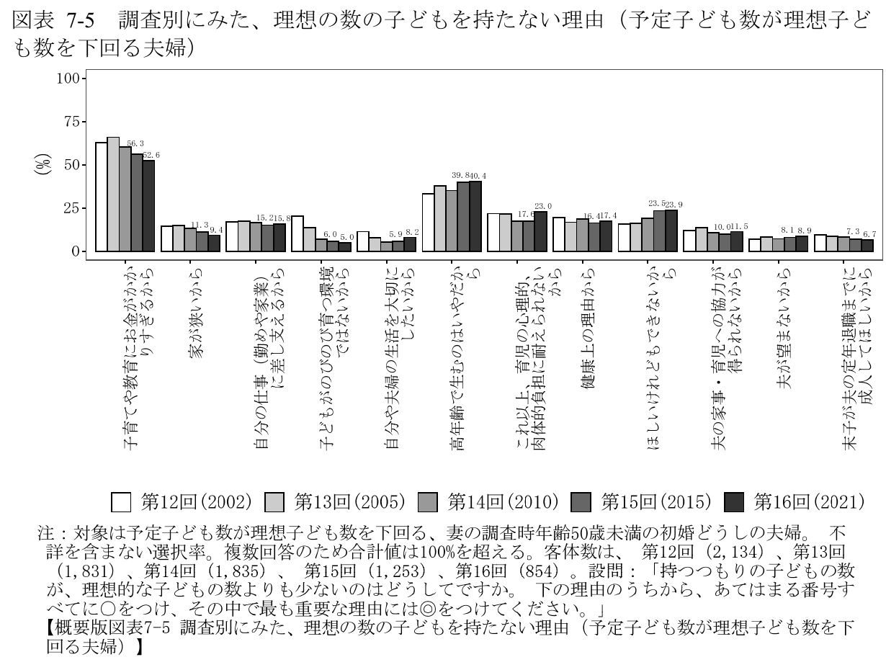

# 横浜は、中学校の給食費も無償化すべきか

2023年、政府が少子化対策で取り上げたのは、子どもを望む人が費用などの事情で希望をかなえられないという問題だった。出生数の減少が想定より早く進んでいるとの認識のもと、児童手当の拡充などとともに、給食費の無償化に向けた検討を試案に盛り込んだ。[^1]

政府は、本人の希望を支えることに加え、将来の働き手や社会保障を支えることにもつながるとして、子育て政策の強化を掲げた。[^1]

給食費の軽減は、その経済的な支援の一つだ。横浜の中学校まで広げる議論も、どの家庭の負担をどれだけ減らし、その費用を誰が引き受けるかという選択につながる。

## 子育ての費用が、希望する暮らしを制約している

政府の試案が参照した調査では、予定する子ども数が理想より少ない夫婦の52.6％が、子育てや教育にかかる費用を理由に挙げていた。下の図は、その調査資料に掲載されたものだ。[^2]

**図の読み方：黒い棒が2021年の回答。** 費用の理由が最も多く、年齢や育児の負担なども挙がっている。対象は予定子ども数が理想を下回る夫婦、複数回答。画像を開くと拡大できる。

出典：国立社会保障・人口問題研究所『第16回出生動向基本調査 結果の概要』58ページ、図表7-5。Open Yokohamaが原資料から図表部分を切り出した。[原資料を見る](https://www.ipss.go.jp/ps-doukou/j/doukou16/JNFS16gaiyo.pdf#page=58)

子育て費用への対応には、給付を増やす方法も、家庭が払う料金を減らす方法もある。給食費の無償化は、このうち毎日の昼食にかかる支払いを減らす手段だ。

一方、子育ての支障には、預け先や相談相手など、お金の給付だけでは直接増やせないものもある。当時の政府試案は、経済的負担とともに、孤立した育児や一時預かりなどの支援の不足も課題に挙げていた。[^1]

## 横浜では、今の支援で何が変わった？

食材の値上がりにも、公費で対応が進められてきた。2022年7月時点の国の調査では、給食費の負担軽減を実施していた自治体は679、実施予定は812で、合わせて回答自治体の83.2％だった。国は物価高対策の交付金を活用できるようにし、取組を後押しした。[^3]

2026年度の横浜市立中学校・義務教育学校後期では、通常の給食1食につき、物価上昇分110円を市が補助し、保護者が330円を払う。就学援助の認定を受けた家庭は、対象期間の最終負担が0円になる。[^4]

小学校段階では、国が所得を問わない支援を始め、横浜市が国の基準額を超える分も補って保護者負担を0円にした。中学校で現在払っている家庭にも、支払いをなくす支援を広げるかが、この記事で考える対象だ。[^5]

## 家庭の支払いを、どこまで公費で引き受ける？

援助を受けず、通常の給食を170食利用する例では、家庭の支払いは **330円×170食＝56,100円**。同じ給食を無償にすれば、この額を家庭が払う必要はなくなる。[^6]

すでに援助で最終負担が0円の家庭では、追加で減る支払いも0円だ。支援を広げたときの変化は、現在の負担によって異なる。

ここで分かれるのは、子育て費用の一部を所得にかかわらず公費で引き受ける範囲と、負担の重さなどの条件に応じて支援を厚くする範囲だ。どちらも支出を軽くする方法だが、対象になる家庭と、家庭ごとに増える支援が変わる。

市が使い道を選べる予算では、給食費とほかの子育て支援に、どれだけずつ向けるかも判断になる。2023年の政府の会議では、構成員が給食費などの経済的支援に議論が偏ることを問題にし、地域の支援団体や担い手を支える役割に言及した。子育て支援に携わる奥山千鶴子氏も、自治体の施策を組み合わせて考える必要性を述べている。[^7]

支払いを減らすことと、相談や預け先を増やすこと。それぞれで生活のどこが改善し、どの負担が残るのかを比べると、支援の優先順位が具体的になる。

### 課題から見た対応の比較〈編集部整理〉

| 解きたい課題・判断すること | 対応の分かれ方 | 誰の何が変わり、何が残るか |
|---|---|---|
| 家庭の子育て支出を、どこまで軽くするか | 現在の料金・援助を続ける／援助の対象を変える／対象家庭の給食費を一律0円にする | 現行維持では援助対象外の支払いが続く。対象変更では新たに支える範囲を定める。一律0円では現在払う対象家庭へ広く支払減が及ぶ。必要な市の予算は対象・食数・既存援助との調整で変わる |
| 支出以外の子育ての負担に、どう応えるか | 給食費の軽減に配分する／相談・預かり等に配分する／組み合わせる | 給食費の軽減は対象家庭の支払いを減らす。相談・預かり等は利用できる支援を増やす。それぞれの対象・必要量・費用をそろえて比べる |
| 支援を継続する費用を、国と市でどう分担するか | 国の支援拡大を求める／市が追加の支援を設ける／両方を進める | 国から受け取る額と、市が別に用意する額が変わる。どの年度から、毎年どの収入で賄うかが実施条件になる |

一つの課題に一つの政策だけが対応するわけではなく、一律軽減と追加援助などを組み合わせることもできる。給食を利用しない子や対象外の学校への対応も、その組合せを考える論点になる。[^8]

## 家庭の負担を減らす費用を、誰が引き受けるか

国と市の負担の分け方も、実際に議論されてきた。横浜市は2025年11月、自治体の負担が他の子育て支援や教育施策に影響するとして、給食費無償化に必要な費用を全額国費で賄うよう求めた。2026年度の市の給食費補助予算には、国の臨時交付金が使われている。[^9]

家庭の請求がゼロになるとき、その分を支えるのは国や市の予算だ。国の支援がどこまで続くかによって、市が毎年用意する額も変わる。

中学校の無償化で市に追加で必要となる額は、今回確認した資料では未確定だ。このため、同じ予算で他の支援をどれだけ増やせるかという金額比較は、まだ残っている。[^10]

給食費を誰まで軽くするか、その費用を国と市でどう分担し、ほかの支援とどう組み合わせるか。家計の支払減と、公共の予算の使い方を合わせて考えることが、この問いの中身になる。

---

## 参考資料・注記

原稿更新：2026年9月9日。現行料金・援助・予算の参照は2026年度の資料。各資料の取得版と確認箇所はレビュー記録に保存している。

[^1]: こども家庭庁『こども・子育て政策の強化について（試案）』2023年3月31日、PDF3・7・12ページ。政府が示した問題認識と検討方針。給食費については実態把握・課題整理の段階。[原資料](https://www.cfa.go.jp/assets/contents/node/basic_page/field_ref_resources/81755c56-2756-427b-a0a6-919a8ef07fb5/2eaccd0d/20230402_policies_01.pdf)

[^2]: 国立社会保障・人口問題研究所『第16回出生動向基本調査 結果の概要』図表7-5、58ページ。2021年の回答は、予定子ども数が理想を下回る初婚どうしの夫婦で、妻が50歳未満の854回答。複数回答・無回答除外。全家庭の困窮率や給食費固有の効果を示すものではない。[原資料](https://www.ipss.go.jp/ps-doukou/j/doukou16/JNFS16gaiyo.pdf#page=58)

[^3]: 文部科学省、2022年9月9日公表。基準日7月29日、回答1,793自治体。679＋812＝1,491、1,491÷1,793×100＝83.156…％。実施予定を含む取組状況で、軽減額や効果の実測ではない。国は取組状況の周知と負担軽減の促進を今後の対応として記載。[原資料](https://www.mext.go.jp/b_menu/houdou/mext_01110.html)

[^4]: 横浜市の[現行料金](https://www.city.yokohama.lg.jp/kosodate-kyoiku/kyoiku/sesaku/kyusyoku/kyushokuhi.html)、[予算概要PDF21ページ](https://www.city.yokohama.lg.jp/city-info/yokohamashi/org/kyoiku/yosan/r8yosangaiyou.files/0009_20260507.pdf#page=21)、[就学援助案内PDF4ページ](https://www.city.yokohama.lg.jp/kosodate-kyoiku/kyoiku/soudan/shugakuenjo/shugakuenjo.files/0119_20260403.pdf#page=4)。新規申請等では審査中に支払い、認定後に返還。前年末対象者は審査中も支払い不要。0円は対象期間の最終負担を指す。

[^5]: [政府の2025年12月19日方針](https://www.mof.go.jp/about_mof/act/kokuji_tsuutatsu/tsuutatsu/251219.html)と横浜市の現行案内。市の0円の対象は小学校・義務教育学校前期・特別支援学校小学部。特別支援学校の小学部以外の料金は学校へ確認する。

[^6]: 170食は[市の事業計画PDF3ページ](https://www.city.yokohama.lg.jp/city-info/yokohamashi/org/kyoiku/jigyoukeikaku/r8jigyoukeikaku.files/0232_20260126.pdf#page=3)の見込み日数による例で、各家庭の年間実績ではない。家計への直接の支払減と、出生・生活への効果は別の検証対象。参考研究には[青森県の小学生家庭の分析](https://www.rieti.go.jp/jp/publications/dp/26j031.pdf)があるが、横浜の中学生への効果を確定するものではない。

[^7]: [2023年2月20日、第3回こども政策強化会議](https://www.cfa.go.jp/councils/kodomo_seisaku_kyouka/Ud2PFWdX)、奥山氏への国・地方の役割についての質問と応答。発言者の問題提起であり、特定政策の効果や横浜の予算削減の実績ではない。

[^8]: 表は課題と対応を比較するための編集上の整理。各行は別の判断軸で、市の決定済み計画・候補者の公約の一覧ではない。所得条件、支援対象、給食の利用状況を混同せず、同じ課題への複数の対応を比較する。

[^9]: [横浜市の2025年11月国要望、PDF14ページ](https://www.city.yokohama.lg.jp/city-info/seisaku/torikumi/bunken/yobo/yobo2025.files/yobo0711.pdf#page=14)と2026年度の市の料金・予算説明。市の要望と国の実施決定は別。臨時交付金の活用を、市税のみの支出や将来年度の確定財源として扱わない。

[^10]: 純増費用には保護者の実支払対象食数、既存援助の給食費分、徴収・審査等の費用、代替給付、国・県・市の財源対応が必要。物資購入事業の総額や、全生徒が一律に支払う仮定の総額を代用していない。
